# 🛡️ Lab 01 – Microsoft Defender for Endpoint: Windows Device Onboarding


> **Objective:** Deploy and onboard a Windows 11 Enterprise test endpoint to Microsoft Defender for Endpoint (MDE), validate endpoint telemetry in Microsoft Defender XDR, and confirm that the device is successfully recognized by Microsoft Purview for future Endpoint DLP enforcement.

---

## 📑 Table of Contents

- [Lab Overview](#-lab-overview)
- [Objectives](#-objectives)
- [Lab Environment](#-lab-environment)
- [Architecture](#-architecture)
- [Implementation](#-implementation)
  - [1. Access Microsoft Defender](#1-access-microsoft-defender)
  - [2. Configure Endpoint Onboarding](#2-configure-endpoint-onboarding)
  - [3. Select Local Script Deployment](#3-select-local-script-deployment)
  - [4. Download the Onboarding Package](#4-download-the-onboarding-package)
  - [5. Onboard the Windows Endpoint](#5-onboard-the-windows-endpoint)
  - [6. Validate the MDE Sensor](#6-validate-the-mde-sensor)
  - [7. Verify Device Inventory](#7-verify-device-inventory)
  - [8. Review the Device Profile](#8-review-the-device-profile)
  - [9. Validate Endpoint Telemetry](#9-validate-endpoint-telemetry)
  - [10. Enable Microsoft Purview Device Onboarding](#10-enable-microsoft-purview-device-onboarding)
  - [11. Validate Purview Device Configuration](#11-validate-purview-device-configuration)
- [Validation Results](#-validation-results)
- [Security Architecture](#-security-architecture)
- [Key Learnings](#-key-learnings)
- [Next Step](#-next-step)
- [Disclaimer](#-disclaimer)

---

# 🔎 Lab Overview

Microsoft Defender for Endpoint provides endpoint detection, visibility, investigation, and response capabilities across enterprise devices.

Before endpoint-based security controls such as **Microsoft Purview Endpoint Data Loss Prevention (Endpoint DLP)** can be tested, a Windows endpoint must first be available to the Microsoft security environment.

In this lab, a dedicated **Windows 11 Enterprise virtual machine** was configured as a test endpoint and onboarded to Microsoft Defender for Endpoint using the local onboarding method.

The implementation was then validated across both:

- **Microsoft Defender XDR**
- **Microsoft Purview**

This establishes the endpoint foundation required for subsequent Endpoint DLP testing.

---

# 🎯 Objectives

The objectives of this lab were to:

- Deploy a dedicated Windows 11 Enterprise security test endpoint.
- Configure Microsoft Defender for Endpoint onboarding.
- Use the local script deployment method for a standalone lab device.
- Validate the Microsoft Defender for Endpoint sensor.
- Confirm successful device registration in Microsoft Defender XDR.
- Review endpoint inventory and device information.
- Validate endpoint telemetry through the device timeline.
- Enable device onboarding within Microsoft Purview.
- Confirm that the MDE-managed endpoint is recognized by Purview.
- Validate the endpoint configuration state for future Endpoint DLP testing.

---

# 🧪 Lab Environment

| Component | Configuration |
|---|---|
| Endpoint | Windows 11 Enterprise VM |
| Virtualization | VMware |
| Endpoint Security | Microsoft Defender for Endpoint |
| Security Portal | Microsoft Defender XDR |
| Data Security Platform | Microsoft Purview |
| Deployment Method | Local onboarding script |
| Device Monitoring | Microsoft Purview Device Onboarding |
| Environment | Microsoft 365 test/demo tenant |
| Lab Type | Non-production security lab |

> **Security Note:** A dedicated virtual machine was used instead of onboarding the personal host operating system. This isolates Defender telemetry and future DLP enforcement from the physical workstation.

---

# 🏗️ Architecture

```text
                    ┌──────────────────────────────┐
                    │   Microsoft 365 Test Tenant  │
                    └──────────────┬───────────────┘
                                   │
                    ┌──────────────▼───────────────┐
                    │ Microsoft Defender for       │
                    │ Endpoint / Defender XDR      │
                    └──────────────┬───────────────┘
                                   │
                         Device Onboarding
                                   │
                                   ▼
                    ┌──────────────────────────────┐
                    │ Windows 11 Enterprise VM     │
                    │                              │
                    │ • MDE Sensor                 │
                    │ • Defender Antivirus         │
                    │ • Endpoint Telemetry         │
                    └──────────────┬───────────────┘
                                   │
                             Telemetry
                                   │
                    ┌──────────────▼───────────────┐
                    │ Microsoft Defender XDR       │
                    │                              │
                    │ • Device Inventory           │
                    │ • Device Profile             │
                    │ • Device Timeline            │
                    └──────────────┬───────────────┘
                                   │
                       Device Integration
                                   │
                    ┌──────────────▼───────────────┐
                    │ Microsoft Purview            │
                    │                              │
                    │ Device Onboarding            │
                    │ Configuration Validation     │
                    └──────────────┬───────────────┘
                                   │
                                   ▼
                    ┌──────────────────────────────┐
                    │ Endpoint DLP Ready           │
                    │                              │
                    │ Future enforcement:          │
                    │ USB • Print • Clipboard      │
                    │ Browser / Network actions    │
                    └──────────────────────────────┘
```

---

# 🛠️ Implementation

## 1. Access Microsoft Defender

The Microsoft Defender portal was accessed using an administrative account within the Microsoft 365 test tenant.

The Defender portal provides centralized visibility across endpoint security, incidents, alerts, assets, identities, and other Microsoft security workloads.

<p align="center">
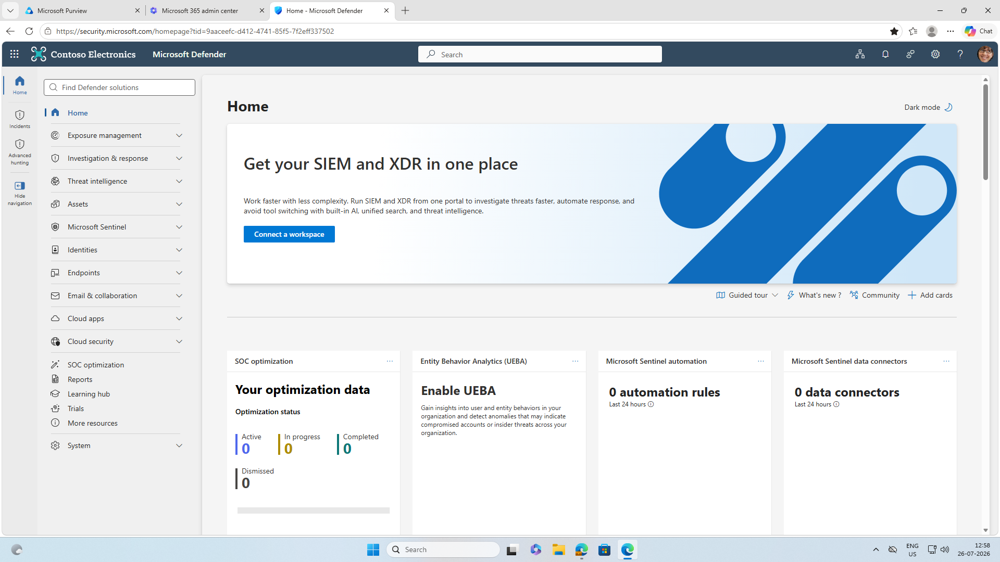
</p>

*Figure 1 – Microsoft Defender XDR portal used for endpoint security administration.*

---

## 2. Configure Endpoint Onboarding

The endpoint configuration area was accessed through Microsoft Defender settings.

This provides the administrative controls required to configure Microsoft Defender for Endpoint and onboard supported devices.

<p align="center">
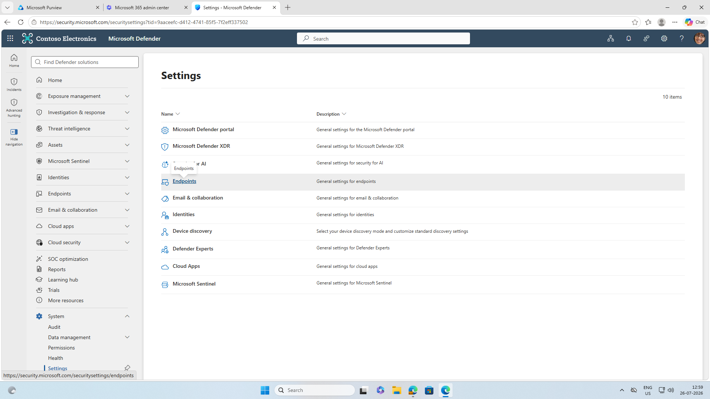
</p>

*Figure 2 – Microsoft Defender for Endpoint configuration settings.*

---

## 3. Select Local Script Deployment

The Windows endpoint onboarding workflow was opened and the appropriate Windows operating system and deployment method were selected.

For this standalone test endpoint, the **Local Script** deployment method was used.

This method is suitable for small-scale testing and individual lab endpoints where enterprise deployment technologies such as Microsoft Intune, Group Policy, or Microsoft Configuration Manager are not required.

<p align="center">
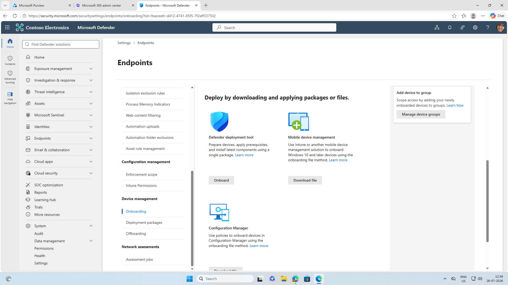
</p>

*Figure 3 – Microsoft Defender for Endpoint onboarding options.*

<p align="center">
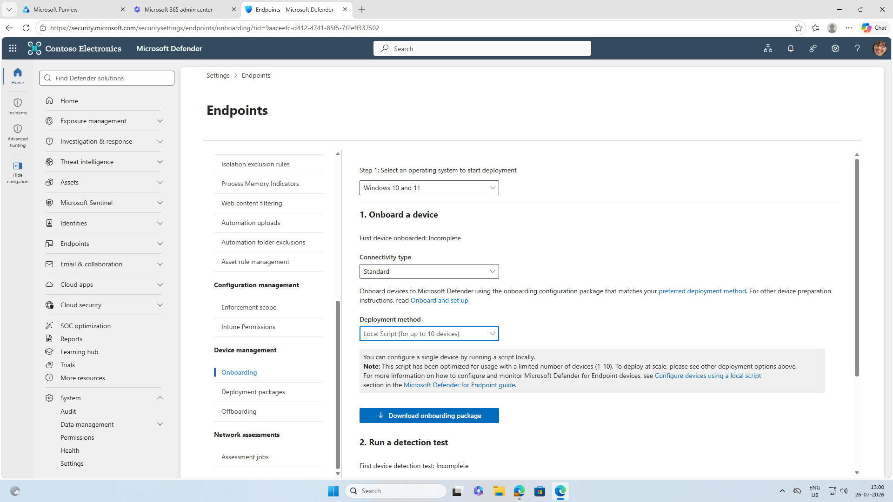
</p>

*Figure 4 – Local script selected as the onboarding deployment method.*

---

## 4. Download the Onboarding Package

The tenant-specific Microsoft Defender for Endpoint onboarding package was downloaded.

The onboarding package establishes the configuration required for the Windows endpoint to communicate with the Microsoft Defender for Endpoint service.

<p align="center">
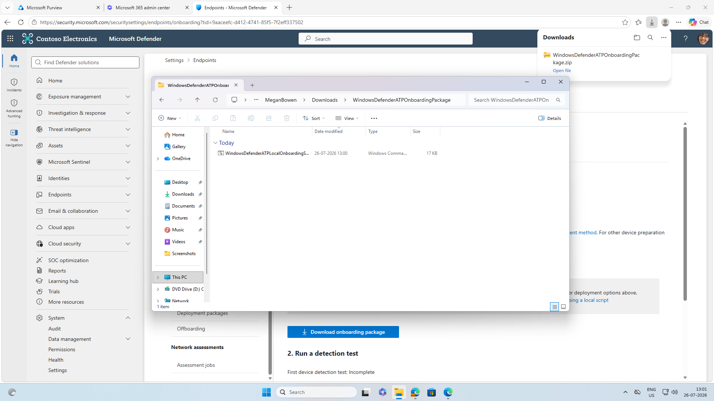
</p>

*Figure 5 – Microsoft Defender for Endpoint onboarding package downloaded for the test endpoint.*

> **Security Practice:** Tenant-specific onboarding scripts and configuration packages should not be committed to public repositories. Only sanitized screenshots and implementation documentation are retained in this lab.

---

## 5. Onboard the Windows Endpoint

The onboarding script was executed with administrative privileges directly on the Windows 11 Enterprise virtual machine.

The script configured the endpoint for Microsoft Defender for Endpoint communication and completed the device onboarding process.

<p align="center">
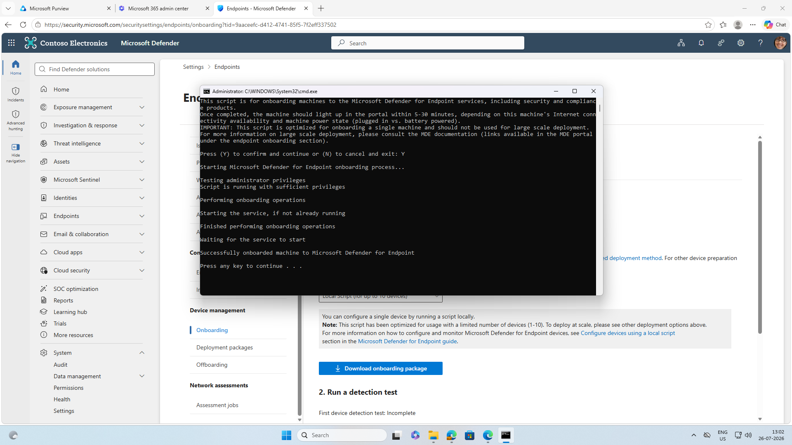
</p>

*Figure 6 – Successful Microsoft Defender for Endpoint onboarding of the Windows test device.*

At this stage, the endpoint architecture became:

```text
Windows 11 Enterprise
        │
        ▼
MDE Onboarding Configuration
        │
        ▼
Microsoft Defender Sensor
        │
        ▼
Defender for Endpoint Cloud Service
```

---

## 6. Validate the MDE Sensor

Successful execution of an onboarding script alone does not provide sufficient validation.

The Microsoft Defender for Endpoint sensor was therefore verified locally on the endpoint.

PowerShell was used to inspect the **Sense** service:

```powershell
Get-Service Sense
```

The running service confirmed that the Microsoft Defender for Endpoint sensor was operational.

<p align="center">
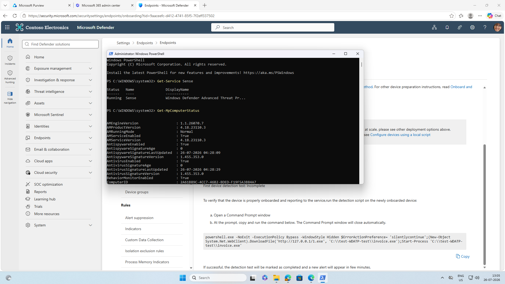
</p>

*Figure 7 – Verification of the Microsoft Defender for Endpoint Sense service.*

This validation is important because the sensor is responsible for collecting and communicating endpoint security telemetry to Microsoft Defender for Endpoint.

---

## 7. Verify Device Inventory

After onboarding and cloud synchronization, the Windows endpoint became visible within:

**Microsoft Defender → Assets → Devices**

This confirmed that the endpoint had successfully registered with the Defender environment and was reporting to the service.

<p align="center">
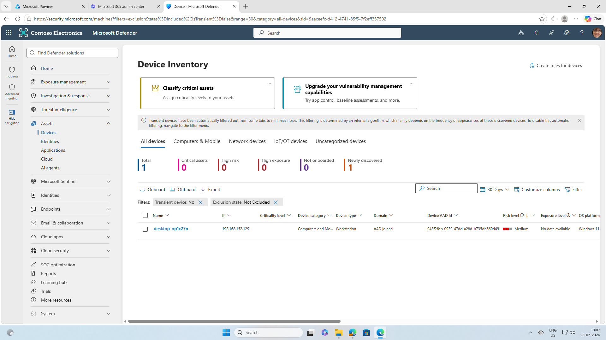
</p>

*Figure 8 – Onboarded Windows endpoint visible in Microsoft Defender Device Inventory.*

The Device Inventory provides centralized visibility into endpoints monitored by Microsoft Defender for Endpoint.

---

## 8. Review the Device Profile

The onboarded endpoint was opened from Device Inventory to review its device profile.

The device page provides security and inventory information associated with the endpoint, which can include:

- Operating system information
- Device identity
- Sensor health
- Risk information
- Exposure information
- Logged-on users
- Security recommendations
- Alerts
- Software inventory
- Endpoint activity

<p align="center">
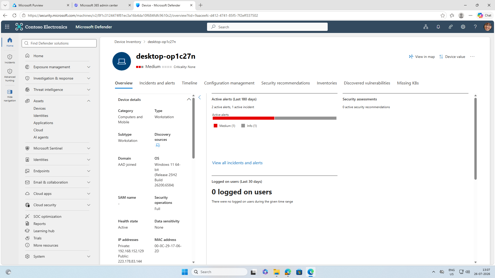
</p>

*Figure 9 – Microsoft Defender device overview for the onboarded Windows endpoint.*

This confirms that the endpoint is represented as a managed security asset rather than simply appearing as an onboarding record.

---

## 9. Validate Endpoint Telemetry

The **Device Timeline** was reviewed to validate that Microsoft Defender was receiving endpoint activity.

<p align="center">
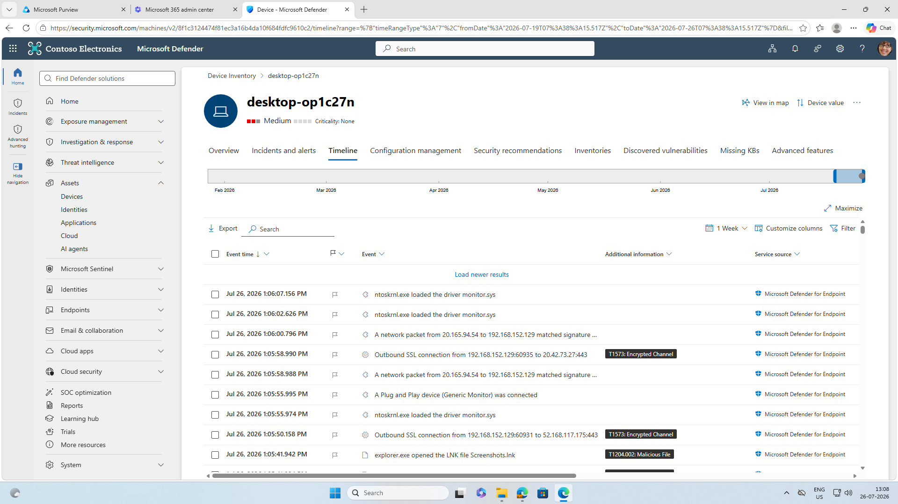
</p>

*Figure 10 – Endpoint telemetry visible through the Microsoft Defender Device Timeline.*

The timeline provides security analysts with chronological endpoint activity that can support investigation and incident analysis.

The resulting telemetry path can be represented as:

```text
Endpoint Activity
       │
       ▼
MDE Sensor
       │
       ▼
Defender for Endpoint
       │
       ▼
Device Timeline
       │
       ▼
Security Investigation
```

---

## 10. Enable Microsoft Purview Device Onboarding

After validating Microsoft Defender for Endpoint, Microsoft Purview device onboarding was enabled.

This allows supported onboarded endpoints to participate in Purview compliance and data security capabilities.

<p align="center">
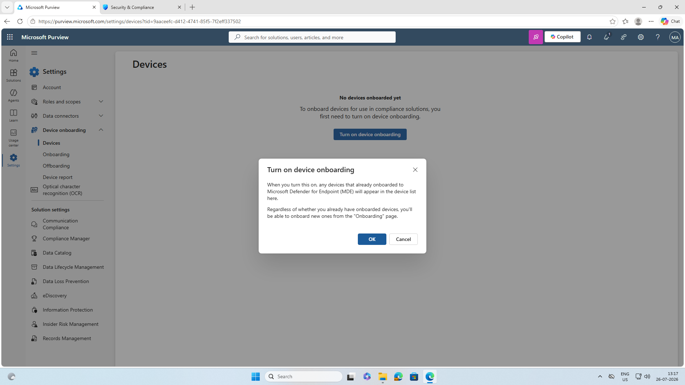
</p>

*Figure 11 – Microsoft Purview device onboarding enabled for endpoint monitoring.*

Because the Windows device had already been onboarded to Microsoft Defender for Endpoint, the existing endpoint could subsequently become visible to Microsoft Purview without deploying a separate endpoint instance.

This establishes the integration path:

```text
Windows Endpoint
       │
       ▼
Microsoft Defender for Endpoint
       │
       ▼
Microsoft Purview
       │
       ▼
Data Security Controls
```

---

## 11. Validate Purview Device Configuration

The final validation was performed from the Microsoft Purview device onboarding interface.

The Defender-onboarded Windows endpoint appeared in the Purview device inventory.

The endpoint reported:

- **Windows 11**
- **Valid user**
- **Configuration status: Updated**

<p align="center">
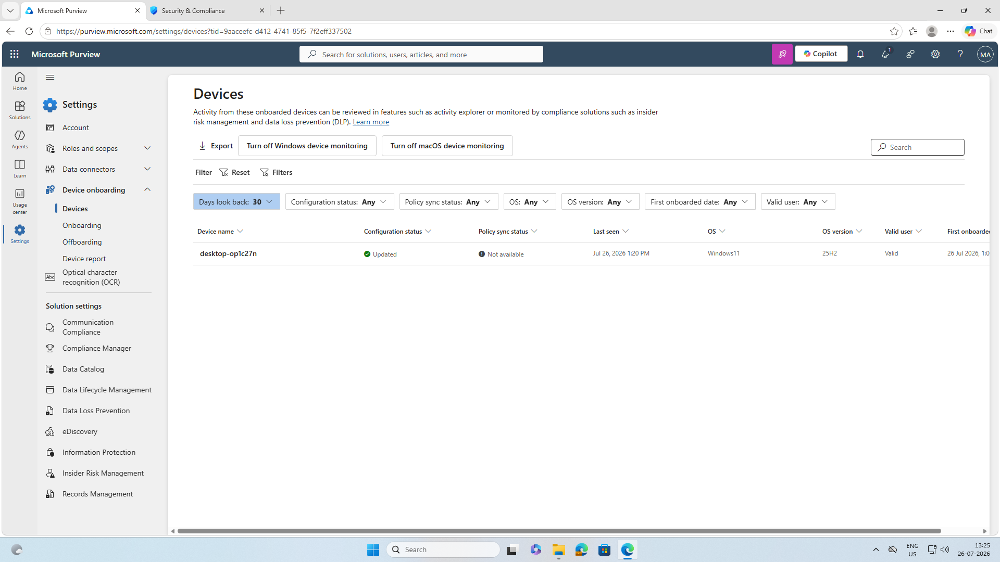
</p>

*Figure 12 – Defender-onboarded endpoint successfully recognized by Microsoft Purview with an updated configuration status.*

This was the final validation checkpoint for the lab.

The endpoint is now positioned for subsequent **Microsoft Purview Endpoint DLP policy deployment and enforcement testing**.

---

# ✅ Validation Results

| Validation | Result |
|---|---|
| Windows 11 Enterprise test endpoint deployed | ✅ Successful |
| MDE onboarding package executed | ✅ Successful |
| Microsoft Defender Sense service verified | ✅ Running |
| Device registered in Defender | ✅ Successful |
| Device visible in Device Inventory | ✅ Successful |
| Device profile available | ✅ Successful |
| Endpoint telemetry available | ✅ Successful |
| Purview device onboarding enabled | ✅ Successful |
| Endpoint discovered by Purview | ✅ Successful |
| Valid user association | ✅ Valid |
| Purview configuration status | ✅ Updated |
| Endpoint ready for Endpoint DLP testing | ✅ Ready |

---

# 🔐 Security Architecture

The completed lab demonstrates the relationship between endpoint security telemetry and data security controls.

```text
┌─────────────────────────────────────────────────────────────┐
│                    WINDOWS ENDPOINT                         │
│                                                             │
│             Windows 11 Enterprise Test VM                   │
│                         │                                   │
│                         ▼                                   │
│              Microsoft Defender Sensor                      │
└─────────────────────────┬───────────────────────────────────┘
                          │
                          │ Endpoint telemetry
                          ▼
┌─────────────────────────────────────────────────────────────┐
│             MICROSOFT DEFENDER FOR ENDPOINT                 │
│                                                             │
│   Device Inventory  ─  Device Profile  ─  Device Timeline   │
└─────────────────────────┬───────────────────────────────────┘
                          │
                          │ Device visibility
                          ▼
┌─────────────────────────────────────────────────────────────┐
│                    MICROSOFT PURVIEW                        │
│                                                             │
│        Device Onboarding / Device Configuration             │
│                         │                                   │
│                         ▼                                   │
│                Endpoint DLP Foundation                      │
└─────────────────────────┬───────────────────────────────────┘
                          │
                          │ Future DLP policies
                          ▼
              ┌─────────────────────────┐
              │ Endpoint Data Controls  │
              │                         │
              │ • USB                   │
              │ • Printing              │
              │ • Clipboard             │
              │ • Browser uploads       │
              │ • Other supported       │
              │   endpoint activities   │
              └─────────────────────────┘
```

The key architectural distinction is that **Microsoft Defender for Endpoint provides endpoint onboarding and security telemetry**, while **Microsoft Purview can use the onboarded device for data security and compliance controls such as Endpoint DLP**.

---

# 🧠 Key Learnings

This lab provided practical experience with:

- Microsoft Defender for Endpoint onboarding.
- Windows endpoint security architecture.
- MDE local-script deployment.
- Defender sensor validation.
- Microsoft Defender Device Inventory.
- Endpoint security telemetry.
- Device Timeline analysis.
- Microsoft Defender and Microsoft Purview integration.
- Purview device onboarding.
- Endpoint configuration validation.
- Building the prerequisite infrastructure for Endpoint DLP.

A key implementation lesson was that successful endpoint onboarding should be validated at multiple layers:

```text
Onboarding Script
       ↓
Sensor Validation
       ↓
Defender Device Inventory
       ↓
Endpoint Telemetry
       ↓
Purview Device Discovery
       ↓
Configuration Status
```

This provides stronger evidence of a functioning deployment than relying solely on the onboarding script's completion message.

---

# 🚀 Next Step

With the Windows endpoint successfully onboarded and recognized by Microsoft Purview, the environment is ready for the next phase:

## Microsoft Purview Endpoint Data Loss Prevention

The next lab will extend this architecture from **endpoint visibility** to **endpoint data protection**.

```text
Sensitive Data
      │
      ▼
Windows 11 Endpoint
      │
      ▼
Microsoft Purview Endpoint DLP
      │
      ├──────────► USB
      │
      ├──────────► Print
      │
      ├──────────► Clipboard
      │
      └──────────► Browser / Web Upload
                         │
                         ▼
                  Audit / Warn / Block
                         │
                         ▼
                  Activity Explorer
                         │
                         ▼
                    Investigation
```

This will demonstrate how Microsoft Purview extends data protection controls beyond Microsoft 365 cloud locations and onto managed Windows endpoints.

---

# ⚠️ Disclaimer

This lab was performed in a dedicated **test/demo environment** for educational and technical documentation purposes.

The configurations demonstrated here should be validated against organizational security requirements, licensing, endpoint-management architecture, and change-management procedures before implementation in a production environment.

No production systems or real sensitive data were used.

---

## 🏁 Lab Status

**Status:** ✅ Completed

**Outcome:** A Windows 11 Enterprise endpoint was successfully onboarded to Microsoft Defender for Endpoint, endpoint telemetry was validated in Microsoft Defender XDR, and the device was successfully recognized by Microsoft Purview with an updated configuration status.
