# Lab 01 - Create and Validate a Microsoft Purview DLP Policy for OneDrive


---

# Objective

Create a custom Microsoft Purview Data Loss Prevention (DLP) policy to detect files containing credit card information uploaded to Microsoft OneDrive, generate security alerts, and validate the complete detection workflow.

---

# Business Scenario

A financial organization stores customer documents in Microsoft OneDrive for Business.

To prevent accidental exposure of payment card information, a Microsoft Purview DLP policy is implemented to:

- Detect Credit Card Numbers
- Monitor OneDrive uploads
- Restrict access to sensitive content
- Notify end users
- Generate alerts for Security Administrators

---

# Lab Environment

| Component | Value |
|------------|------------------------------|
| Platform | Microsoft Purview |
| Tenant | Microsoft 365 E5 Demo |
| Workload | Microsoft OneDrive for Business |
| Policy Type | Custom DLP Policy |
| Detection | Credit Card Number (Sensitive Information Type) |

---

# Architecture

```text
                    User Uploads File
                            │
                            ▼
               OneDrive for Business
                            │
                            ▼
             Microsoft Purview DLP Engine
                            │
                            ▼
      Credit Card Number Detected (High Confidence)
                            │
                            ▼
                DLP Rule Evaluation
                            │
        ┌───────────────────┼────────────────────┐
        │                   │                    │
        ▼                   ▼                    ▼
 Restrict Access      Notify User         Generate Alert
                            │
                            ▼
          Security Analyst Investigation
```

---

# Lab Workflow

```text
Create Policy
      │
      ▼
Configure Rule
      │
      ▼
Publish Policy
      │
      ▼
Policy Sync Completed
      │
      ▼
Upload Test File
      │
      ▼
Purview Content Inspection
      │
      ▼
Credit Card Number Detected
      │
      ▼
DLP Rule Matched
      │
      ▼
Alert Generated
      │
      ▼
Activity Explorer Investigation
```

---

# Step 1 – Open Microsoft Purview

Navigate to:

```
Microsoft Purview
→ Data Loss Prevention
```

### Screenshot

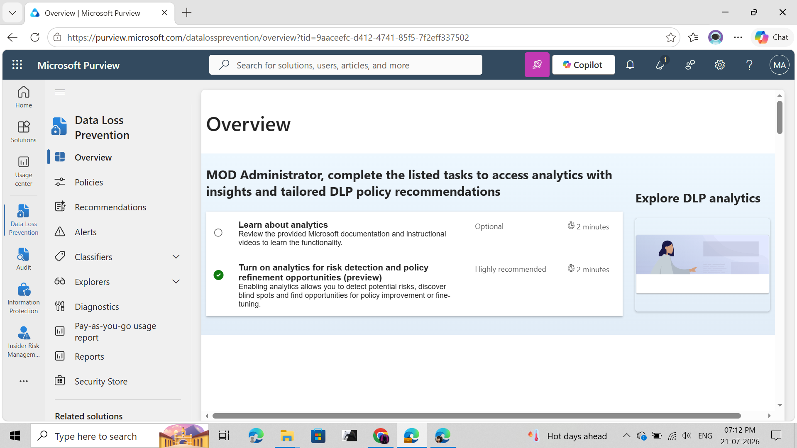

---

# Step 2 – Create a Custom DLP Policy

Select

```
Custom Policy
```

instead of a predefined template.

A custom policy provides full control over:

- Detection logic
- Rule conditions
- Enforcement actions
- User notifications

### Screenshot

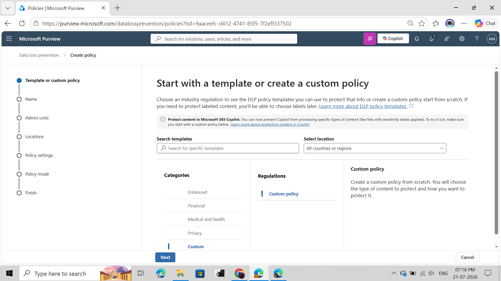

---

# Step 3 – Configure Policy Information

**Policy Name**

```
Credit Card Protection Policy (onedrive)
```

**Description**

```
Detects credit card numbers uploaded to OneDrive and generates DLP alerts.
```

### Screenshot

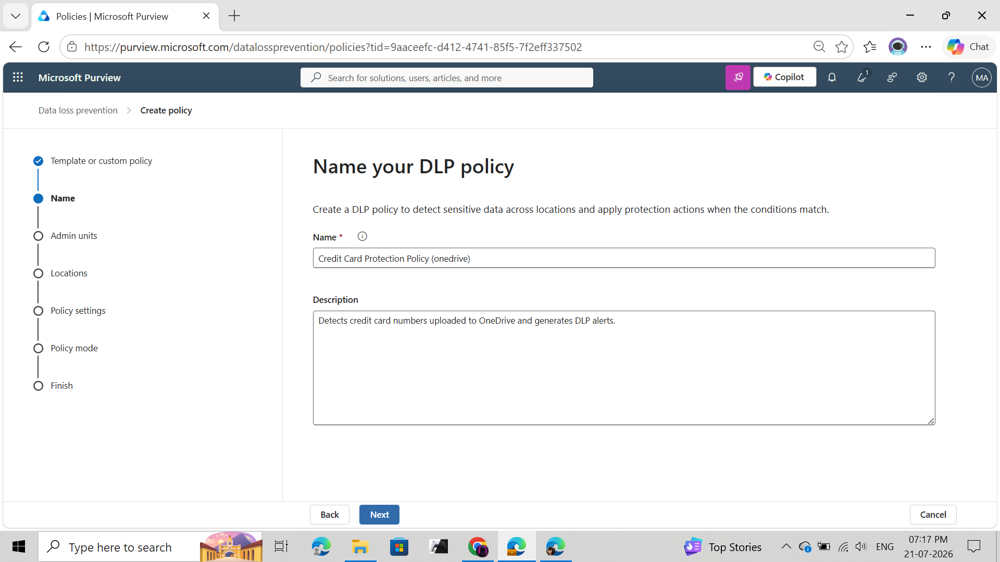

---

# Step 4 – Configure Policy Scope

Enabled Location

✅ OneDrive Accounts

Disabled

- Exchange Online
- SharePoint Online
- Microsoft Teams
- Devices

This lab focuses only on protecting Microsoft OneDrive.

### Screenshot

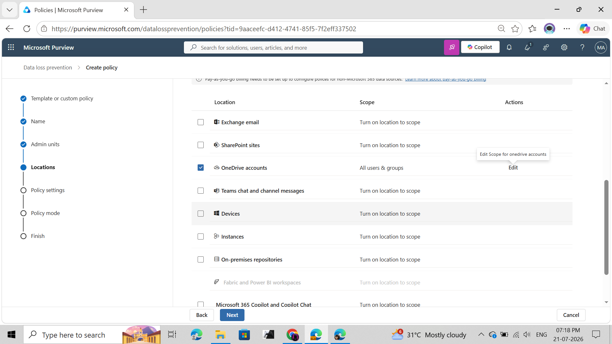

---

# Step 5 – Configure Detection Rule

Sensitive Information Type

```
Credit Card Number
```

Confidence Level

```
High Confidence
```

Minimum Occurrence

```
1
```

The policy triggers whenever at least one valid credit card number is detected.

### Screenshot

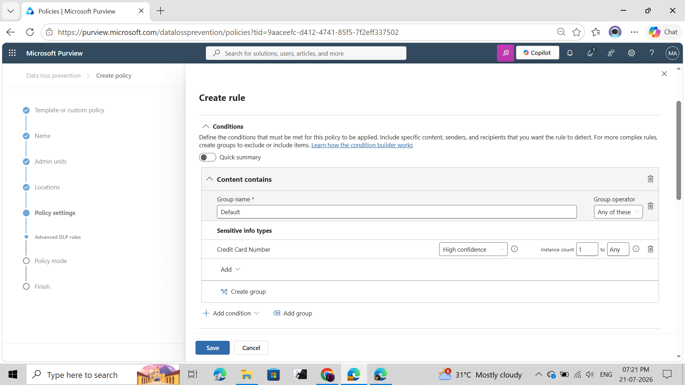

---

# Step 6 – Configure Protection Actions

Configured actions:

- Restrict access to content
- Notify users with policy tips
- Generate alerts

This combines preventive and detective security controls.

### Screenshot

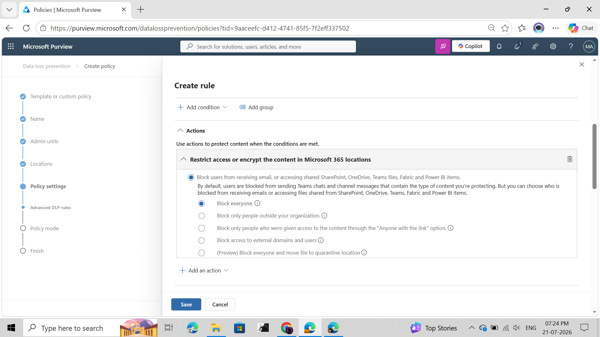

---

# Step 7 – Configure User Notifications

Enabled

- Policy Tips

Custom message

```
Sharing files containing credit card information not allowed
```

Purpose

Educate users whenever sensitive information is detected.

### Screenshot

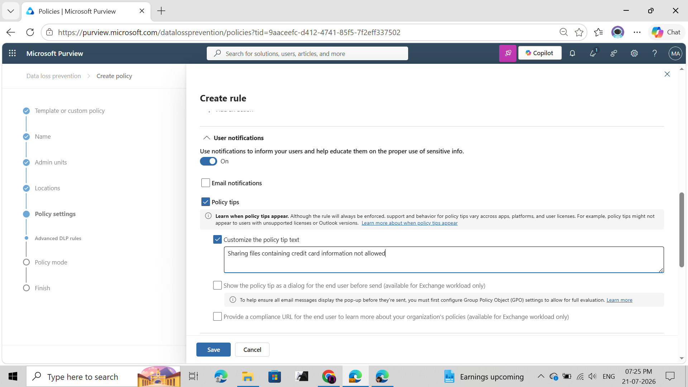

---

# Step 8 – Review Policy

Before publishing, verify:

- Locations
- Conditions
- Rule Actions
- User Notifications

### Screenshot

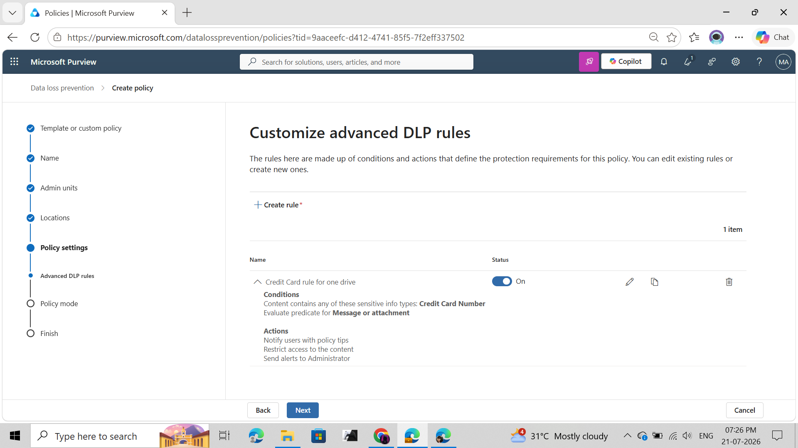

---

# Step 9 – Enable Policy

Policy Mode

```
Turn policy on immediately
```

This enables enforcement immediately after synchronization.

### Screenshot

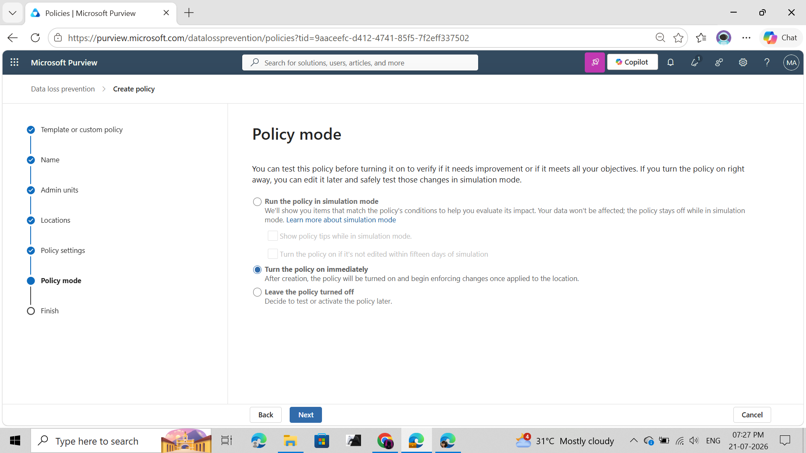

---

# Step 10 – Verify Synchronization

Wait until the policy status displays

```
Sync completed
```

before beginning validation.

### Screenshot

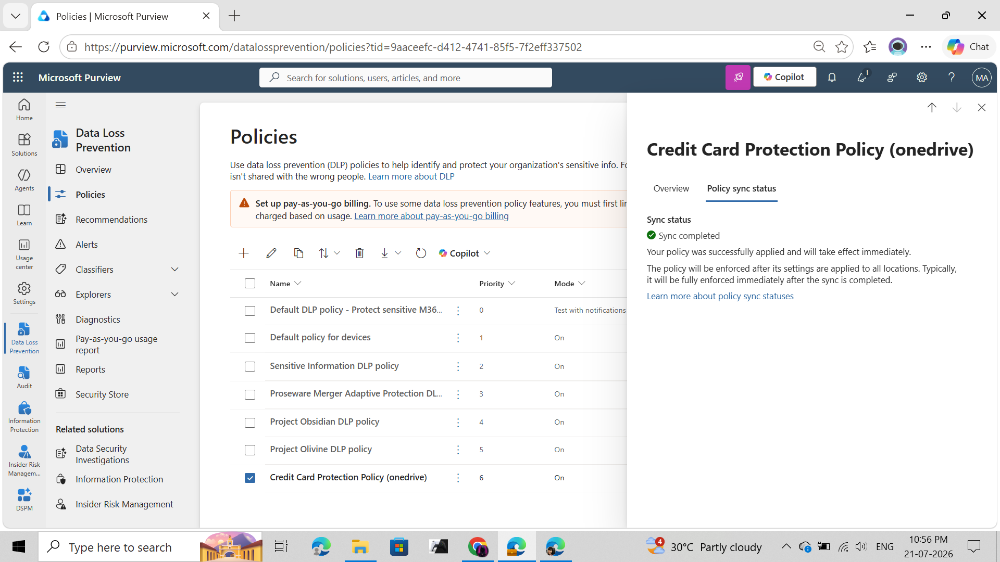

---

# Validation

## Test File

```
Sample Credit Card data.pdf
```

The document contains a Microsoft test credit card number.

---

## Upload File

Upload the document into OneDrive.

### Screenshot

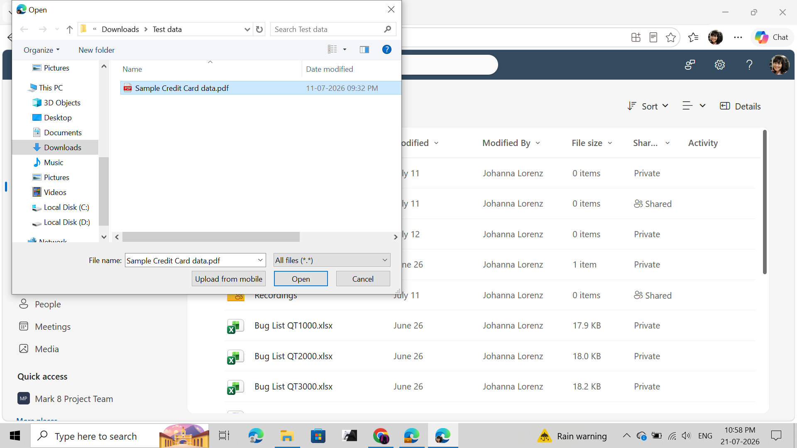

---

## Upload Completed

The upload completed successfully.

### Screenshot

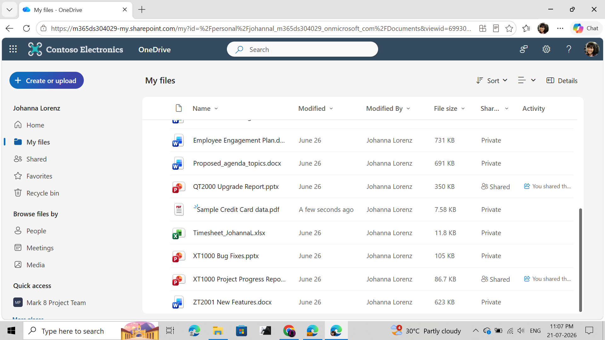

---

# Alert Investigation

Microsoft Purview successfully generated a DLP alert after detecting sensitive information.

### Screenshot

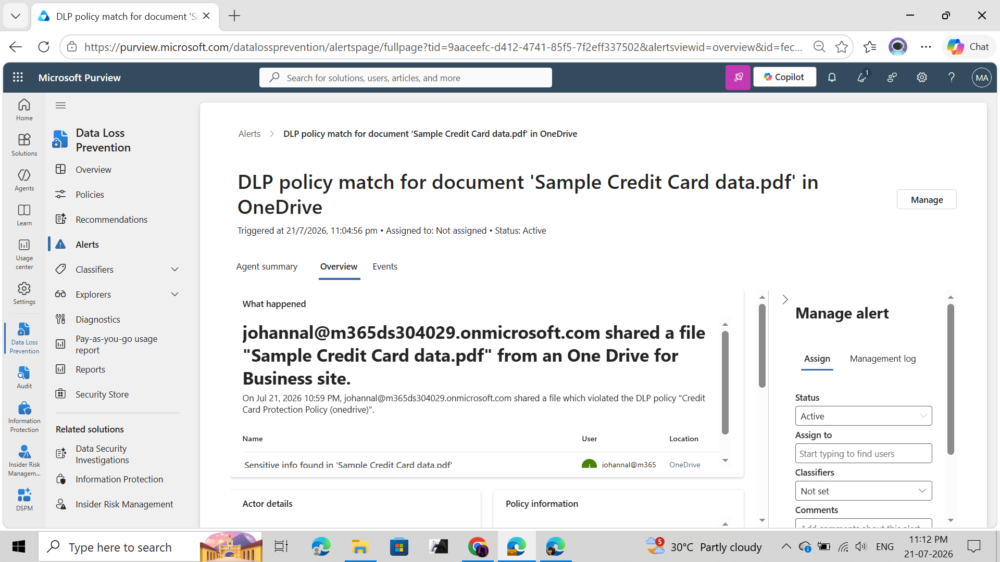

---

# Activity Explorer Investigation

Activity Explorer confirmed:

| Property | Value |
|------------|-----------------------------|
| Activity | DLP rule matched |
| Policy | Credit Card Protection Policy (onedrive) |
| Rule | Credit Card rule for one drive |
| Sensitive Information | Credit Card Number |
| Policy Mode | Enabled |
| Rule Actions | BlockAccess, NotifyUser, GenerateAlert |

### Screenshot

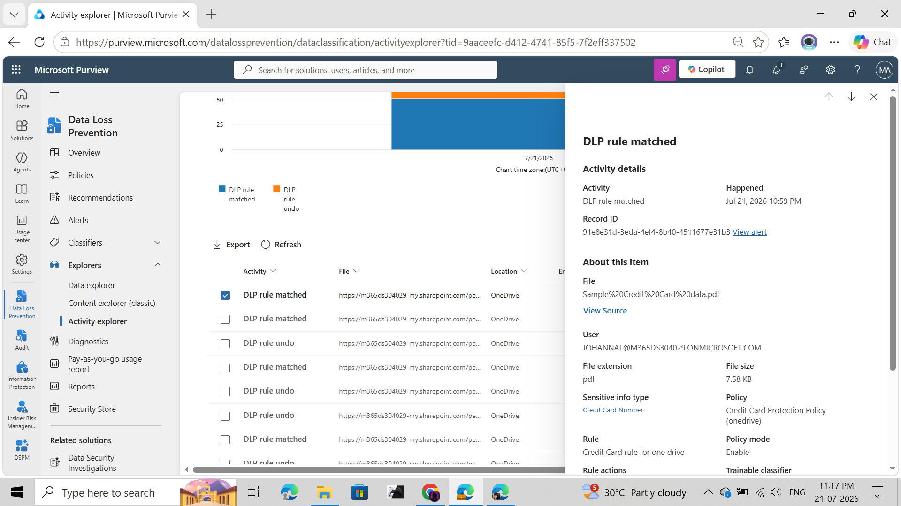

---

# Validation Results

| Validation | Status |
|------------|--------|
| Custom DLP Policy Created | ✅ |
| Policy Published | ✅ |
| Policy Sync Completed | ✅ |
| Credit Card Number Detected | ✅ |
| DLP Rule Matched | ✅ |
| Alert Generated | ✅ |
| Activity Explorer Recorded Event | ✅ |
| User Notification Configured | ✅ |
| Restrict Access Configured | ✅ |

---

# Key Observations

### Detection

Microsoft Purview successfully detected the **Credit Card Number** Sensitive Information Type and generated a DLP alert.

---

### Alert Generation

A DLP alert was automatically created and was available for investigation within Microsoft Purview.

---

### Activity Explorer

Activity Explorer recorded the policy match and displayed the configured rule actions:

- BlockAccess
- NotifyUser
- GenerateAlert

---

### Policy Tips

Although Policy Tips were configured, they were not displayed during the OneDrive web upload.

This is expected because Policy Tip behavior varies depending on:

- Microsoft workload
- Client application
- User experience

---

### Access Restriction

Although the configured action included **BlockAccess**, the file owner retained access to the document.

This is expected behavior in many OneDrive scenarios where Microsoft Purview allows the owner (or last modifier) to continue accessing the file while restricting access or sharing for other users.

---

# Skills Demonstrated

- Microsoft Purview DLP
- Microsoft OneDrive Protection
- Custom DLP Policy Creation
- Sensitive Information Type Detection
- DLP Rule Configuration
- DLP Alert Investigation
- Activity Explorer Analysis
- Security Operations
- Data Loss Prevention
- Microsoft 365 Security

---

# Lessons Learned

During this lab I successfully:

- Created a custom Microsoft Purview DLP policy.
- Configured OneDrive as the protected workload.
- Detected Credit Card Number sensitive information.
- Validated end-to-end DLP detection.
- Investigated alerts using Microsoft Purview.
- Analyzed policy matches through Activity Explorer.
- Learned the difference between **detection**, **user notifications**, and **enforcement** in Microsoft Purview DLP.

---

# Conclusion

This lab demonstrates the complete lifecycle of implementing and validating a Microsoft Purview Data Loss Prevention policy—from policy creation and deployment to detection, alert generation, and investigation.

Although the uploaded file remained accessible to the owner and no Policy Tip was displayed during the OneDrive web upload, the successful DLP rule match, alert generation, and Activity Explorer logs confirmed that the policy functioned as expected within the tested scenario.

# 👨‍💻 Author

**Dinesh Kumar**

Cybersecurity Engineer | Microsoft Purview | Microsoft 365 Security | Data Loss Prevention

---

<p align="center">

**⭐ If you found this project useful, consider starring the repository.**

</p>

