# Microsoft Purview DLP Lab 03
# Microsoft Teams Chat Data Loss Prevention (D5)

<p align="center">


</p>

---

# Overview

This lab demonstrates how Microsoft Purview Data Loss Prevention (DLP) protects sensitive information shared through Microsoft Teams conversations.

A custom DLP policy was created to detect **Credit Card Numbers** within Microsoft Teams chat messages. When sensitive information was identified, Microsoft Purview automatically:

- Blocked the message
- Displayed a policy tip
- Generated a security alert
- Logged the activity inside Activity Explorer

This scenario simulates a real-world enterprise security control used to prevent accidental disclosure of payment card information through collaboration platforms.

---

# Business Scenario

A financial organization wants to prevent employees from sharing customers' credit card information through Microsoft Teams.

The security team implements Microsoft Purview DLP to inspect Teams conversations in real time. If a message contains sensitive payment card information, Microsoft Purview should:

- Detect the sensitive information
- Block message delivery
- Notify the user
- Generate an investigation alert
- Record the event for auditing

---

# Objectives

- Create a Microsoft Teams DLP Policy
- Configure DLP rule conditions
- Configure protection actions
- Configure user notifications
- Publish the policy
- Validate message blocking
- Investigate generated alerts
- Review Activity Explorer logs

---

# Table of Contents

- Overview
- Business Scenario
- Objectives
- Lab Environment
- Architecture
- Validation Workflow
- Policy Configuration
- Testing Procedure
- Investigation
- Results
- Skills Demonstrated
- Technologies Used
- Screenshots
- Key Learnings

---

# Lab Environment

| Component | Configuration |
|------------|---------------|
| Microsoft Tenant | Microsoft 365 E5 Developer Tenant |
| Security Solution | Microsoft Purview |
| Workload | Microsoft Teams |
| Protection Type | Data Loss Prevention |
| Sensitive Information Type | Credit Card Number |
| Policy Mode | Enabled |
| Detection Confidence | High Confidence |
| Test Environment | Microsoft Teams (1:1 Chat) |

---

# Solution Architecture

```text
                   Microsoft Purview DLP

                           │
                           │
               DLP Policy Published
                           │
                           ▼

                 Microsoft Teams Chat
                           │
                    User sends message
                           │
                           ▼
              Content Inspection Engine
                           │
               Detect Credit Card Number
                           │
      ┌────────────────────┼────────────────────┐
      │                    │                    │
      ▼                    ▼                    ▼

 Block Message        Policy Tip         Generate Alert

      │                    │                    │
      ▼                    ▼                    ▼

 User Notification    Audit Record     Activity Explorer
                                            │
                                            ▼
                                      Security Analyst
```

> **Recommendation:** Replace this ASCII diagram with a Microsoft-style draw.io diagram using official Microsoft 365 icons for Teams, Purview, Alert, and Activity Explorer.

---

# Validation Workflow

```text
Create Policy
      │
      ▼
Configure Rule
      │
      ▼
Enable Policy
      │
      ▼
Policy Synchronization
      │
      ▼
User Sends Sensitive Message
      │
      ▼
Message Inspection
      │
      ▼
Credit Card Detected
      │
      ▼
Message Blocked
      │
      ▼
Alert Generated
      │
      ▼
Activity Explorer
      │
      ▼
Security Investigation
```

---

# Policy Configuration Summary

| Setting | Value |
|----------|-------|
| Policy Name | Credit Card Protection Policy (Teams) |
| Workload | Microsoft Teams Chat |
| Additional Location | SharePoint Sites |
| Detection | Credit Card Number |
| Confidence Level | High |
| Minimum Instance Count | 1 |
| Policy Tip | Enabled |
| User Notification | Enabled |
| Restrict Access | Enabled |
| Generate Alert | Enabled |
| Policy Status | Enabled |

---

# Screenshots
# Implementation

## Step 1 – Create the DLP Policy

A new Microsoft Purview Data Loss Prevention policy was created specifically to monitor Microsoft Teams chat messages for sensitive payment card information.

**Policy Name**

> Credit Card Protection Policy (Teams)

The policy was configured to detect **Credit Card Number** sensitive information types and apply protection actions when a match is identified.

<p align="center">

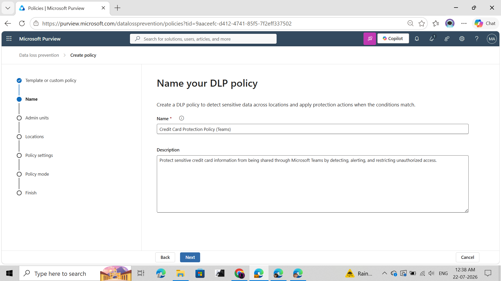

</p>

---

## Step 2 – Configure Protected Locations

The policy scope was configured to protect Microsoft Teams conversations.

### Selected Locations

- Microsoft Teams Chat and Channel Messages
- SharePoint Sites

> **Note**
>
> Microsoft Teams stores shared files in SharePoint or OneDrive depending on the conversation type. For this lab, Microsoft Teams chat message inspection was successfully validated.

<p align="center">

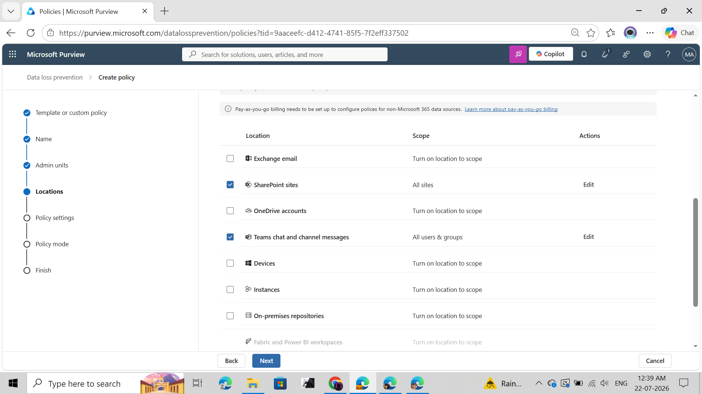

</p>

---

## Step 3 – Configure Detection Conditions

The DLP rule was configured to inspect Microsoft Teams conversations for sensitive payment card information.

### Detection Configuration

| Setting | Value |
|----------|-------|
| Sensitive Information Type | Credit Card Number |
| Confidence | High |
| Minimum Match Count | 1 |
| Detection Scope | Message or Attachment |

Whenever Microsoft Purview identifies at least one high-confidence credit card number, the configured protection actions are triggered.

<p align="center">

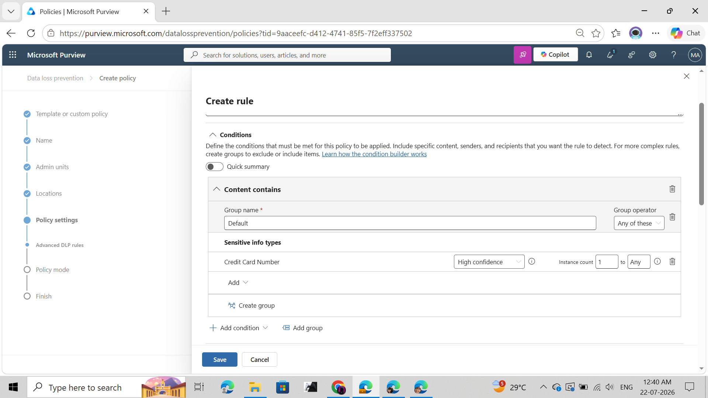

</p>

---

## Step 4 – Configure Protection Actions

The policy was configured to automatically protect detected sensitive information.

### Configured Actions

- Block message delivery
- Restrict access
- Generate administrator alerts
- Notify the end user
- Display Policy Tip

This ensures sensitive information is prevented from leaving Microsoft Teams while simultaneously notifying both users and security administrators.

<p align="center">

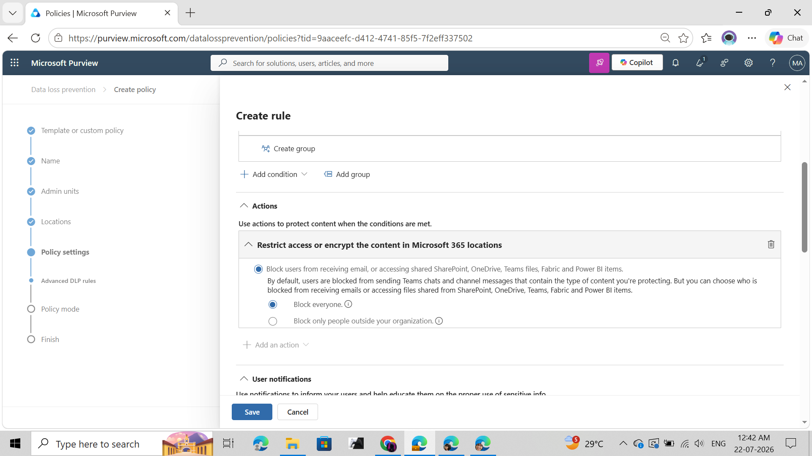

</p>

---

## Step 5 – Configure User Notifications

To improve user awareness and reduce accidental data leakage, Microsoft Purview Policy Tips were enabled.

### Notification Configuration

- User notification enabled
- Policy Tip enabled
- Custom policy message configured

**Custom Policy Tip**

> Credit card info sharing not allowed

This message provides immediate feedback to the user whenever sensitive information is detected.

<p align="center">

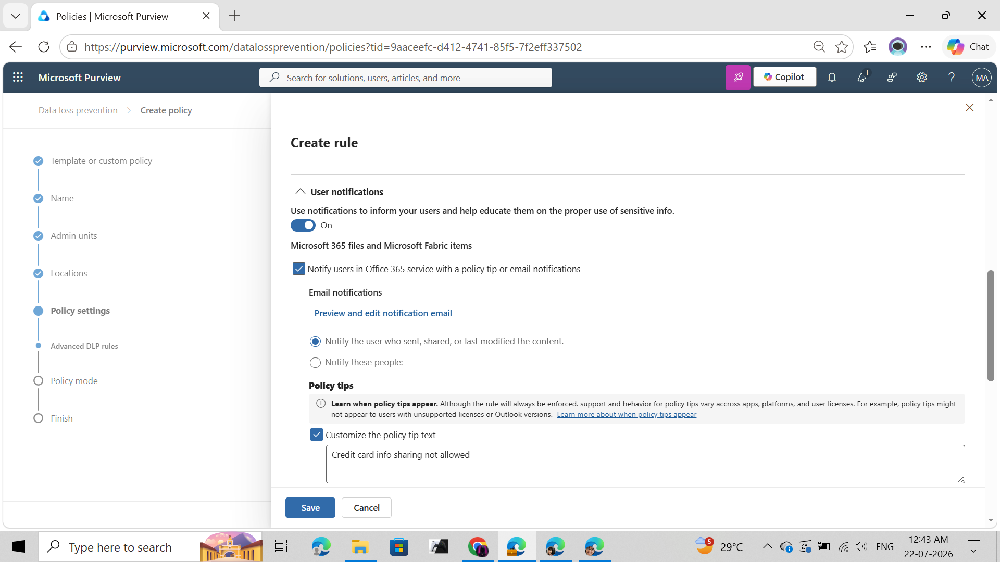

</p>

---

## Step 6 – Review Policy Configuration

Before publishing the policy, all configured settings were reviewed to verify:

- Detection conditions
- Protected workloads
- User notifications
- Restriction actions
- Alert generation

This validation step helps ensure the policy behaves as expected after deployment.

<p align="center">

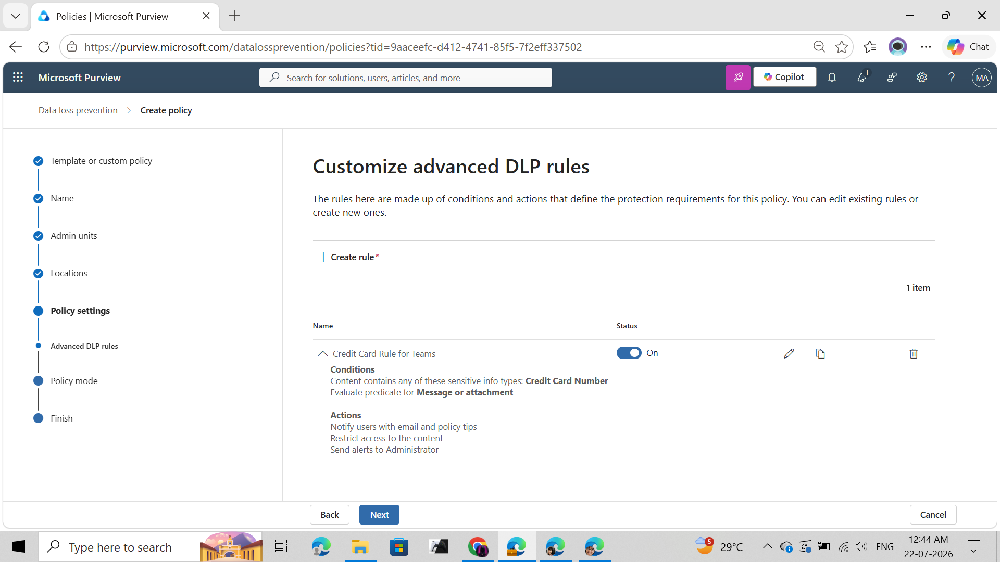

</p>

---

## Step 7 – Publish and Synchronize

The DLP policy was enabled and synchronized across the Microsoft 365 tenant.

After synchronization completed successfully, the policy became active and immediately started inspecting Microsoft Teams conversations.

<p align="center">

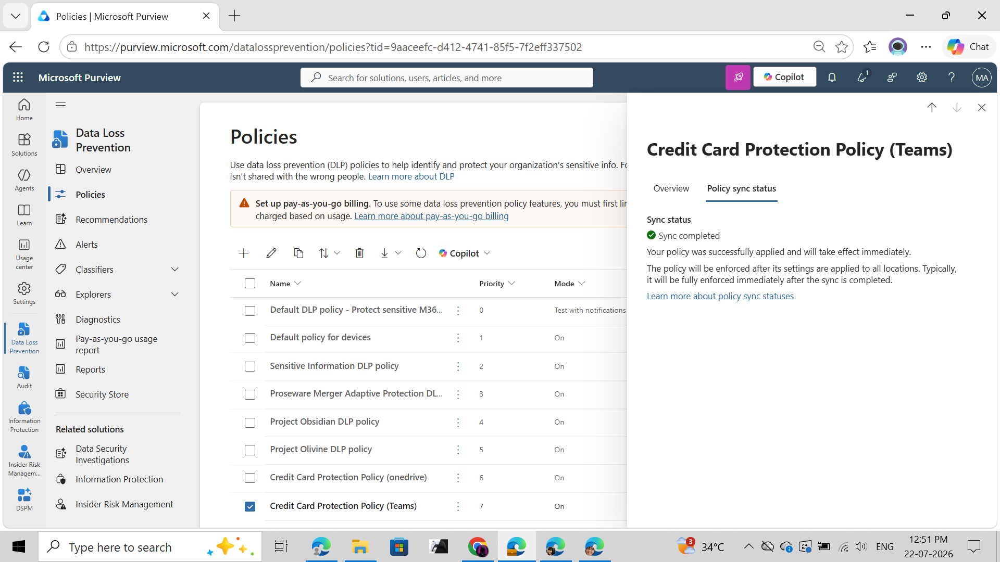

</p>

---

# Policy Validation

Once policy synchronization completed, Microsoft Teams was used to validate real-time DLP enforcement.

---

## Step 8 – Compose a Test Message

A Microsoft Teams 1:1 conversation was opened.

A sample credit card number was entered into the chat window to simulate accidental disclosure of sensitive payment information.

<p align="center">

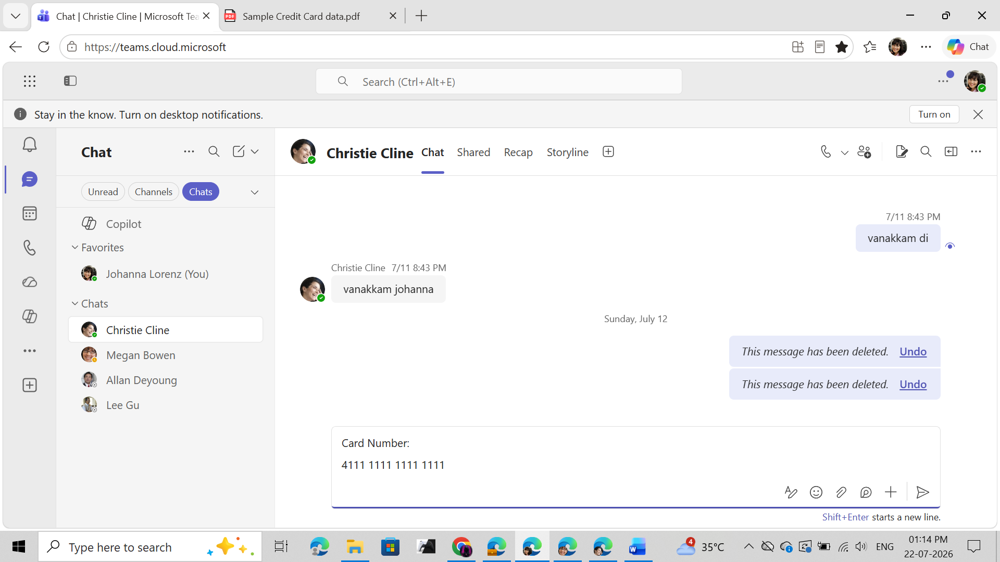

</p>

---

## Step 9 – Microsoft Purview Detection

As soon as the message was evaluated, Microsoft Purview identified the Credit Card Number sensitive information type.

The configured DLP policy immediately triggered protection actions according to the configured rule.

<p align="center">

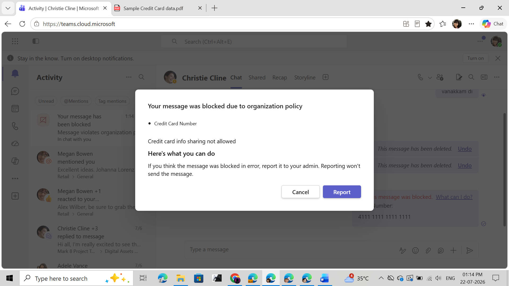

</p>

---

## Step 10 – Message Blocked

Microsoft Teams prevented the message from being delivered.

Instead of allowing the sensitive information to be shared, the user received an organization policy notification explaining why the message was blocked.

This demonstrates successful real-time enforcement of Microsoft Purview Data Loss Prevention.

<p align="center">

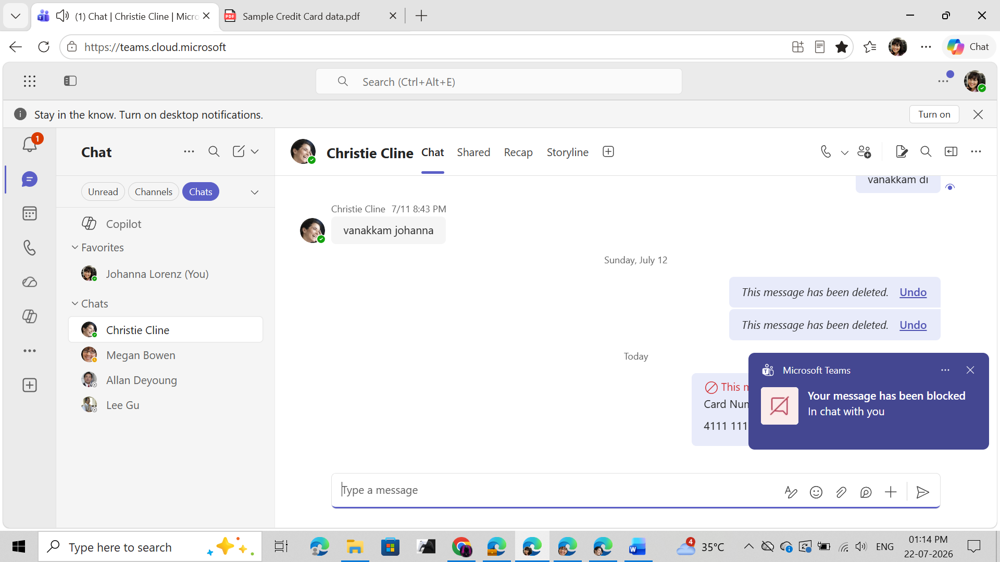

</p>

---

## Step 11 – User Experience

Following policy enforcement, Microsoft Teams displayed the blocked message indicator to the user.

The sender receives immediate feedback that organizational security policies prevented transmission of the sensitive information.

This improves security awareness while preventing accidental data exposure.

<p align="center">

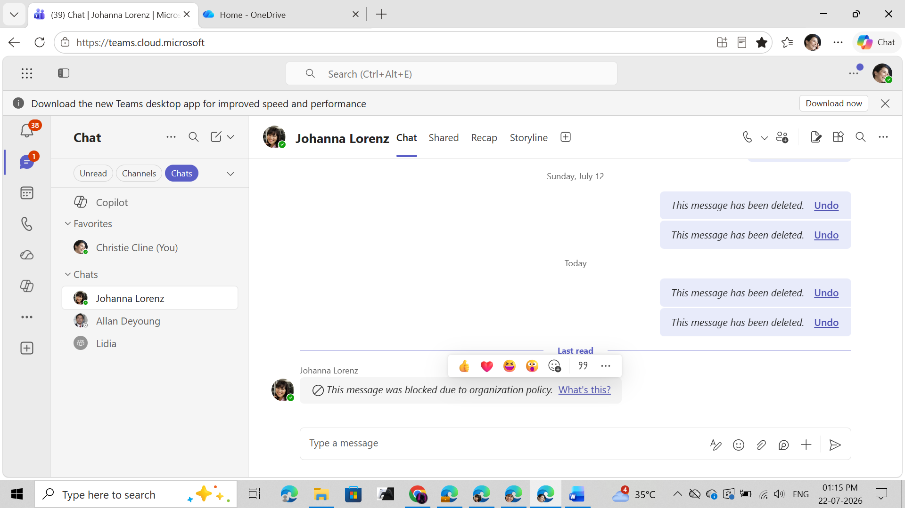

</p>

---

# Validation Summary

| Validation Test | Status |
|-----------------|--------|
| Policy Created | ✅ |
| Teams Location Enabled | ✅ |
| Sensitive Information Detected | ✅ |
| Policy Tip Displayed | ✅ |
| Message Blocked | ✅ |
| User Notification Displayed | ✅ |
| Alert Generated | ✅ |
| Activity Explorer Logged | ✅ |

---
# Security Investigation

Following policy enforcement, Microsoft Purview automatically generated a Data Loss Prevention alert. Security analysts can use this alert to investigate the incident, identify the affected user, review policy matches, and determine whether additional action is required.

---

## Step 12 – Alert Generation

After the policy blocked the Teams message, Microsoft Purview created a DLP alert within the Alerts portal.

The alert contains valuable information including:

- Alert Severity
- User
- Workload
- Policy Name
- Matched Rule
- Detection Time

This allows security teams to quickly identify potential data leakage attempts.

<p align="center">

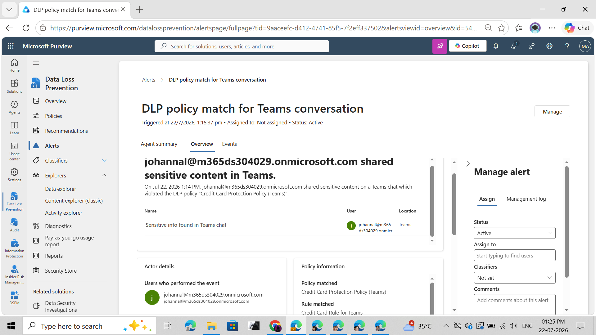

</p>

---

## Step 13 – Alert Investigation

Opening the alert provides detailed information regarding the policy violation.

The investigation page includes:

| Information | Description |
|-------------|-------------|
| User | User responsible for the activity |
| Workload | Microsoft Teams |
| Sensitive Information Type | Credit Card Number |
| Policy | Credit Card Protection Policy (Teams) |
| Rule | Credit Card Detection Rule |
| Activity | Teams Chat Message |
| Severity | Medium / High (Based on Policy) |

Security analysts can use these details to determine whether the activity was accidental or intentional.

<p align="center">

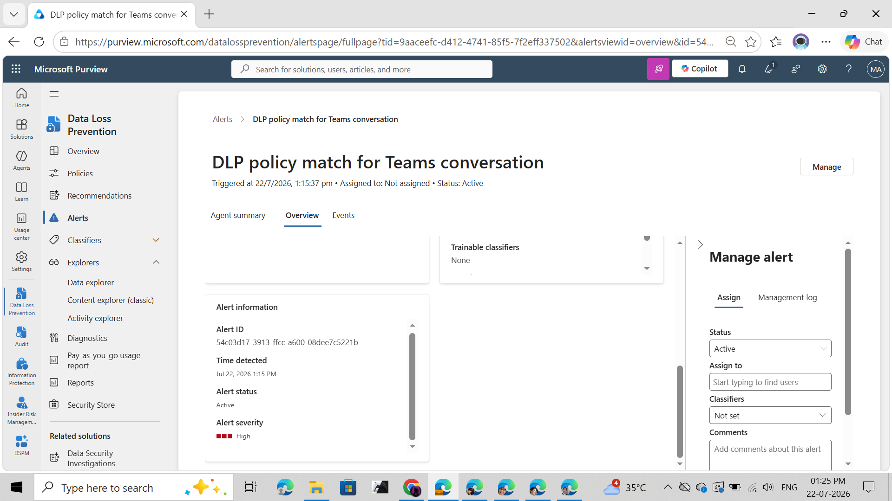

</p>

---

## Step 14 – Activity Explorer

Microsoft Purview Activity Explorer records all DLP events for investigation and auditing purposes.

The recorded event includes:

- User
- Activity
- Location
- Policy
- Rule
- Timestamp
- Sensitive Information Type
- Enforcement Action

Activity Explorer enables security teams to search historical events, identify trends, and perform incident investigations.

<p align="center">

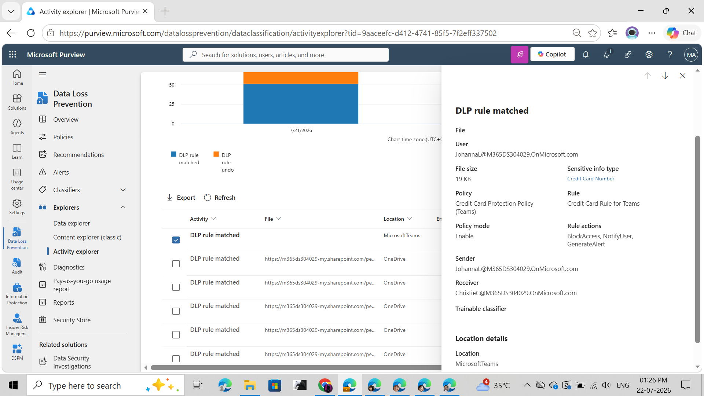

</p>

---

# End-to-End Security Workflow

```text
User Creates Teams Message
            │
            ▼
Microsoft Teams Chat
            │
            ▼
Microsoft Purview DLP Inspection
            │
            ▼
Credit Card Number Detected
            │
            ▼
Policy Evaluation
            │
 ┌──────────┼─────────────┐
 │          │             │
 ▼          ▼             ▼
Policy Tip  Message Blocked  Alert Generated
                             │
                             ▼
                    Activity Explorer
                             │
                             ▼
                    Security Investigation
```

---

# Results

| Validation | Result |
|------------|--------|
| DLP Policy Created | ✅ Successful |
| Microsoft Teams Protection Enabled | ✅ Successful |
| Credit Card Number Detection | ✅ Successful |
| Policy Tip Displayed | ✅ Successful |
| User Notification | ✅ Successful |
| Teams Message Blocked | ✅ Successful |
| Alert Generated | ✅ Successful |
| Alert Investigation | ✅ Successful |
| Activity Explorer Logging | ✅ Successful |

---

# Skills Demonstrated

Throughout this lab, the following Microsoft Purview DLP skills were demonstrated:

- Microsoft Purview Administration
- Data Loss Prevention (DLP)
- Microsoft Teams Protection
- Policy Creation
- Policy Publishing
- Sensitive Information Detection
- Rule Configuration
- User Notification Configuration
- Policy Tips
- Alert Generation
- Security Investigation
- Activity Explorer Analysis
- Incident Validation
- Microsoft 365 Security Administration

---

# Technologies Used

| Technology | Purpose |
|------------|----------|
| Microsoft Purview | Data Loss Prevention |
| Microsoft Teams | Collaboration Platform |
| Microsoft 365 E5 | Test Environment |
| Microsoft Defender Portal | Security Administration |
| Activity Explorer | Event Investigation |
| Microsoft Entra ID | Identity Management |

---

# Key Learnings

- Microsoft Purview can inspect Microsoft Teams chat messages for sensitive information.
- Sensitive Information Types enable accurate identification of regulated data such as payment card information.
- Policy Tips educate users before sensitive information is shared.
- User notifications improve security awareness while reducing accidental data leakage.
- Microsoft Purview automatically generates alerts for policy violations.
- Activity Explorer provides detailed visibility into DLP events for investigation and auditing.
- End-to-end testing validates both policy configuration and enforcement behavior across Microsoft 365 workloads.

---

# Conclusion

This lab demonstrated the implementation and validation of Microsoft Purview Data Loss Prevention (DLP) for Microsoft Teams chat messages.

A custom DLP policy was successfully configured to detect credit card information shared within Teams conversations. The policy automatically enforced organizational security controls by displaying policy tips, notifying the user, blocking the message, generating security alerts, and recording the event within Activity Explorer.

The end-to-end validation showcased the complete DLP lifecycle—from policy creation and deployment to enforcement, investigation, and auditing—reflecting how Microsoft Purview helps organizations protect sensitive information and maintain compliance across Microsoft 365 collaboration workloads.

---

# 👨‍💻 Author

**Dinesh Kumar**

Cybersecurity Engineer | Microsoft Purview | Microsoft 365 Security | Data Loss Prevention

---

<p align="center">

**⭐ If you found this project useful, consider starring the repository.**

</p>

