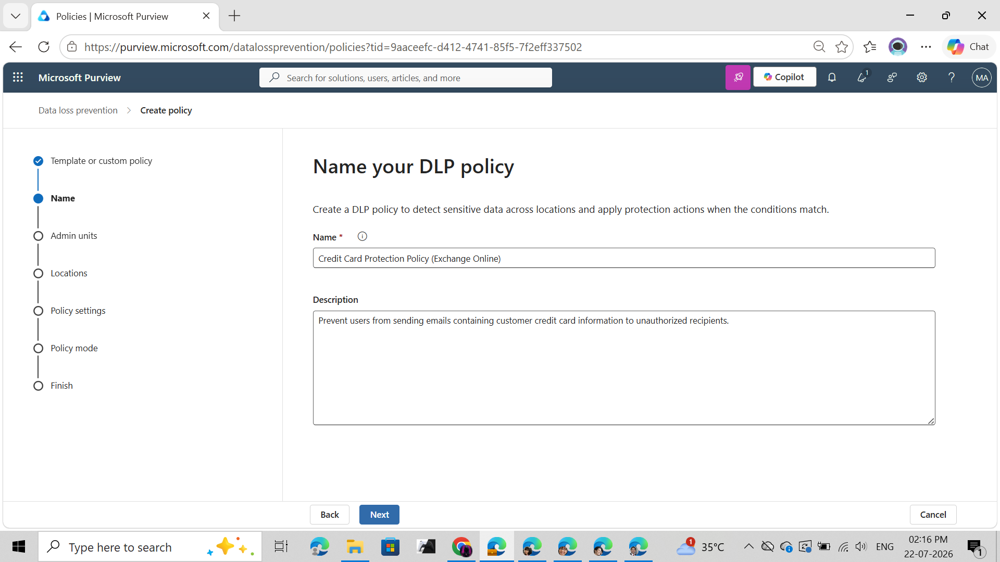
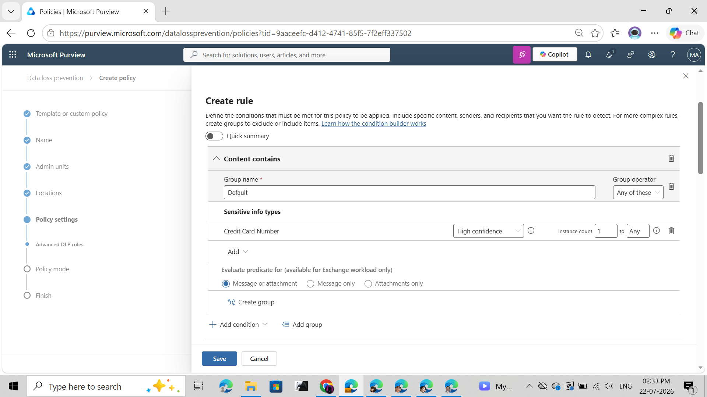
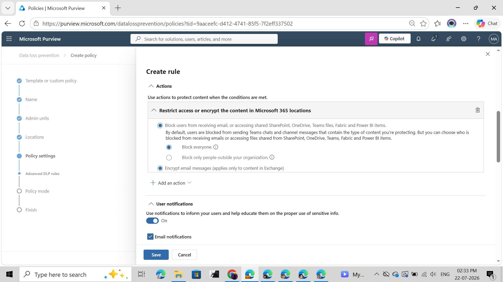
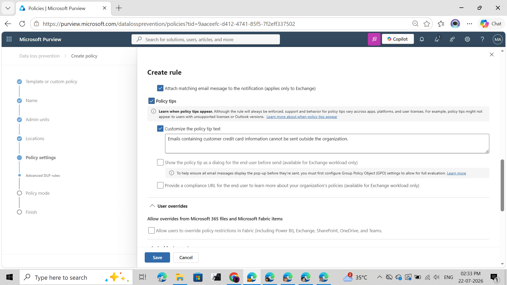
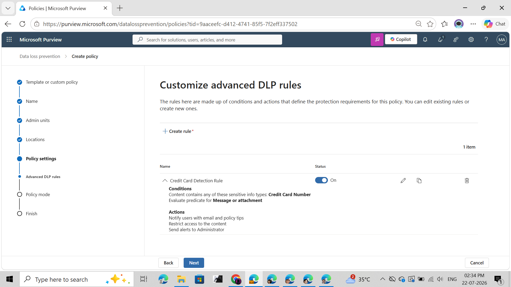
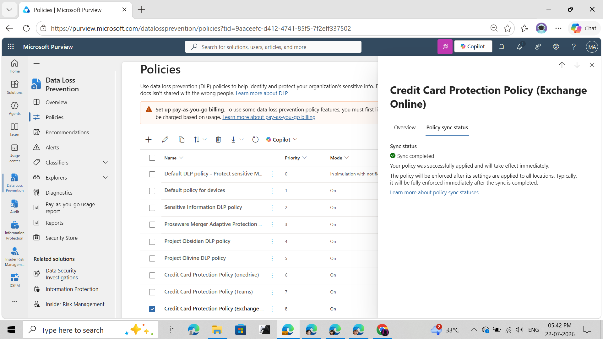
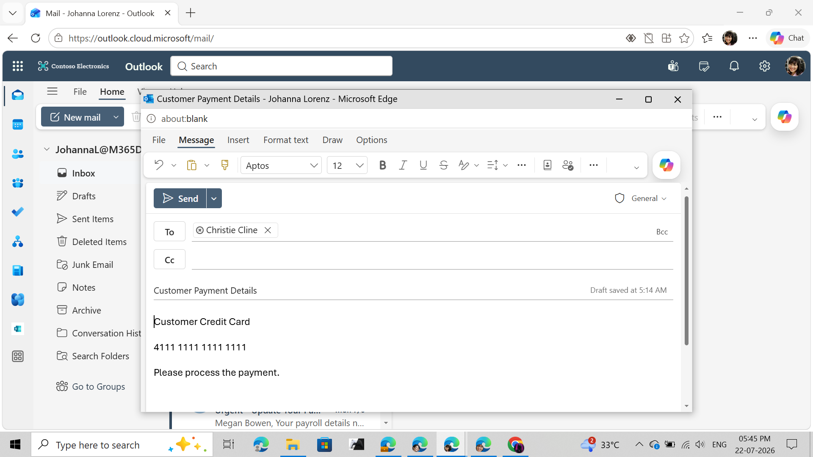
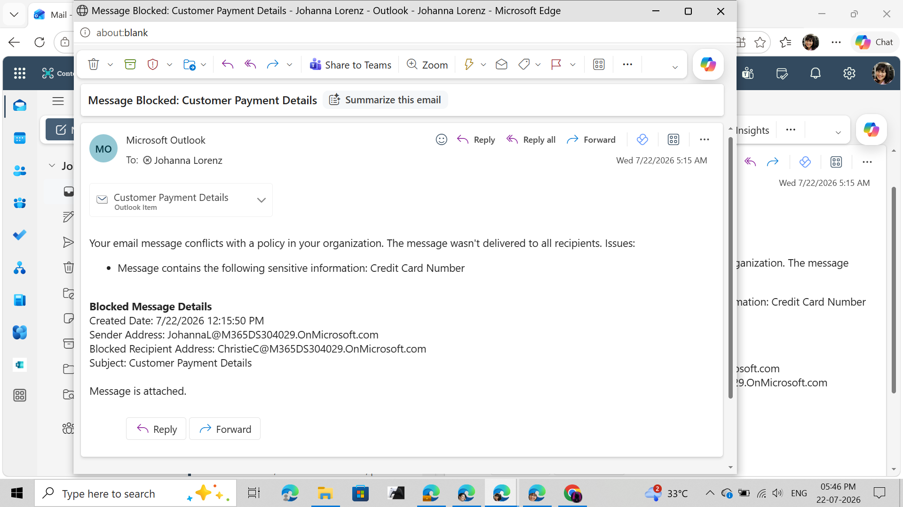
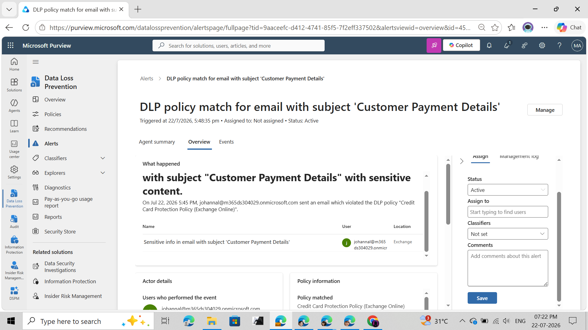
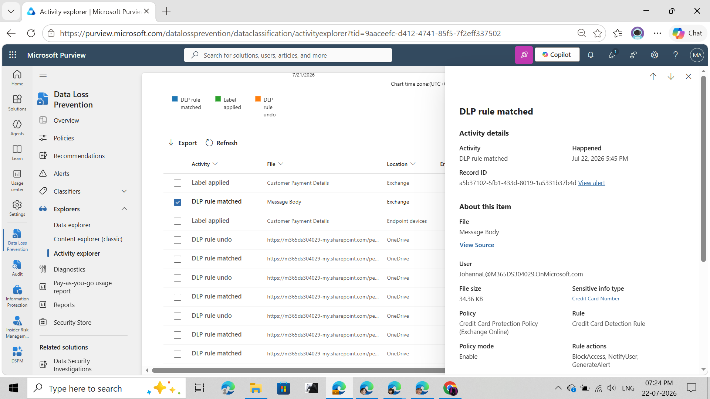

# 📧 Microsoft Purview DLP Lab 04 – Protecting Sensitive Credit Card Data in Exchange Online

<p align="center">


</p>

---

# 📑 Table of Contents

- [Overview](#overview)
- [Objectives](#objectives)
- [Business Scenario](#business-scenario)
- [Lab Environment](#lab-environment)
- [Solution Architecture](#solution-architecture)
- [Implementation Workflow](#implementation-workflow)
- [Policy Configuration](#policy-configuration)
- [Testing Procedure](#testing-procedure)
- [Investigation Workflow](#investigation-workflow)
- [Screenshots](#screenshots)
- [Key Skills Demonstrated](#key-skills-demonstrated)
- [Learning Outcome](#learning-outcome)

---

# Overview

This lab demonstrates the implementation of a **Microsoft Purview Data Loss Prevention (DLP)** policy for **Exchange Online**.

The objective is to prevent users from sending emails containing **Credit Card Numbers** by detecting sensitive information, blocking message delivery, notifying the sender, generating alerts, and logging all activities for security investigation.

The lab simulates a real-world enterprise scenario where organizations must prevent accidental or unauthorized disclosure of customer payment information through email.

---

# Objectives

✔ Configure a custom Microsoft Purview DLP Policy

✔ Protect Exchange Online email

✔ Detect Credit Card Numbers

✔ Block outbound email

✔ Notify end users

✔ Generate DLP Alerts

✔ Investigate events using Activity Explorer

✔ Validate policy enforcement

---

# Business Scenario

A financial services organization wants to prevent employees from accidentally emailing customer credit card information outside approved business processes.

Security requirements include:

- Detect Credit Card Numbers
- Block email delivery
- Notify the sender
- Generate security alerts
- Record all events for investigation
- Support compliance requirements such as PCI-DSS

Microsoft Purview DLP is used to enforce these controls automatically.

---

# Lab Environment

| Component | Configuration |
|------------|--------------|
| Solution | Microsoft Purview |
| Workload | Exchange Online |
| Sensitive Information Type | Credit Card Number |
| Confidence Level | High |
| Rule Action | Block Email |
| Notifications | Enabled |
| Alerts | Enabled |
| Investigation Tools | Activity Explorer, Alerts Dashboard |

---

# Solution Architecture

```

+-----------------------+
| Outlook Web App |
| Compose Email |
+----------+------------+
|
Contains Credit Card
|
v
+-----------------------+
| Microsoft Purview DLP |
| Exchange Policy |
+----------+------------+
|
Sensitive Information
Detected
|
+-------------+--------------+
| | |
v v v
Block Email Notify User Generate Alert
| | |
v v v
Activity Explorer Security Investigation

```

---

# Implementation Workflow

1. Create a custom DLP Policy

2. Configure Exchange Online as the protected location

3. Create a rule to detect Credit Card Numbers

4. Configure enforcement actions

5. Enable Policy Tips

6. Enable Email Notifications

7. Publish the policy

8. Wait for Policy Synchronization

9. Send a test email containing a Credit Card Number

10. Verify email blocking

11. Investigate generated alerts

12. Review Activity Explorer logs

---

# Policy Configuration

| Setting | Value |
|----------|-------|
| Policy Name | Credit Card Protection Policy (Exchange Online) |
| Workload | Exchange Online |
| Sensitive Information Type | Credit Card Number |
| Confidence | High |
| Minimum Matches | 1 |
| Evaluation | Message or Attachment |
| Action | Block Email |
| Notify User | Enabled |
| Policy Tips | Enabled |
| Generate Alert | Enabled |

---

# Testing Procedure

### Test Email

Subject

```

Customer Payment Details

```

Body

```

Customer Credit Card

4111 1111 1111 1111

Please process the payment.

```

Expected Result

✅ Email blocked

✅ Sender notified

✅ Alert generated

✅ Activity Explorer event logged

---

# Investigation Workflow

After the policy was triggered, Microsoft Purview automatically generated:

- DLP Alert
- Activity Explorer Event
- Policy Match
- Sensitive Information Detection
- Sender Information
- Policy Applied
- Rule Actions
- Timestamp
- Investigation Details

These artifacts allow security analysts to validate policy enforcement and investigate potential data loss incidents.

---

# Screenshots

## 1️⃣ Policy Creation



---

## 2️⃣ Configure Exchange Online Location


---

## 3️⃣ Configure Detection Conditions



---

## 4️⃣ Configure Enforcement Actions



---

## 5️⃣ Configure Policy Tips



---

## 6️⃣ Review Policy



---

## 7️⃣ Policy Synchronization Completed



---

## 8️⃣ Send Test Email



---

## 9️⃣ Email Blocked by Microsoft Purview



---

## 🔟 DLP Alert Generated



---

## 1️⃣1️⃣ Activity Explorer Investigation



---

# Key Skills Demonstrated

- Microsoft Purview Administration
- Data Loss Prevention (DLP)
- Exchange Online Security
- Sensitive Information Type Detection
- DLP Rule Configuration
- Policy Tips Configuration
- Email Protection
- Alert Investigation
- Activity Explorer Analysis
- Microsoft 365 Security Administration
- Incident Validation
- Security Monitoring

---

# Learning Outcome

Through this lab, I successfully implemented an end-to-end Microsoft Purview Data Loss Prevention solution for Exchange Online.

The implementation included configuring custom DLP rules, protecting sensitive customer payment information, enforcing email restrictions, notifying end users, generating security alerts, and validating policy execution using Microsoft Purview Activity Explorer.

This lab demonstrates practical experience in designing, deploying, testing, and investigating Microsoft Purview DLP policies within a Microsoft 365 environment, closely reflecting enterprise security operations.

---

<p align="center">
<b>Author</b><br>
Dinesh Kumar<br>
Microsoft Purview DLP | Microsoft 365 Security | Cybersecurity Portfolio
</p>
