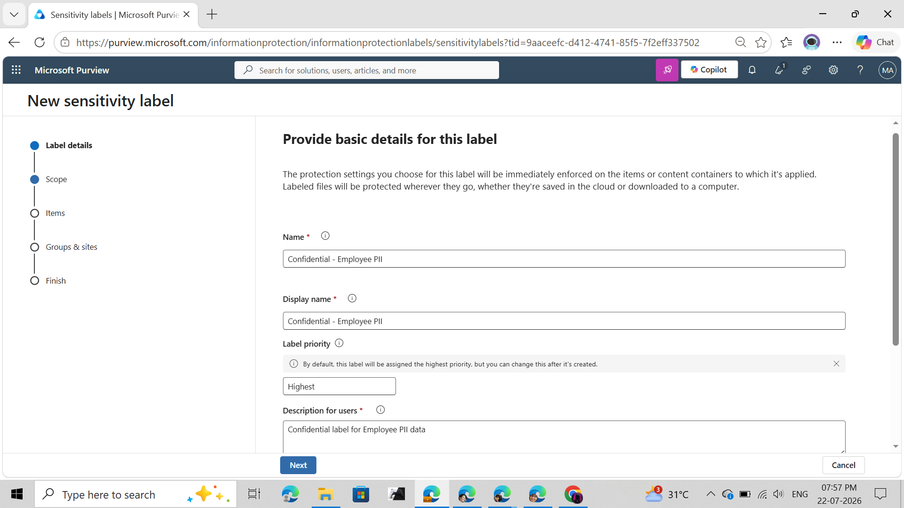
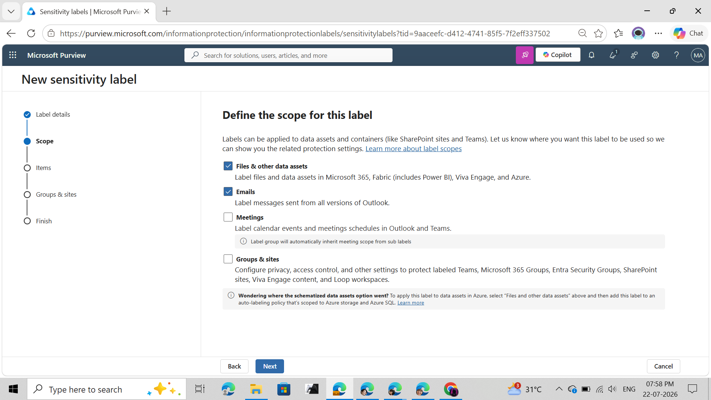
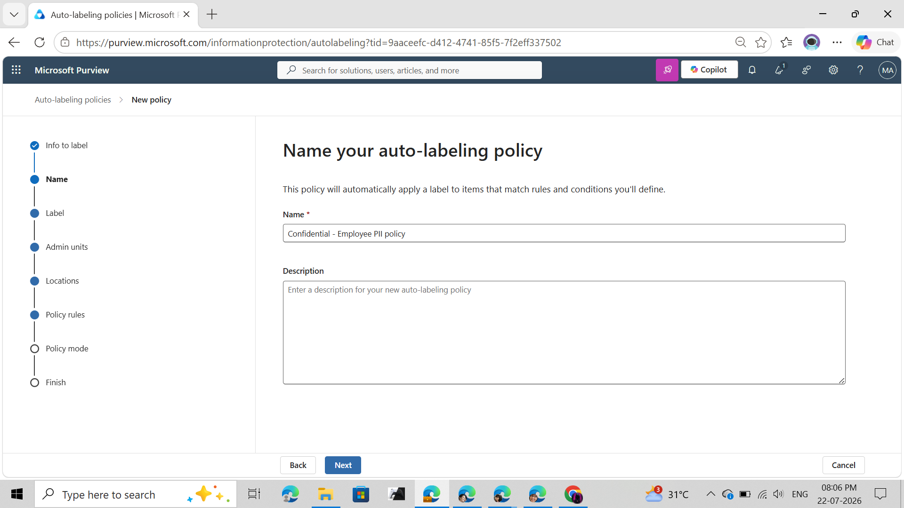
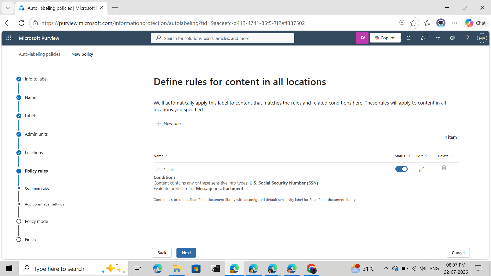
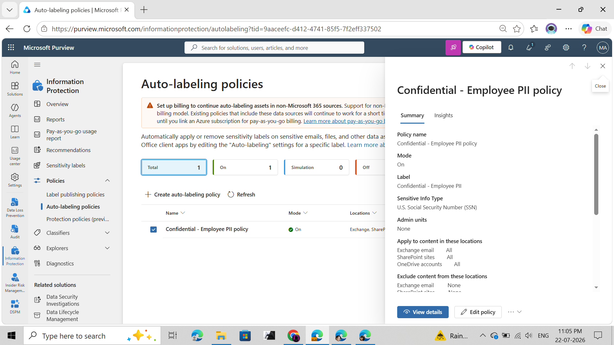
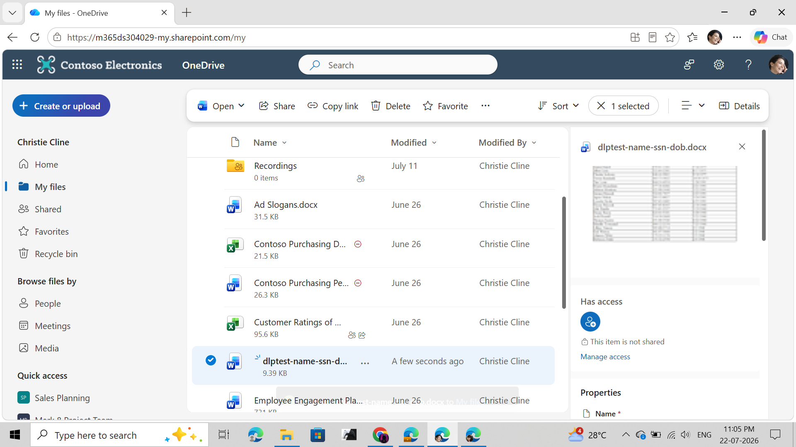
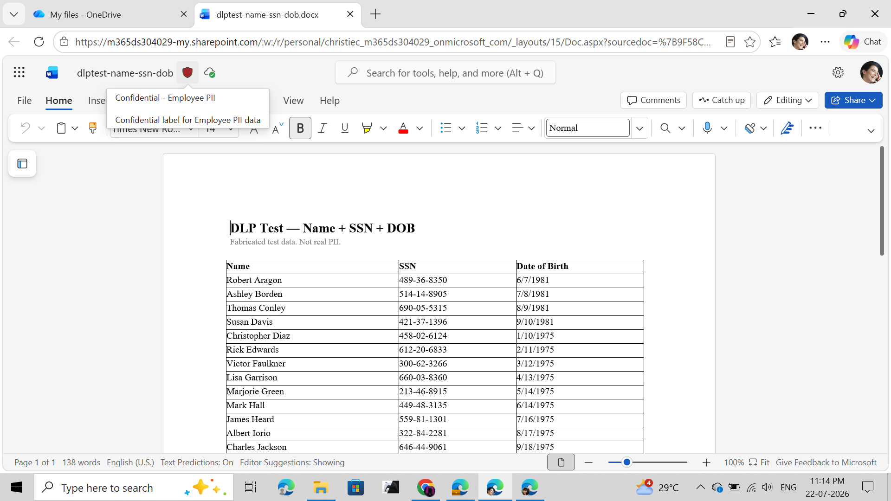
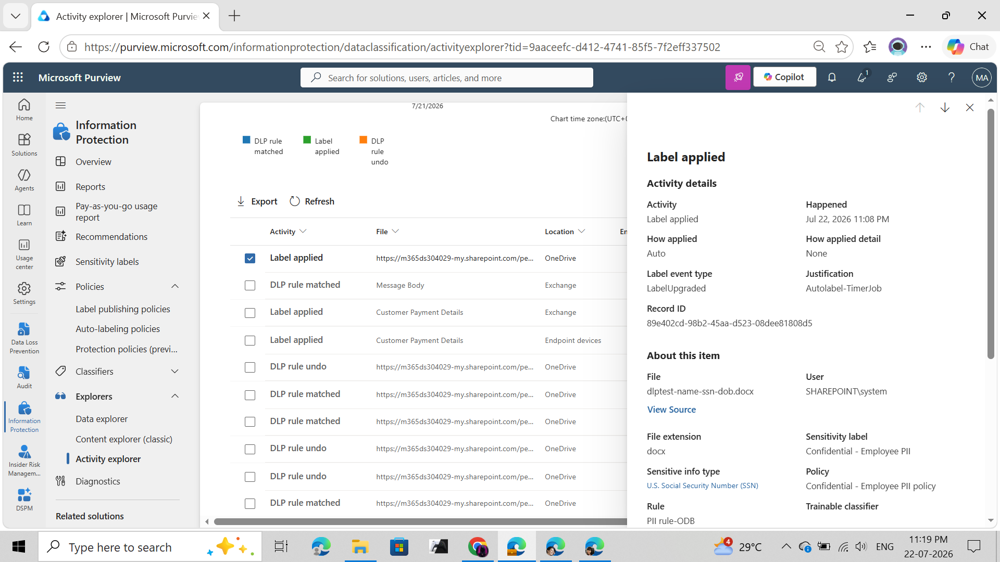
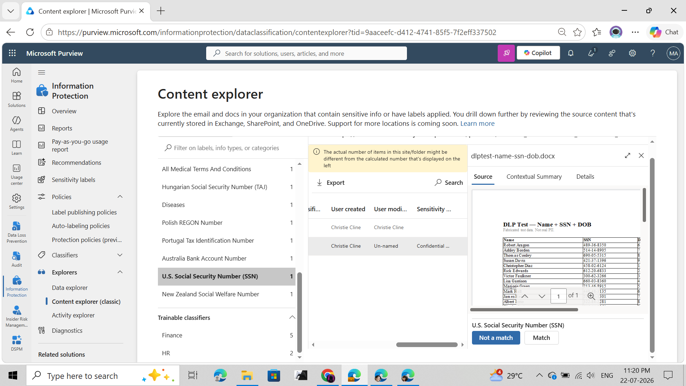

# Lab 05 - Microsoft Purview Auto-Labeling Policy for Employee PII

<p align="center">


</p>

---

# Table of Contents

- Overview
- Business Scenario
- Objectives
- Environment
- Architecture
- Workflow
- Lab Implementation
- Validation
- Results
- Skills Demonstrated
- Repository Structure
- Learning Outcomes

---

# Overview

This lab demonstrates how Microsoft Purview Information Protection automatically classifies and labels sensitive documents stored in Microsoft 365.

A sensitivity label containing Employee Personally Identifiable Information (PII) was created and published. An Auto-labeling Policy was configured to detect documents containing **U.S. Social Security Numbers (SSNs)** and automatically apply a **Confidential – Employee PII** sensitivity label.

The policy was validated using:

- Microsoft Purview Activity Explorer
- Microsoft Purview Content Explorer
- Microsoft OneDrive
- Microsoft Word Online

---

# Business Scenario

Human Resources stores employee onboarding documents inside Microsoft OneDrive and SharePoint.

These documents contain sensitive employee information including:

- Employee Name
- Social Security Number (SSN)
- Date of Birth

To ensure regulatory compliance and prevent accidental exposure, Microsoft Purview automatically classifies and labels these documents whenever sensitive information is detected.

---

# Objectives

- Create a Sensitivity Label
- Publish the label
- Configure an Auto-labeling Policy
- Detect U.S. Social Security Numbers
- Automatically apply Confidential labels
- Validate policy execution
- Investigate labeling events

---

# Environment

| Component | Value |
|-----------|-------|
| Platform | Microsoft Purview |
| Tenant | Microsoft CDX Demo Tenant |
| Storage | Microsoft OneDrive |
| Classification | U.S. Social Security Number (Built-in SIT) |
| Protection | Sensitivity Labels |
| Validation | Activity Explorer & Content Explorer |

---

# Architecture

```text
                        Employee uploads HR document
                                      │
                                      ▼
                          Microsoft OneDrive
                                      │
                                      ▼
                    Microsoft Purview Auto-labeling
                                      │
             Detects U.S. Social Security Numbers
                                      │
                                      ▼
                  Automatically applies Sensitivity Label
                                      │
                                      ▼
                  Confidential - Employee PII
                                      │
              ┌───────────────────────┴────────────────────────┐
              ▼                                                ▼
      Activity Explorer                              Content Explorer
      Audit & Investigation                    Classification Verification
```

---

# Workflow

```text
Create Sensitivity Label
          │
          ▼
Publish Label Policy
          │
          ▼
Create Auto-labeling Policy
          │
          ▼
Run Simulation
          │
          ▼
Enable Auto-labeling Policy
          │
          ▼
Upload Employee PII Document
          │
          ▼
Automatic Detection
          │
          ▼
Sensitivity Label Applied
          │
          ▼
Validate in Activity Explorer
          │
          ▼
Validate in Content Explorer
```

---

# Lab Implementation

## Step 1 — Create Sensitivity Label

Created a sensitivity label named:

> Confidential – Employee PII

Purpose:

Protect documents containing employee personally identifiable information.

Screenshot



---

## Step 2 — Configure Label Scope

Applied the label for:

- Files
- Emails

Screenshot



---

## Step 3 — Create Auto-labeling Policy

Configured an Auto-labeling Policy targeting:

- Exchange Online
- SharePoint Online
- OneDrive

Screenshot



---

## Step 4 — Configure Detection Rule

Configured Microsoft Purview to detect:

**Sensitive Information Type**

- U.S. Social Security Number (Built-in)

Configured Action

Automatically apply

**Confidential – Employee PII**

Screenshot



---

## Step 5 — Enable Auto-labeling Policy

After the simulation completed successfully, the policy was enabled for production.

Screenshot



---

## Step 6 — Upload Test Document

Uploaded a fabricated HR onboarding document containing:

- Employee Names
- Fake SSNs
- Dates of Birth

Location

Microsoft OneDrive

Screenshot



---

## Step 7 — Automatic Sensitivity Label Applied

Microsoft Purview automatically classified the uploaded document and applied the configured sensitivity label.

Applied Label

**Confidential – Employee PII**

Screenshot



---

## Step 8 — Activity Explorer Validation

Verified the policy execution using Microsoft Purview Activity Explorer.

Observed:

- Label Applied
- Auto-labeling Timer Job
- U.S. SSN detected
- Policy name recorded
- Sensitivity Label applied successfully

Screenshot



---

## Step 9 — Content Explorer Validation

Verified document classification inside Content Explorer.

Confirmed:

- U.S. Social Security Number detected
- Sensitivity Label assigned
- Source document identified

Screenshot



---

# Results

| Validation | Status |
|------------|--------|
| Sensitivity Label Created | ✅ |
| Label Published | ✅ |
| Auto-labeling Policy Created | ✅ |
| Policy Enabled | ✅ |
| Employee PII Detected | ✅ |
| Label Automatically Applied | ✅ |
| Activity Explorer Verified | ✅ |
| Content Explorer Verified | ✅ |

---

# Skills Demonstrated

- Microsoft Purview Information Protection
- Sensitivity Labels
- Label Publishing Policies
- Auto-labeling Policies
- Sensitive Information Types (SIT)
- Microsoft OneDrive Protection
- Microsoft 365 Compliance
- Information Classification
- Activity Explorer Investigation
- Content Explorer Investigation
- Data Protection
- Security Administration
---

# Learning Outcomes

Through this lab, I gained hands-on experience with Microsoft Purview Information Protection by designing and deploying an end-to-end Auto-labeling solution for sensitive employee data. I configured sensitivity labels, created publishing and auto-labeling policies, validated automatic classification using built-in Sensitive Information Types, and confirmed policy execution through Activity Explorer and Content Explorer. This exercise demonstrates practical knowledge of automated data classification, information protection, and compliance workflows commonly used in enterprise Microsoft 365 environments.

---

## Key Technologies

- Microsoft Purview
- Microsoft Information Protection
- Microsoft OneDrive
- Microsoft 365
- Sensitivity Labels
- Auto-labeling Policies
- U.S. Social Security Number SIT
- Activity Explorer
- Content Explorer
- Information Classification
- Data Loss Prevention (DLP)

---

# 👨‍💻 Author

**Dinesh Kumar**

Cybersecurity Engineer | Microsoft Purview | Microsoft 365 Security | Data Loss Prevention

---

<p align="center">

**⭐ If you found this project useful, consider starring the repository.**

</p>

