# Microsoft Purview DLP Lab 06
# Custom Sensitive Information Type (Patient Medical Record Number) with Enterprise DLP Protection

<p align="center">


</p>

---

# Project Overview

This lab demonstrates the complete lifecycle of designing, implementing, validating, and monitoring a **Custom Sensitive Information Type (SIT)** within **Microsoft Purview Data Loss Prevention (DLP)**.

Unlike Microsoft's built-in Sensitive Information Types, this implementation detects **organization-specific Medical Record Numbers (MRNs)** used by a fictional healthcare organization (**Contoso Regional Medical Center**) and automatically enforces enterprise DLP controls across Microsoft 365 workloads.

The solution protects confidential healthcare records stored or shared through:

- Exchange Online
- OneDrive for Business
- Microsoft Teams
- SharePoint Online

The implementation also demonstrates how Microsoft Purview generates alerts, records security events, and enables investigators to review policy matches through Activity Explorer and Content Explorer.

---

# Table of Contents

- Project Overview
- Business Scenario
- Solution Architecture
- Technologies Used
- Lab Objectives
- Creating the Custom Sensitive Information Type
- Creating the DLP Policy
- Policy Rule Configuration
- Testing the Policy
  - OneDrive
  - Exchange Online
  - Microsoft Teams
- Alert Investigation
- Activity Explorer
- Content Explorer
- Security Workflow
- Skills Demonstrated
- Key Takeaways

---

# Business Scenario

Contoso Regional Medical Center manages thousands of patient records every day.

Every patient receives an internal Medical Record Number (MRN) following the format:

```
MRN-01234567
```

These identifiers are proprietary and do not match any built-in Microsoft Sensitive Information Types.

Without a custom classifier, Microsoft Purview cannot recognize these records or prevent accidental disclosure.

To mitigate this risk, the security team creates:

- A Custom Sensitive Information Type
- A Microsoft Purview DLP Policy
- Automated protection across Microsoft 365 services

The objective is to prevent healthcare records from being unintentionally shared through collaboration platforms while enabling security administrators to investigate policy matches.

---

# Solution Architecture

```text
                         Contoso Regional Medical Center

                              Patient Registry
                                      │
                                      │
                                      ▼
                      Patient Registry Export (.docx)
                                      │
                                      ▼
                    Custom Sensitive Information Type
                  (Patient Medical Record Number - MRN)
                                      │
                                      ▼
                   Microsoft Purview Data Classification
                                      │
                                      ▼
                   Microsoft Purview DLP Policy Engine
                                      │
          ┌──────────────┬──────────────┬──────────────┐
          │              │              │              │
          ▼              ▼              ▼              ▼
     Exchange       OneDrive      SharePoint      Microsoft Teams
          │              │              │              │
          └──────────────┴──────────────┴──────────────┘
                                      │
                                      ▼
                          DLP Rule Evaluation
                                      │
                      Detect Custom Patient MRNs
                                      │
                                      ▼
                           Restrict Content Access
                                      │
                                      ▼
                        Generate Security Alert
                                      │
               ┌──────────────────────┴─────────────────────┐
               ▼                                            ▼
       Activity Explorer                          Content Explorer
               ▼                                            ▼
      Security Investigation               Sensitive Data Discovery
```

---

# Technologies Used

| Technology | Purpose |
|------------|---------|
| Microsoft Purview | Data Loss Prevention |
| Microsoft 365 E5 | Security & Compliance |
| Microsoft Exchange Online | Email Protection |
| OneDrive for Business | File Protection |
| Microsoft Teams | Collaboration Protection |
| SharePoint Online | Document Storage |
| Custom Sensitive Information Types | Custom Data Classification |
| Activity Explorer | Security Investigation |
| Content Explorer | Data Discovery |
| Microsoft Defender Portal | Security Monitoring |

---
# 🎯 Lab Objectives

The primary objective of this lab is to implement an enterprise-grade data classification solution capable of detecting proprietary healthcare identifiers that are not supported by Microsoft's built-in Sensitive Information Types.

The implementation demonstrates how Microsoft Purview can classify organization-specific data and enforce Data Loss Prevention (DLP) policies across Microsoft 365 services.

### Objectives Achieved

- Design a Custom Sensitive Information Type (SIT)
- Detect proprietary Medical Record Numbers (MRNs)
- Configure Regular Expression (Regex) based detection
- Improve detection accuracy using contextual healthcare keywords
- Create an enterprise DLP policy
- Protect Exchange Online
- Protect Microsoft Teams
- Protect OneDrive for Business
- Validate detections using Activity Explorer
- Validate classified content using Content Explorer
- Investigate generated DLP alerts

---

# 🏥 Custom Sensitive Information Type (SIT)

Microsoft Purview includes hundreds of built-in Sensitive Information Types for common data such as credit card numbers, passport numbers, and national identifiers.

However, enterprise organizations frequently store proprietary identifiers that are unique to their internal systems. These identifiers require custom classifiers before Microsoft Purview can recognize and protect them.

In this lab, a **Custom Sensitive Information Type** was created to identify **Hospital Medical Record Numbers (MRNs)** used by Contoso Regional Medical Center.

---

## Step 1 – Create Custom Sensitive Information Type

Navigate to:

```
Microsoft Purview Portal

↓

Information Protection

↓

Classifiers

↓

Sensitive Information Types

↓

Create Sensitive Information Type
```

A new Sensitive Information Type was created with the following properties:

| Property | Value |
|----------|-------|
| Name | Patient Medical Record Number (MRN) |
| Description | Detect proprietary hospital Medical Record Numbers used by Contoso Regional Medical Center |
| Confidence Level | High |
| Primary Element | Regular Expression |
| Supporting Elements | Healthcare Keywords |

---

### Create Custom Sensitive Information Type

<p align="center">
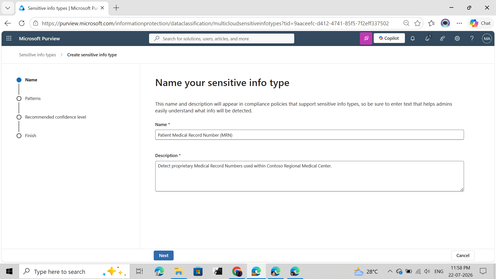
</p>

*Figure 1 – Creating the Custom Sensitive Information Type.*

---

## Step 2 – Configure Healthcare Keyword List

To reduce false positives, contextual healthcare keywords were added as supporting elements.

Rather than relying solely on a Regular Expression, Microsoft Purview validates that the detected Medical Record Number appears alongside healthcare-specific terminology.

### Configured Keywords

- Medical Record No.
- Patient Name
- Date of Birth
- ICD-10 Code
- CPT Code
- Attending Physician
- Hospital Code
- Department
- Patient Registry

This approach significantly increases detection confidence while minimizing accidental matches.

---

### Configure Supporting Keywords

<p align="center">
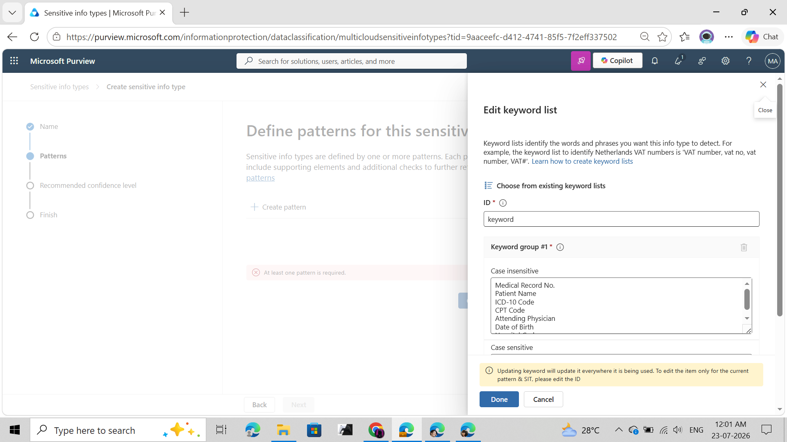
</p>

*Figure 2 – Configuring healthcare contextual keywords.*

---

## Step 3 – Configure Regular Expression

The primary detection logic was implemented using a Regular Expression capable of identifying proprietary Medical Record Numbers.

### Regular Expression

```regex
MRN-[0-9]{8}
```

### Example Matches

```
MRN-01200951

MRN-38840815

MRN-77286921
```

The expression detects the literal prefix **MRN-** followed by exactly eight numeric digits.

This format mirrors the organization's internal patient identifier standard.

---

### Configure Regular Expression

<p align="center">
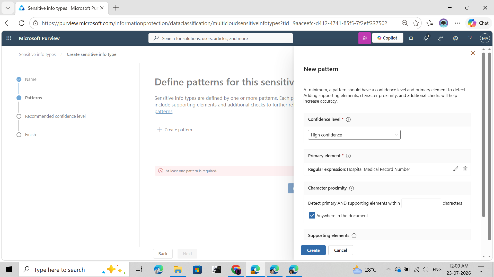
</p>

*Figure 3 – Configuring the Regular Expression used for Medical Record Number detection.*

---

## Step 4 – Configure Detection Logic

Microsoft Purview allows multiple detection elements to be combined into a single pattern.

For this implementation, detection requires:

- Medical Record Number Regular Expression
- Healthcare keyword match
- Character proximity validation
- High confidence evaluation

### Detection Logic

```
Primary Element
        │
        ▼
MRN-[0-9]{8}

        +

Supporting Keywords

        +

300 Character Proximity

        ▼

High Confidence Match
```

This design prevents random text containing an MRN-like pattern from being incorrectly classified as sensitive healthcare data.

---

### Review Detection Pattern

<p align="center">
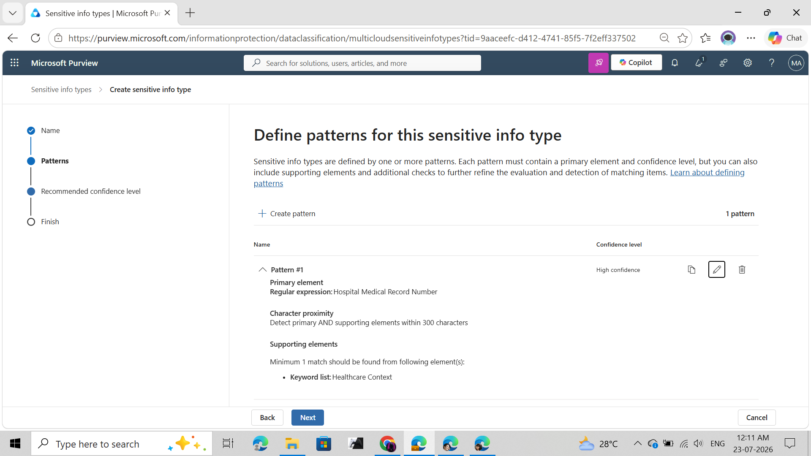
</p>

*Figure 4 – Reviewing the completed Custom Sensitive Information Type before deployment.*

---

## Why Contextual Detection Matters

A simple Regular Expression can identify text matching a specific pattern, but it cannot determine whether the detected value actually represents sensitive business information.

For example:

```
MRN-12345678
```

could appear in test data or documentation.

By combining the Regular Expression with healthcare-specific keywords such as **Medical Record No.**, **Patient Name**, and **ICD-10 Code**, Microsoft Purview classifies only genuine medical records with a much higher level of confidence.

This layered detection approach reflects enterprise best practices for reducing false positives while maintaining effective protection of sensitive information.

---
# 🧪 Testing the Custom Sensitive Information Type

Before using the Custom Sensitive Information Type (SIT) in a production Data Loss Prevention (DLP) policy, Microsoft Purview provides a testing feature to validate the detection logic.

This validation step ensures that the configured Regular Expression, contextual healthcare keywords, and confidence level accurately identify proprietary Medical Record Numbers (MRNs) while minimizing false positives.

For testing, the sample document **Contoso_Regional_Medical_Center_Patient_Registry_Export.docx** containing multiple patient records was uploaded.

Microsoft Purview successfully detected the proprietary Medical Record Numbers using the configured detection pattern.

---

## Test Document

**Filename**

```
Contoso_Regional_Medical_Center_Patient_Registry_Export.docx
```

**Document Contents**

- Patient Names
- Medical Record Numbers (MRNs)
- Date of Birth
- ICD-10 Diagnosis Codes
- CPT Procedure Codes
- Contact Numbers
- Attending Physicians

---

### Validate Custom Sensitive Information Type

<p align="center">
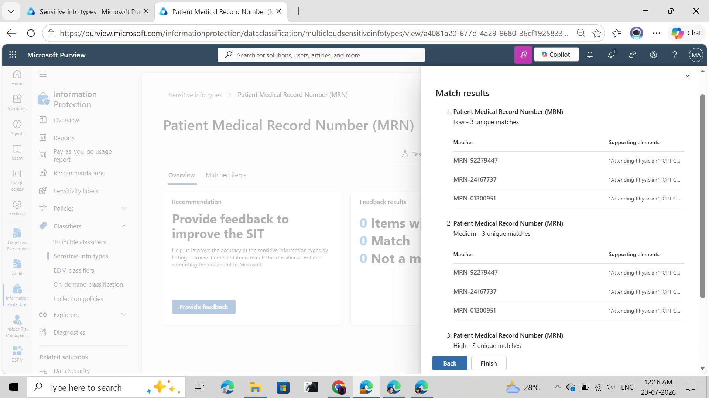
</p>

*Figure 5 – Testing the Custom Sensitive Information Type against a healthcare patient registry document.*

---

## Detection Results

Microsoft Purview successfully identified:

- Proprietary Medical Record Numbers
- Regular Expression matches
- Healthcare contextual keywords
- High-confidence pattern matches

The successful validation confirmed that the classifier was ready to be integrated into a Data Loss Prevention policy.

---

# 🔐 Creating the Data Loss Prevention Policy

After validating the Custom Sensitive Information Type, a Microsoft Purview Data Loss Prevention policy was created to protect healthcare records across Microsoft 365 services.

The policy uses the newly created **Patient Medical Record Number (MRN)** Sensitive Information Type as its detection condition.

---

## Policy Configuration

| Setting | Value |
|----------|-------|
| Policy Name | Protect Hospital Medical Records |
| Policy Type | Custom |
| Sensitive Information Type | Patient Medical Record Number (MRN) |
| Enforcement Mode | Enabled |
| Priority | Standard |

---

## Protected Locations

The policy was configured to inspect content across the following Microsoft 365 workloads:

- Exchange Online
- OneDrive for Business
- SharePoint Online
- Microsoft Teams Chat & Channels

This ensures that patient records remain protected regardless of how users attempt to store or share the document.

---

### Create DLP Policy

<p align="center">
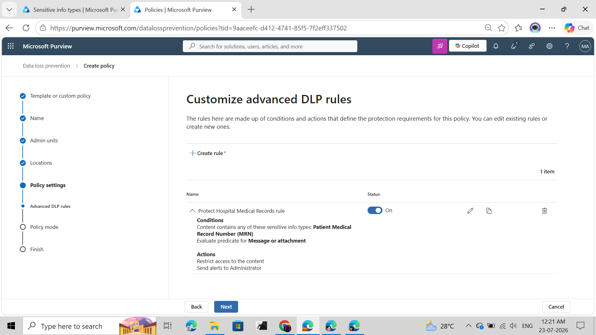
</p>

*Figure 6 – Creating the Microsoft Purview Data Loss Prevention policy.*

---

# 📋 Configure DLP Rule

The DLP rule was configured to trigger whenever Microsoft Purview detects the Custom Sensitive Information Type.

## Detection Condition

```
Content contains

↓

Patient Medical Record Number (MRN)
```

---

## Configured Actions

The policy was configured to:

- Detect proprietary Medical Record Numbers
- Restrict unauthorized sharing
- Generate administrator alerts
- Record policy matches for investigation
- Log all enforcement events within Microsoft Purview

These actions provide both preventative protection and visibility into attempted policy violations.

---

## DLP Rule Logic

```text
Patient Registry Document
            │
            ▼
Contains Custom Sensitive Information Type
            │
            ▼
Evaluate DLP Rule
            │
            ▼
Generate Policy Match
            │
            ▼
Take Configured Action
            │
     ┌──────┴──────────────┐
     ▼                     ▼
Block Sharing      Generate Alert
```

---

### Review DLP Policy

<p align="center">
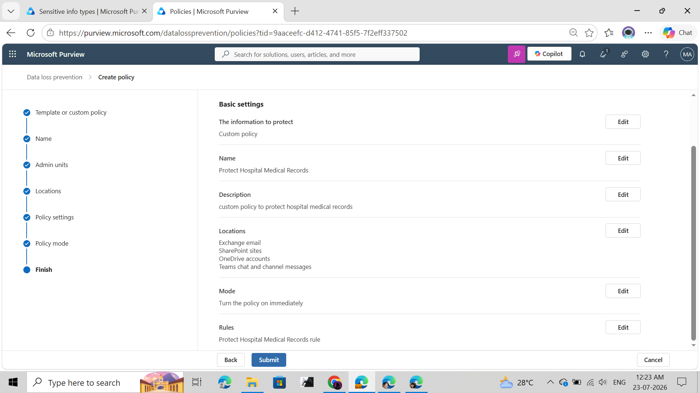
</p>

*Figure 7 – Reviewing the completed Data Loss Prevention policy before deployment.*

---

# 🚀 Deploy the Policy

Once the policy configuration was completed, Microsoft Purview synchronized the policy across all configured Microsoft 365 workloads.

After synchronization completed successfully, the policy became active and began inspecting content shared through:

- Exchange Online
- Microsoft Teams
- OneDrive for Business
- SharePoint Online

Policy synchronization is required before enforcement begins, ensuring consistent protection across the Microsoft 365 environment.

---

### Policy Synchronization Completed

<p align="center">
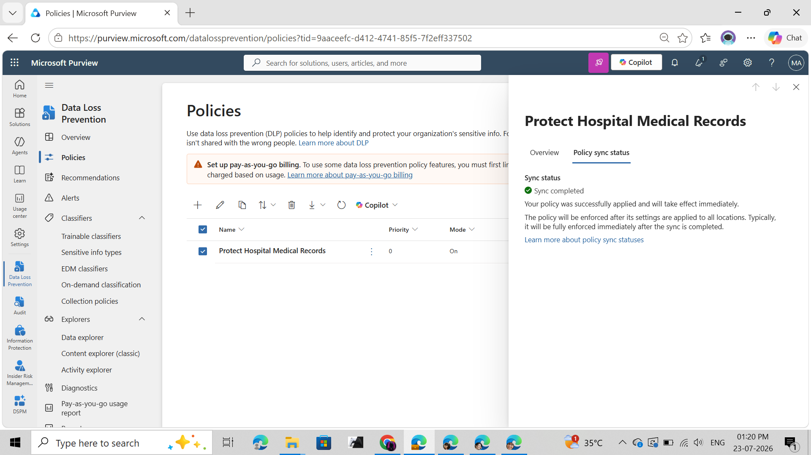
</p>

*Figure 8 – Microsoft Purview successfully synchronized the DLP policy across Microsoft 365 services.*

---

## Deployment Summary

| Component | Status |
|-----------|:------:|
| Custom Sensitive Information Type | ✅ |
| Regular Expression | ✅ |
| Healthcare Keyword Detection | ✅ |
| Pattern Validation | ✅ |
| DLP Policy Created | ✅ |
| DLP Rule Configured | ✅ |
| Policy Synchronized | ✅ |
| Ready for Enforcement | ✅ |

---

At this stage, the environment was fully configured and ready for end-to-end validation. The next phase focuses on verifying policy enforcement by attempting to share sensitive healthcare records through OneDrive, Exchange Online, and Microsoft Teams.
# ✅ End-to-End Policy Validation

After deploying the Data Loss Prevention (DLP) policy, a series of validation tests were performed to confirm that Microsoft Purview correctly enforced protection across Microsoft 365 workloads.

The same patient registry document containing proprietary Medical Record Numbers (MRNs) was used throughout each validation scenario.

The objective was to verify that Microsoft Purview consistently detected the Custom Sensitive Information Type and enforced the configured security actions regardless of where the document was shared.

---

# 📂 Validation Scenario 1 – OneDrive for Business

The patient registry document was uploaded to OneDrive for Business.

During the upload, Microsoft Purview automatically scanned the file, identified the proprietary Medical Record Numbers using the Custom Sensitive Information Type, and evaluated the content against the configured Data Loss Prevention policy.

Although the upload was permitted, the document was successfully classified, monitored, and recorded for investigation.

This demonstrates Microsoft's ability to continuously inspect content stored within Microsoft 365 while maintaining visibility into sensitive organizational data.

---

### Upload Patient Registry Document

<p align="center">
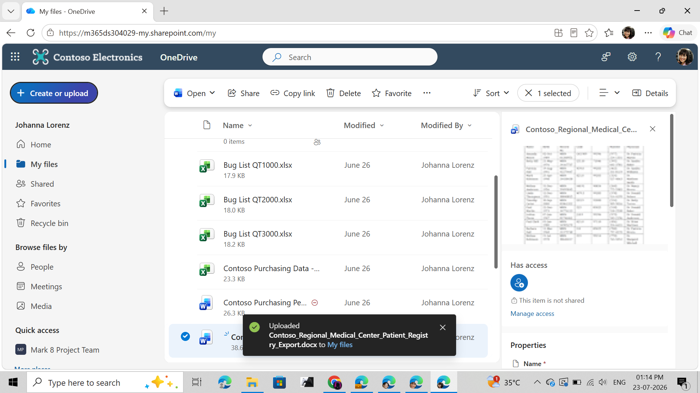
</p>

*Figure 9 – Uploading the patient registry document to OneDrive for Business.*

---

## Expected Outcome

✔ Document uploaded successfully

✔ Custom Sensitive Information Type detected

✔ DLP policy evaluated

✔ Security event recorded

✔ Alert generated for administrators

---

# 📧 Validation Scenario 2 – Exchange Online Protection

The same patient registry document was attached to an email and sent through Exchange Online.

Before the message could be delivered, Microsoft Purview inspected the attachment and detected multiple instances of the Custom Sensitive Information Type.

Because the document contained proprietary Medical Record Numbers, the configured DLP policy prevented the email from being transmitted.

This validation demonstrates Microsoft's ability to prevent accidental disclosure of sensitive healthcare information through corporate email.

---

### Attempt to Send Protected Document

<p align="center">
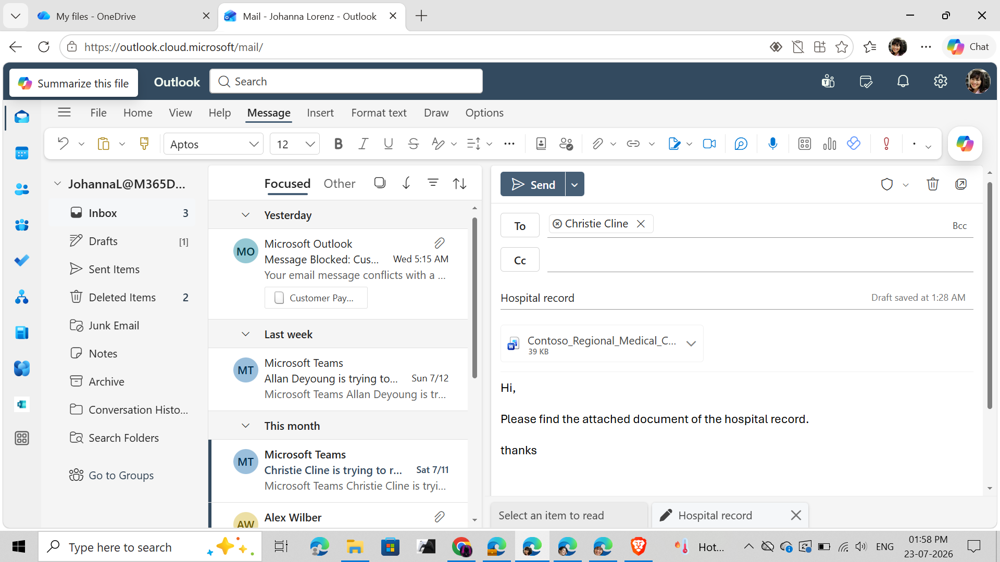
</p>

*Figure 10 – Attempting to send the protected patient registry document via Exchange Online.*

---

### Email Blocked by Microsoft Purview

<p align="center">
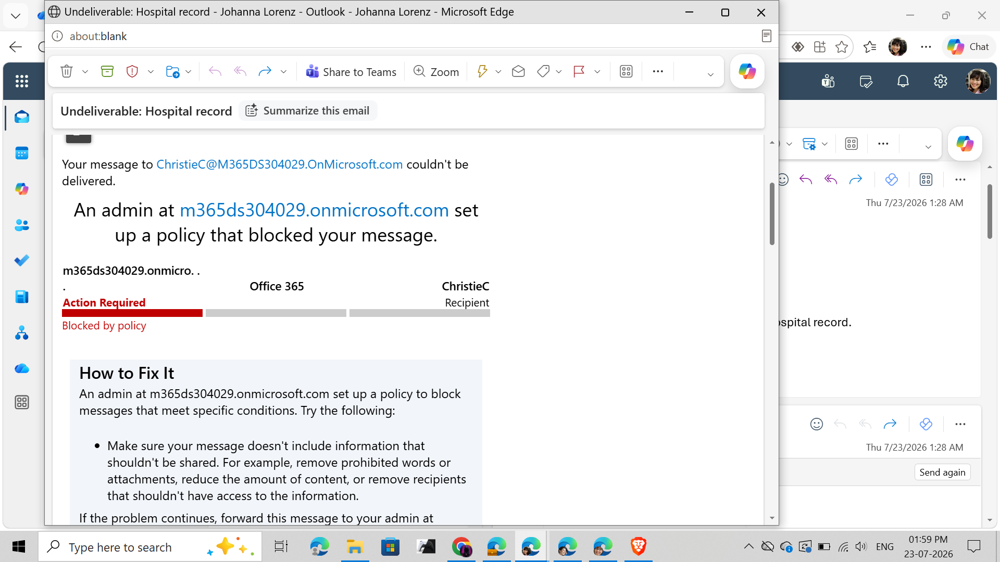
</p>

*Figure 11 – Microsoft Purview blocking the email because sensitive healthcare information was detected.*

---

### DLP Alert Generated

<p align="center">
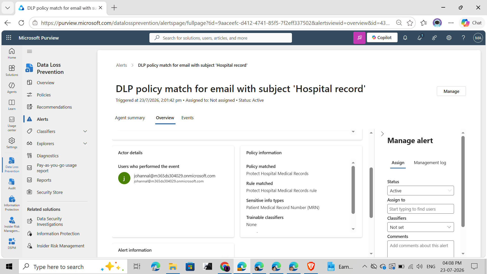
</p>

*Figure 12 – Security alert generated after the Exchange Online DLP policy was triggered.*

---

## Expected Outcome

✔ Email inspection completed

✔ Custom Sensitive Information Type detected

✔ Policy matched

✔ Email blocked

✔ DLP alert generated

✔ Incident available for investigation

---

# 💬 Validation Scenario 3 – Microsoft Teams Protection

To validate protection within collaboration services, the patient registry document was shared through Microsoft Teams.

Microsoft Purview inspected the uploaded document before allowing it to be shared with other users.

Because the document contained proprietary Medical Record Numbers, the configured DLP policy identified the sensitive content and prevented unauthorized sharing.

This demonstrates how Microsoft Purview extends data protection beyond email into modern collaboration platforms.

---

### Share Protected Document in Microsoft Teams

<p align="center">
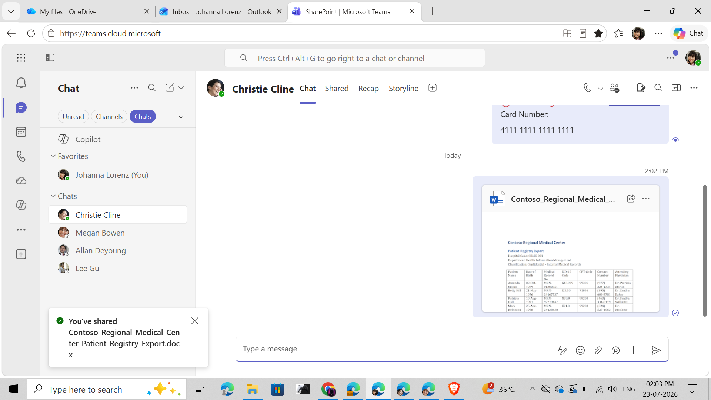
</p>

*Figure 13 – Sharing the protected patient registry document through Microsoft Teams.*

---

### Recipient Experience

When another user attempted to access the shared document, Microsoft Teams displayed a policy restriction instead of granting access.

The recipient was informed that the content could not be shared because it violated the organization's Data Loss Prevention policy.

---

### Recipient View

<p align="center">
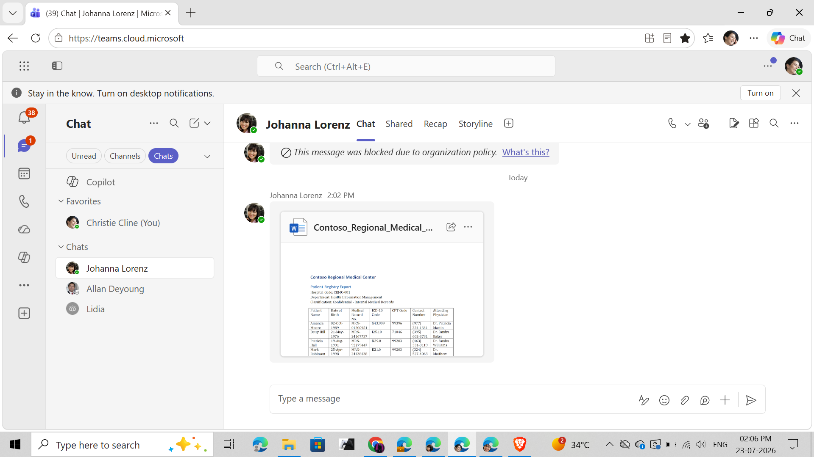
</p>

*Figure 14 – Recipient experience after Microsoft Purview enforced the DLP policy.*

---

### Sharing Blocked

<p align="center">
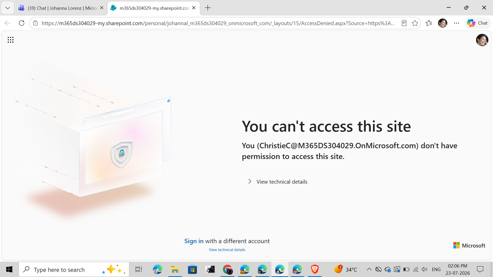
</p>

*Figure 15 – Microsoft Teams blocking document sharing after detecting proprietary healthcare information.*

---

### Teams DLP Alert

<p align="center">
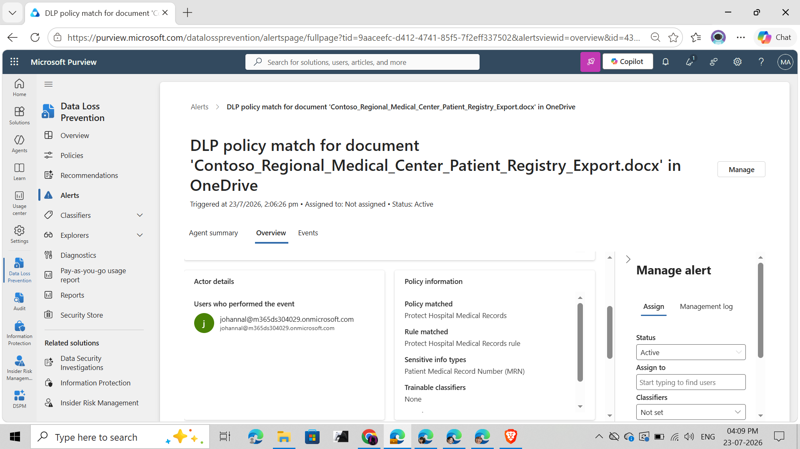
</p>

*Figure 16 – Security alert generated after the Microsoft Teams DLP policy was triggered.*

---

## Expected Outcome

✔ Custom Sensitive Information Type detected

✔ Sharing attempt inspected

✔ Policy matched

✔ Access restricted

✔ Teams sharing blocked

✔ Security alert generated

---

# 📊 Validation Summary

| Microsoft 365 Workload | Detection | Policy Match | Enforcement | Alert Generated |
|-------------------------|:---------:|:------------:|:-----------:|:---------------:|
| OneDrive for Business | ✅ | ✅ | Monitoring | ✅ |
| Exchange Online | ✅ | ✅ | Email Blocked | ✅ |
| Microsoft Teams | ✅ | ✅ | Sharing Blocked | ✅ |

---

## Key Validation Results

The end-to-end testing confirmed that the Custom Sensitive Information Type was successfully recognized across multiple Microsoft 365 services.

The configured Data Loss Prevention policy consistently enforced organizational security controls by:

- Detecting proprietary Medical Record Numbers
- Evaluating content against enterprise DLP rules
- Preventing unauthorized disclosure
- Generating administrator alerts
- Recording security events for investigation

These validation scenarios demonstrate how Microsoft Purview provides centralized protection for sensitive healthcare information across collaboration, storage, and communication services.
# 🔍 Security Investigation

Creating a Data Loss Prevention (DLP) policy is only one aspect of enterprise data protection. Equally important is the ability to investigate policy matches, validate detections, and analyze user activities after a security event occurs.

Microsoft Purview provides several investigation tools that enable security teams to understand:

- Which policy was triggered
- Which rule matched
- What sensitive information was detected
- Who performed the action
- Which Microsoft 365 workload was involved
- What enforcement action was taken

In this lab, the generated DLP events were investigated using **Activity Explorer**, **Content Explorer**, and **Microsoft Purview Alerts**.

---

# 📈 Activity Explorer Investigation

Activity Explorer provides a centralized timeline of Microsoft Purview activities and records every Data Loss Prevention event across Microsoft 365 workloads.

After triggering the DLP policy, Activity Explorer was used to validate that the custom policy had executed successfully.

The investigation confirmed:

- User activity
- Timestamp
- Policy name
- Rule matched
- Sensitive Information Type detected
- Protected workload
- Enforcement action

This information enables security analysts to quickly determine why a policy was triggered and whether additional investigation is required.

---

### Review Activity Explorer

<p align="center">
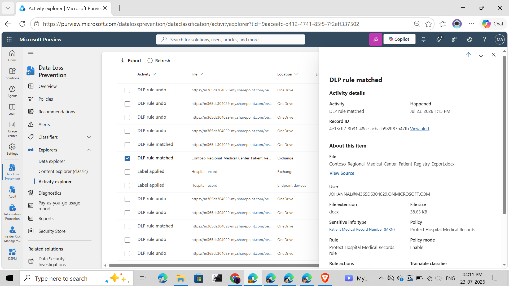
</p>

*Figure 17 – Activity Explorer displaying a successful DLP policy match.*

---

## Information Verified

| Investigation Item | Status |
|--------------------|:------:|
| User Activity | ✅ |
| DLP Policy Name | ✅ |
| Rule Matched | ✅ |
| Sensitive Information Type | ✅ |
| Timestamp | ✅ |
| Microsoft 365 Workload | ✅ |
| Enforcement Action | ✅ |

---

# 📂 Content Explorer Investigation

While Activity Explorer records user activity, Content Explorer provides visibility into the classified content itself.

Using Content Explorer, the uploaded patient registry document was examined to verify that Microsoft Purview correctly identified the proprietary Medical Record Numbers using the Custom Sensitive Information Type.

The investigation confirmed that the document contained multiple sensitive data elements and that the custom classifier successfully detected them.

---

### Review Content Explorer

<p align="center">
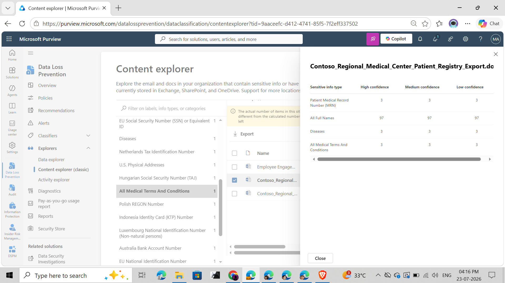
</p>

*Figure 18 – Content Explorer identifying sensitive healthcare information within the uploaded document.*

---

## Sensitive Information Detected

Microsoft Purview successfully identified:

- Patient Medical Record Numbers (MRNs)
- Patient Names
- Healthcare terminology
- ICD-10 diagnosis codes
- CPT procedure codes
- Medical context keywords

This validation confirms that the Custom Sensitive Information Type accurately classified organization-specific healthcare records.

---

# 🚨 DLP Alert Investigation

Whenever the configured DLP policy detected sensitive information, Microsoft Purview automatically generated a security alert for administrators.

Each alert contains detailed information required for incident investigation, including:

- Alert severity
- Triggering policy
- Matched rule
- User responsible for the action
- Protected workload
- Timestamp
- Detected Sensitive Information Type

These alerts enable security teams to prioritize incidents and determine whether additional response actions are necessary.

---

### Review OneDrive DLP Alert

<p align="center">
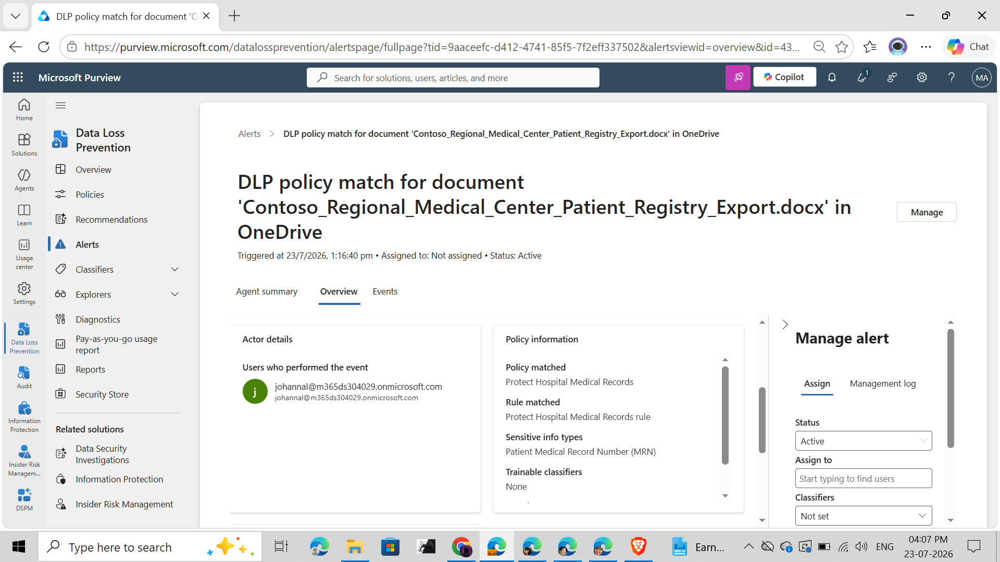
</p>

*Figure 19 – Reviewing the generated DLP alert within Microsoft Purview.*

---

## Alert Details Reviewed

During the investigation, the following information was verified:

| Investigation Detail | Verified |
|----------------------|:--------:|
| Alert Generated | ✅ |
| Policy Name | ✅ |
| Rule Matched | ✅ |
| Sensitive Information Type | ✅ |
| User | ✅ |
| Workload | ✅ |
| File Name | ✅ |
| Timestamp | ✅ |

---

# 🔄 Incident Investigation Workflow

The following workflow summarizes how Microsoft Purview processes and records a DLP event after sensitive content is detected.

```text
User Uploads or Shares Document
               │
               ▼
Microsoft Purview Scans Content
               │
               ▼
Custom Sensitive Information Type Detected
               │
               ▼
Evaluate DLP Policy
               │
               ▼
Rule Matches
               │
               ▼
Enforcement Action Applied
(Block, Restrict or Monitor)
               │
               ▼
Security Alert Generated
               │
      ┌────────┴─────────┐
      ▼                  ▼
Activity Explorer   Content Explorer
      ▼                  ▼
Incident Analysis   Data Classification Review
```

---

# 🛡 Security Operations Perspective

From a Security Operations (SecOps) perspective, this workflow demonstrates the complete lifecycle of a Data Loss Prevention incident.

Rather than simply blocking sensitive content, Microsoft Purview provides security teams with comprehensive visibility into:

- Who attempted the action
- What sensitive information was involved
- Which policy enforced protection
- When the event occurred
- Where the content was shared
- How the policy responded

This centralized investigation capability enables analysts to quickly determine whether an event represents accidental data exposure, policy misuse, or a potential insider risk scenario.

---

# ✅ Investigation Summary

The investigation confirmed that Microsoft Purview successfully:

- Detected proprietary Medical Record Numbers using a Custom Sensitive Information Type
- Evaluated content against the configured DLP policy
- Applied enforcement actions across Microsoft 365 workloads
- Generated administrator alerts
- Recorded activity for forensic analysis
- Classified sensitive healthcare documents within Content Explorer

These capabilities demonstrate Microsoft's end-to-end approach to enterprise Data Loss Prevention, combining **classification**, **policy enforcement**, **alerting**, and **investigation** within a unified security platform.

---
# 💼 Skills Demonstrated

This project demonstrates practical implementation of Microsoft Purview Information Protection and Data Loss Prevention capabilities in an enterprise Microsoft 365 environment.

## Microsoft Purview

- Custom Sensitive Information Types (SIT)
- Microsoft Purview Data Loss Prevention
- Information Protection
- Content Classification
- Data Discovery
- Activity Explorer
- Content Explorer
- DLP Alert Investigation

---

## Microsoft 365 Security

- Exchange Online Protection
- OneDrive for Business Protection
- Microsoft Teams Protection
- SharePoint Online Protection
- Cross-workload DLP Enforcement

---

## Data Classification

- Regular Expression (Regex) Design
- Custom Pattern Matching
- Contextual Keyword Matching
- Confidence Level Configuration
- Sensitive Data Identification

---

## Security Operations

- DLP Policy Creation
- Policy Rule Configuration
- Policy Deployment
- Incident Investigation
- Alert Analysis
- Security Event Validation
- Data Protection Monitoring

---

# 📚 Key Learning Outcomes

This lab provided practical experience implementing Microsoft Purview Data Loss Prevention beyond the use of Microsoft's built-in Sensitive Information Types.

Key concepts explored include:

- Designing custom enterprise data classifiers
- Creating proprietary Sensitive Information Types
- Improving detection accuracy using contextual keywords
- Building organization-specific DLP policies
- Deploying policies across Microsoft 365 workloads
- Validating policy enforcement through real-world scenarios
- Investigating DLP incidents using Microsoft Purview
- Understanding the complete lifecycle of a DLP event from detection to investigation
---

# 📖 References

- Microsoft Purview Information Protection
- Microsoft Purview Data Loss Prevention
- Microsoft Learn
- Microsoft 365 Security & Compliance Documentation

---

# 🎯 Key Takeaways

This project demonstrates an end-to-end implementation of Microsoft Purview Data Loss Prevention using a **Custom Sensitive Information Type** designed to protect proprietary healthcare identifiers.

The implementation covered the complete DLP lifecycle:

- Designing a custom classifier
- Validating detection logic
- Creating and deploying a DLP policy
- Protecting Exchange Online, OneDrive, Microsoft Teams, and SharePoint
- Generating security alerts
- Investigating policy matches using Activity Explorer
- Reviewing classified content using Content Explorer

By combining custom data classification with automated policy enforcement and centralized investigation capabilities, Microsoft Purview provides organizations with a comprehensive approach to protecting sensitive information across Microsoft 365.

---

# ⭐ Project Highlights

✔ Custom Sensitive Information Type (SIT)

✔ Regex-based Data Classification

✔ Contextual Keyword Matching

✔ Microsoft Purview DLP

✔ Exchange Online Protection

✔ OneDrive Protection

✔ Microsoft Teams Protection

✔ SharePoint Online Protection

✔ Activity Explorer Investigation

✔ Content Explorer Validation

✔ Security Alert Investigation

✔ Enterprise Data Protection Workflow

---

# 👨‍💻 Author

**Dinesh Kumar**

Cybersecurity Engineer | Microsoft Purview | Microsoft 365 Security | Data Loss Prevention

### Connect with Me

- GitHub: https://github.com/DINESHKUMARDK02
- LinkedIn: *(Add your LinkedIn profile URL here)*

---

<p align="center">

**⭐ If you found this project useful, consider starring the repository.**

</p>
