# 🛡️ Lab 7 — Microsoft Purview DLP Policy Tuning with Exact Data Match


> **Scenario:** Design, test, analyse, and tune a Microsoft Purview DLP control for proprietary customer records by migrating from broad pattern-based detection to Exact Data Match (EDM).

---

## 📑 Table of Contents

- [Overview](#-overview)
- [Business Scenario](#-business-scenario)
- [Objectives](#-objectives)
- [Architecture](#-architecture)
- [Detection Strategy](#-detection-strategy)
- [Phase 1 — Create the Custom Sensitive Information Type](#-phase-1--create-the-custom-sensitive-information-type)
- [Phase 2 — Implement the Baseline DLP Policy](#-phase-2--implement-the-baseline-dlp-policy)
- [Phase 3 — Validate the Baseline Policy](#-phase-3--validate-the-baseline-policy)
- [Phase 4 — Identify the False Positive](#-phase-4--identify-the-false-positive)
- [Phase 5 — Root Cause Analysis](#-phase-5--root-cause-analysis)
- [Phase 6 — Implement Exact Data Match](#-phase-6--implement-exact-data-match)
- [Phase 7 — Deploy the EDM-Tuned DLP Policy](#-phase-7--deploy-the-edm-tuned-dlp-policy)
- [Phase 8 — False-Positive Regression Test](#-phase-8--false-positive-regression-test)
- [Phase 9 — True-Positive Regression Test](#-phase-9--true-positive-regression-test)
- [Test Results](#-test-results)
- [Security Engineering Analysis](#-security-engineering-analysis)
- [Skills Demonstrated](#-skills-demonstrated)
- [Key Takeaways](#-key-takeaways)

---

# 🔎 Overview

This lab demonstrates an end-to-end **Microsoft Purview Data Loss Prevention (DLP) policy engineering and tuning workflow**.

The initial control uses a custom **Sensitive Information Type (SIT)** to identify Contoso Customer IDs through pattern-based detection.

Testing confirms that the control can detect and block customer information. However, further validation reveals that syntactically similar values can also trigger the policy even when they do not represent genuine customer records.

The detection strategy is therefore enhanced using **Exact Data Match (EDM)**.

The final implementation demonstrates that:

- genuine customer records continue to be detected and blocked;
- pattern-only false positives are no longer blocked;
- DLP alerts continue to provide administrative visibility into genuine policy violations.

This represents a practical DLP lifecycle:

```text
Sensitive Data Identification
        ↓
Custom SIT Development
        ↓
Baseline DLP Policy
        ↓
True-Positive Testing
        ↓
False-Positive Discovery
        ↓
Root Cause Analysis
        ↓
EDM Implementation
        ↓
Policy Tuning
        ↓
Regression Testing
        ↓
Validated DLP Control
```

---

# 🏢 Business Scenario

Contoso maintains customer records containing organisation-specific identifiers.

These records represent sensitive business information and should not be distributed through email in violation of the organisation's data handling requirements.

The security requirement is therefore:

> Detect Contoso customer records transmitted through Exchange Online and prevent unauthorised disclosure while minimising unnecessary business disruption caused by false positives.

A simple pattern-based control can identify values matching the format of a Customer ID.

However, pattern matching alone creates an important challenge.

A value may **look like a valid Customer ID without actually belonging to a customer**.

This lab demonstrates how **Exact Data Match** can improve the precision of the DLP control.

---

# 🎯 Objectives

The objectives of this lab are to:

1. Create a custom Sensitive Information Type for Contoso Customer IDs.
2. Build a baseline Microsoft Purview DLP policy.
3. Validate enforcement against genuine customer information.
4. Reproduce a false-positive condition.
5. Analyse the cause of the false positive.
6. Configure an Exact Data Match schema.
7. Upload and index authoritative customer data.
8. Create an EDM-based DLP policy.
9. Retest the original false-positive scenario.
10. Confirm genuine customer records remain protected.
11. Validate DLP alert generation following tuning.

---

# 🏗️ Architecture

## Baseline Architecture

```text
┌──────────────────────────────┐
│       Exchange Online        │
│                              │
│  User sends email containing │
│      Customer ID / Record    │
└──────────────┬───────────────┘
               │
               ▼
┌──────────────────────────────┐
│     Microsoft Purview DLP    │
│                              │
│  Custom Sensitive Info Type  │
│     "Contoso Customer ID"    │
└──────────────┬───────────────┘
               │
               ▼
┌──────────────────────────────┐
│       Pattern Matching       │
│                              │
│     Customer ID Regex        │
└──────────────┬───────────────┘
               │
         Pattern Match?
          /          \
        YES           NO
         │             │
         ▼             ▼
┌──────────────┐  ┌──────────────┐
│ Block Email  │  │ Allow Email  │
│ Generate     │  │              │
│ DLP Alert    │  │              │
└──────────────┘  └──────────────┘
```

### Baseline Limitation

The custom SIT determines whether a value matches the expected **Customer ID pattern**.

It does not by itself establish whether the detected value corresponds to the customer data represented in the organisation's authoritative dataset.

This can produce false positives.

---

## EDM-Tuned Architecture

```text
                       ┌──────────────────────────┐
                       │ Authoritative Customer   │
                       │      Master Dataset      │
                       └────────────┬─────────────┘
                                    │
                                    ▼
                       ┌──────────────────────────┐
                       │ Exact Data Match Schema  │
                       │                          │
                       │ Contoso_Customer_        │
                       │ Master_EDM               │
                       └────────────┬─────────────┘
                                    │
                              Hash / Index
                                    │
                                    ▼
┌──────────────────┐     ┌──────────────────────────┐
│ Exchange Online  │────▶│ Microsoft Purview DLP    │
│                  │     │                          │
│ Outbound Email   │     │ EDM-based Detection      │
└──────────────────┘     └────────────┬─────────────┘
                                      │
                                EDM Match?
                                 /       \
                               YES        NO
                                │          │
                                ▼          ▼
                      ┌──────────────┐ ┌──────────────┐
                      │ Block Email  │ │ Allow Email  │
                      │              │ │              │
                      │ Generate DLP │ │ No DLP       │
                      │ Alert        │ │ Enforcement  │
                      └──────────────┘ └──────────────┘
```

The tuned architecture moves the control from primarily asking:

> **Does this value look like a Customer ID?**

towards determining whether the content corresponds to the customer data represented in the **EDM reference dataset**.

---

# 🧠 Detection Strategy

| Control | Detection Method | Advantage | Limitation |
|---|---|---|---|
| Custom SIT | Pattern-based detection | Flexible and easy to deploy | Can match structurally similar values |
| DLP Policy | Policy/rule evaluation | Provides enforcement | Accuracy depends on detection logic |
| Exact Data Match | Dataset-based matching | Higher precision for structured proprietary data | Requires schema and dataset management |
| DLP Alerts | Administrative monitoring | Investigation and audit visibility | Alert quality depends on policy accuracy |

The engineering goal is not simply to maximise the number of detections.

The objective is to achieve:

```text
HIGH DETECTION COVERAGE
        +
HIGH DETECTION PRECISION
        +
LOW FALSE-POSITIVE RATE
        =
EFFECTIVE DLP CONTROL
```

---

# 🔬 Phase 1 — Create the Custom Sensitive Information Type

The first stage was to define how Microsoft Purview should recognise a Contoso Customer ID.

A custom Sensitive Information Type was created for:

```text
Contoso Customer ID
```

The SIT uses pattern-based detection to recognise the organisation-specific Customer ID structure.

## Configuration

The detection logic included:

- custom Sensitive Information Type;
- regex-based Customer ID recognition;
- confidence configuration;
- supporting detection settings.

### Screenshot 01 — Custom Sensitive Information Type

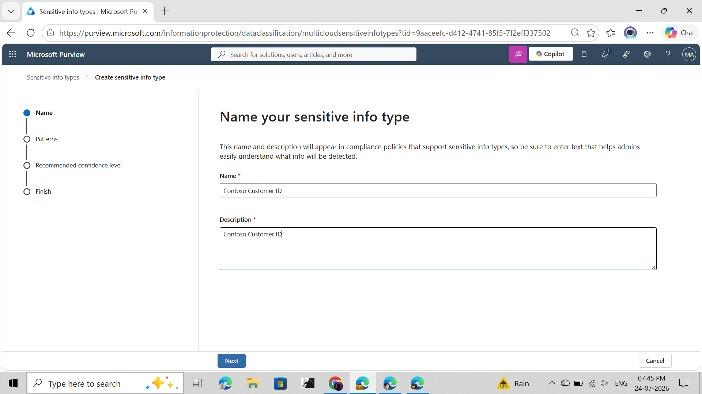

### Screenshot 02 — Customer ID Detection Pattern

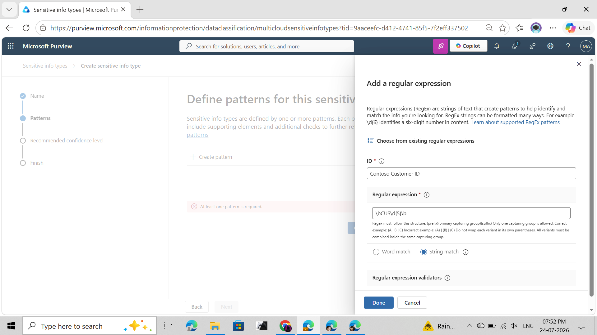

### Screenshot 03 — SIT Configuration

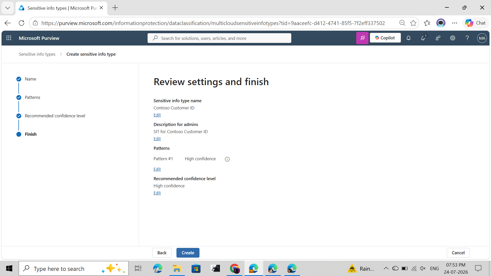

### Engineering Outcome

Microsoft Purview can now identify content matching the expected **Contoso Customer ID format**.

However, at this stage the system is identifying the **pattern**, not validating the value against the authoritative customer dataset.

---

# 🛡️ Phase 2 — Implement the Baseline DLP Policy

A baseline DLP policy was created:

```text
Protect Contoso Customer Records - SIT Baseline
```

The policy uses the custom **Contoso Customer ID** Sensitive Information Type as its detection condition.

When matching information is detected, the policy is configured to restrict the email and generate administrative visibility.

### Screenshot 04 — Baseline DLP Policy

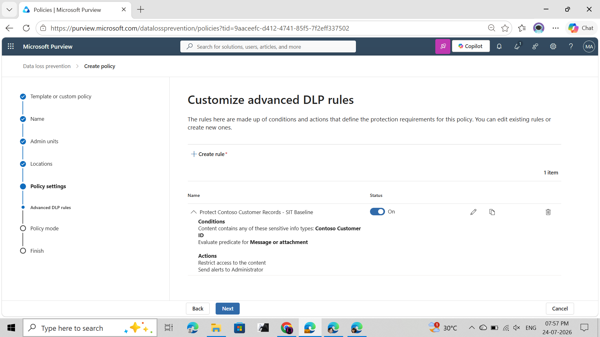

### Screenshot 05 — Baseline DLP Rule

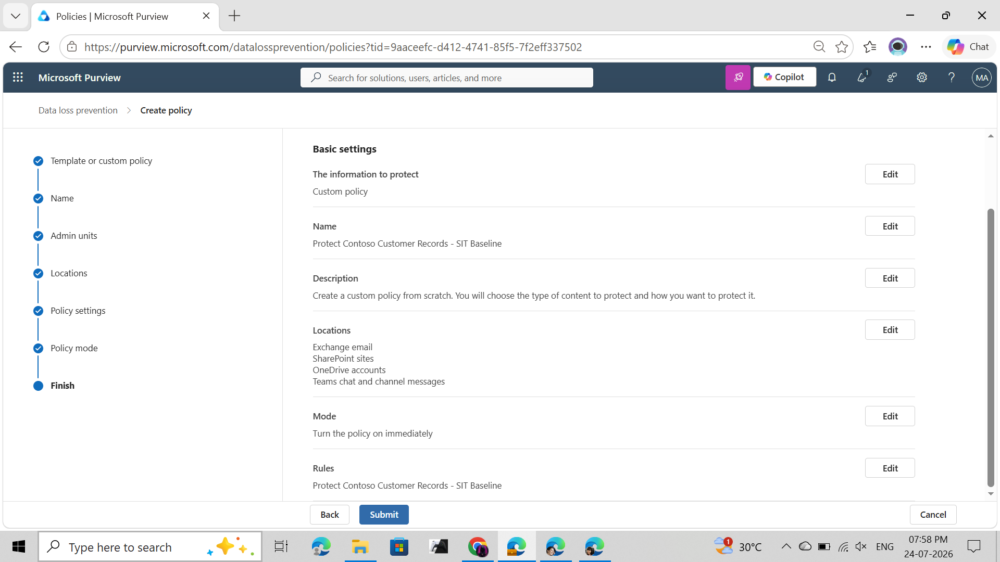

### Screenshot 06 — Policy Synchronisation

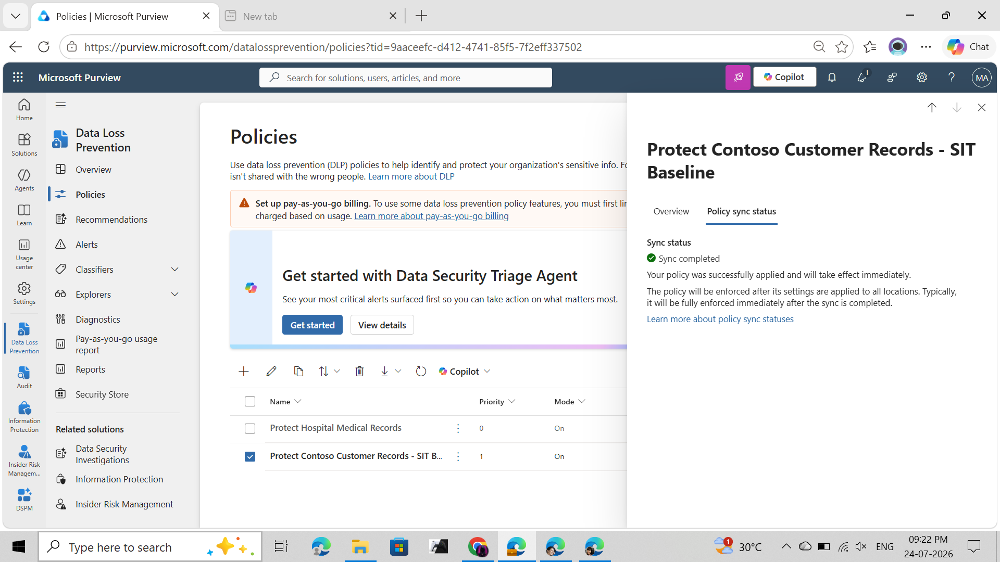

The baseline control is now:

```text
Email
   ↓
Microsoft Purview DLP
   ↓
Contoso Customer ID SIT
   ↓
Pattern Match
   ↓
Restrict Access + Alert
```

---

# ✅ Phase 3 — Validate the Baseline Policy

The first functional test verifies that genuine customer information is protected.

A test email containing a customer record was prepared and sent through Exchange Online.

### Screenshot 07 — True-Positive Test Email

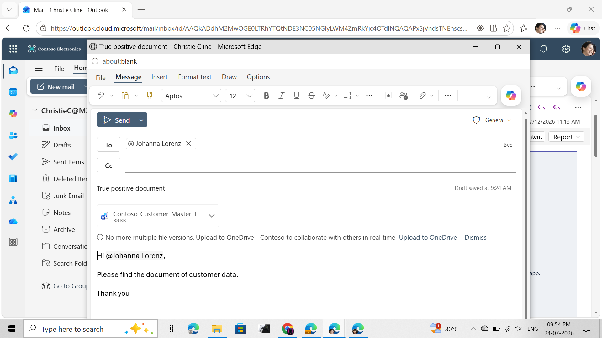

The DLP policy detects the sensitive information and prevents successful delivery.

### Screenshot 08 — Email Blocked

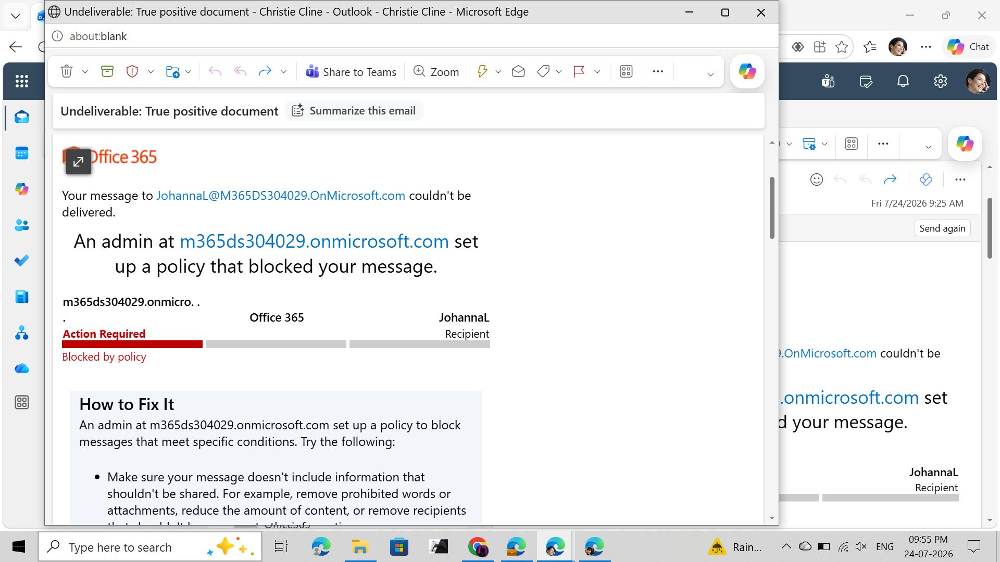

Microsoft Purview also generates a DLP alert.

### Screenshot 09 — DLP Alert

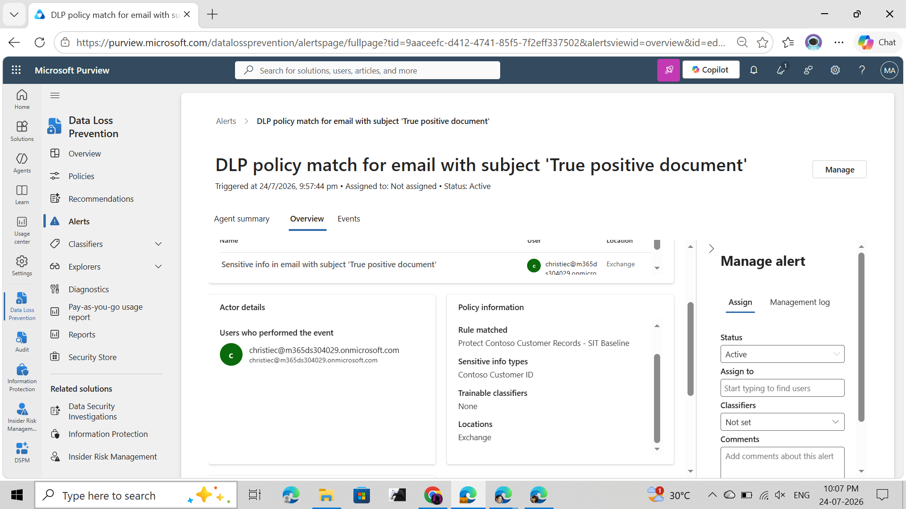

### Result

```text
Genuine Customer Record
          ↓
Contoso Customer ID detected
          ↓
DLP policy matched
          ↓
Email blocked
          ↓
Alert generated
```

**Result: PASS ✅**

The baseline policy successfully protects the target information.

---

# ⚠️ Phase 4 — Identify the False Positive

Successful blocking alone does not prove that a DLP policy is correctly tuned.

The next test determines whether the policy can distinguish genuine customer information from data that merely resembles it.

A second document was created containing data designed to trigger the Customer ID pattern without representing the intended genuine customer record.

### Screenshot 10 — False-Positive Test Document

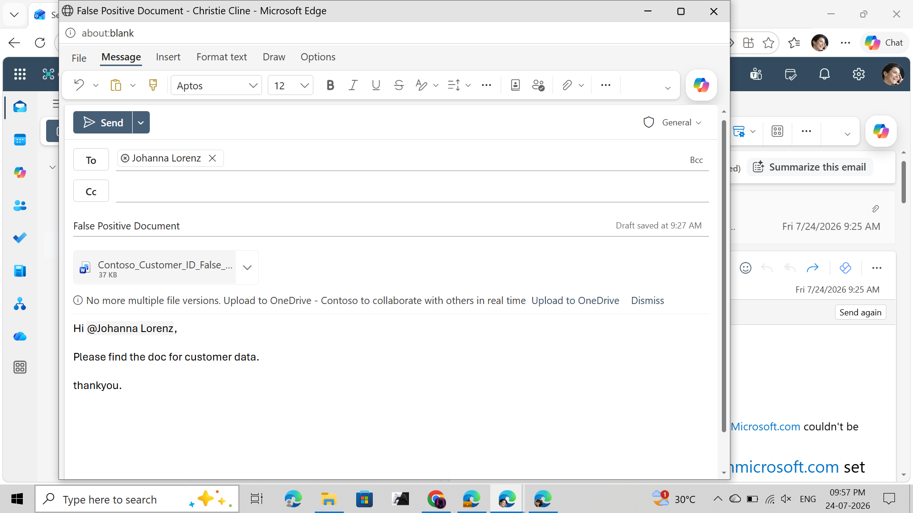

The document was transmitted through Exchange Online.

Despite representing the false-positive test case, the baseline SIT recognised the Customer ID-like pattern.

### Screenshot 11 — False-Positive Email Blocked

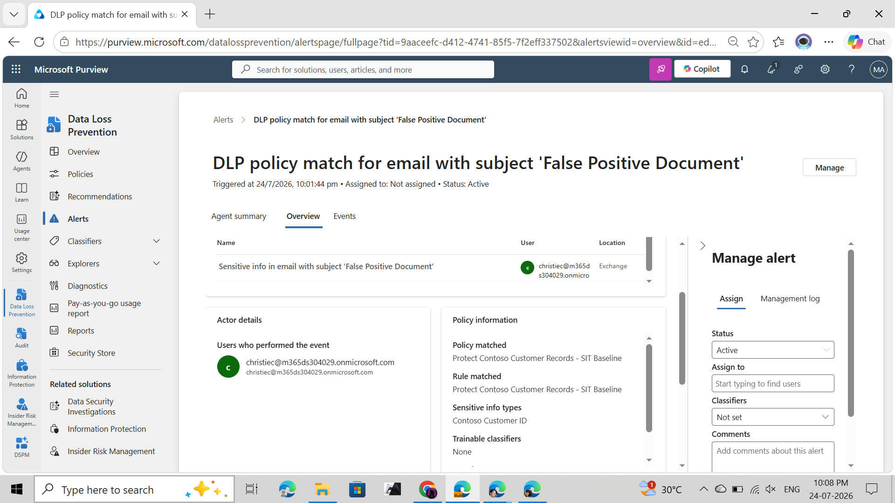

A corresponding DLP event/alert was generated.

### Screenshot 12 — False-Positive DLP Detection

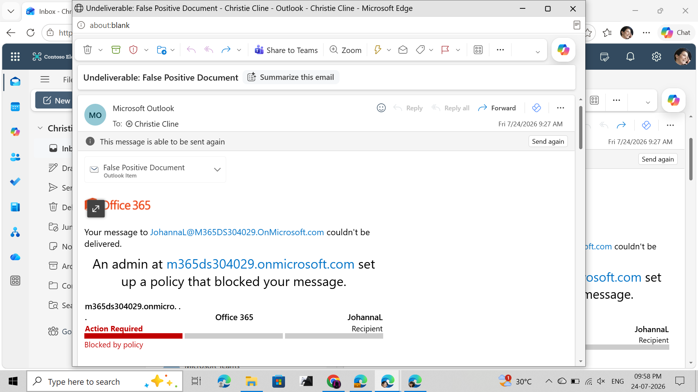

### Result

```text
Pattern-only Test Data
          ↓
Regex pattern matches
          ↓
SIT identifies Customer ID
          ↓
DLP policy triggers
          ↓
Email blocked
```

**Result: FALSE POSITIVE ❌**

The control is functional but insufficiently precise.

---

# 🔍 Phase 5 — Root Cause Analysis

The false positive is caused by the difference between **pattern recognition** and **data validation**.

The baseline SIT effectively answers:

```text
Does this value have the expected Customer ID structure?
```

It cannot independently answer:

```text
Does this content correspond to the customer data
represented in Contoso's authoritative customer dataset?
```

Conceptually:

```text
Pattern Match
     │
     ├── Genuine Customer ID ────────▶ Match
     │
     └── Similar-looking Test Value ─▶ Match
```

Both values can satisfy the structural detection condition.

### Root Cause

> **The baseline DLP policy relied on pattern-based identification that was broader than the business definition of the sensitive data requiring protection.**

Rather than weakening enforcement or broadly excluding content, the detection logic itself was tuned.

The selected solution was:

# Exact Data Match (EDM)

---

# 🧬 Phase 6 — Implement Exact Data Match

Microsoft Purview Exact Data Match was implemented to increase detection precision.

The EDM configuration uses an authoritative dataset representing the customer information that should be protected.

The EDM classifier created for the lab is:

```text
Contoso_Customer_Master_EDM
```

---

## 6.1 EDM Schema

The EDM schema defines the structure used by Microsoft Purview when matching protected customer information.

The `CustomerID` field was associated with the previously created **Contoso Customer ID** Sensitive Information Type.

Conceptually:

```text
EDM Schema
│
└── CustomerID
       │
       └── Contoso Customer ID SIT
```

### Screenshot 13 — EDM Schema Configuration

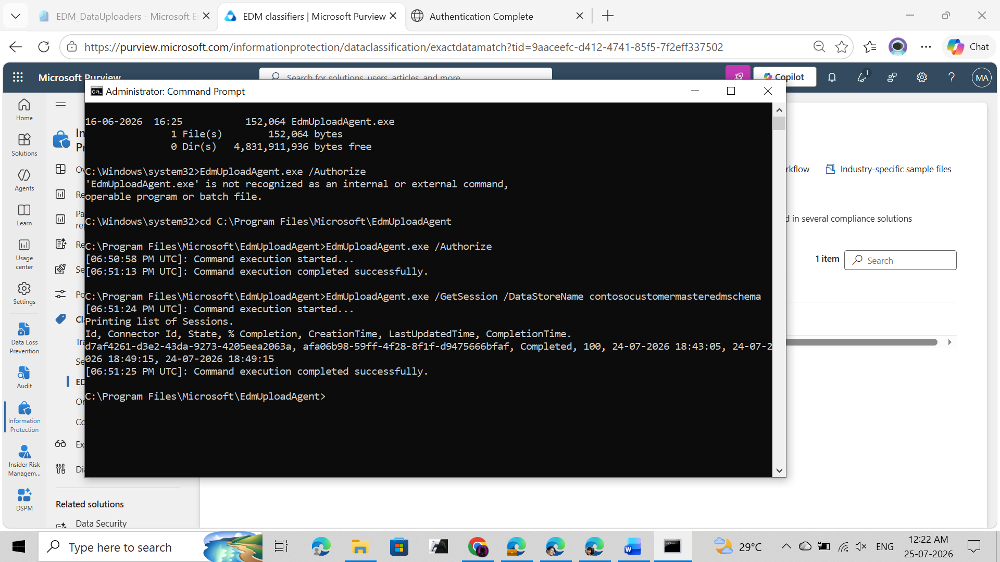

---

## 6.2 EDM Detection Configuration

The EDM classifier was configured with the required matching and confidence settings.

### Screenshot 14 — EDM Configuration

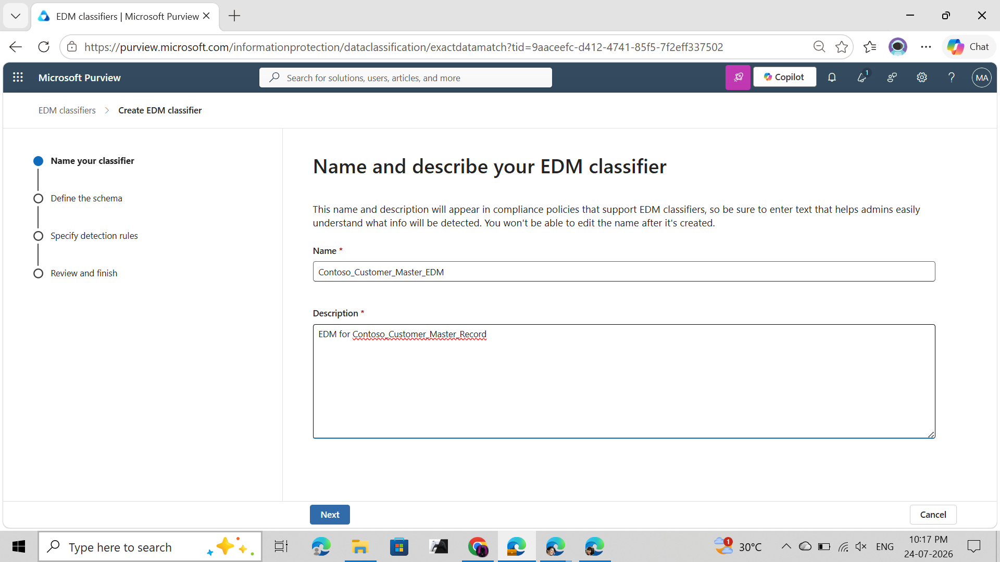

---

## 6.3 Upload and Index the Dataset

The EDM Upload Agent was used to process the customer reference data.

The dataset was uploaded for indexing so that Purview could use the EDM configuration during DLP evaluation.

### Screenshot 15 — EDM Upload

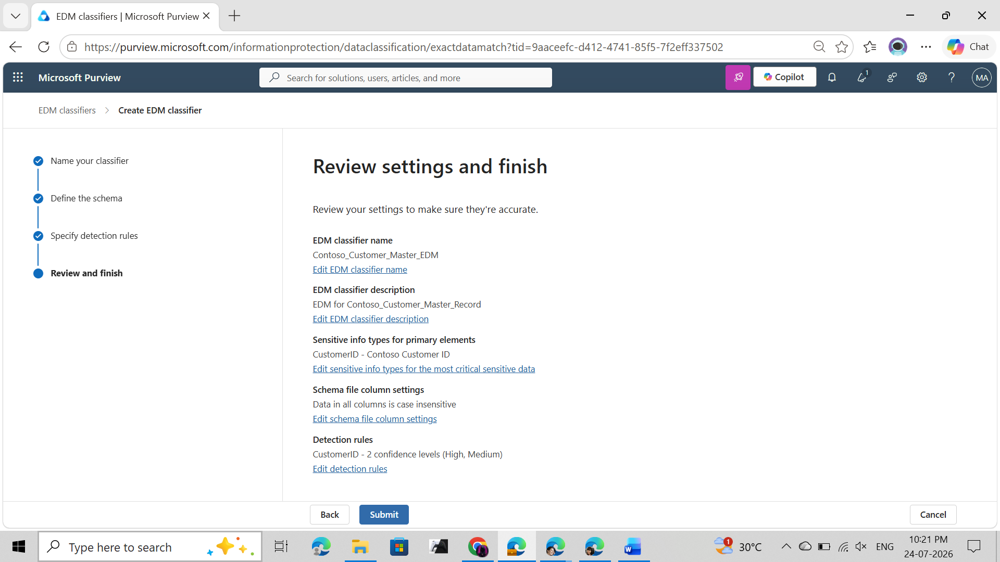

---

## 6.4 Verify Index Completion

The indexing process completed successfully.

### Screenshot 16 — EDM Index Complete

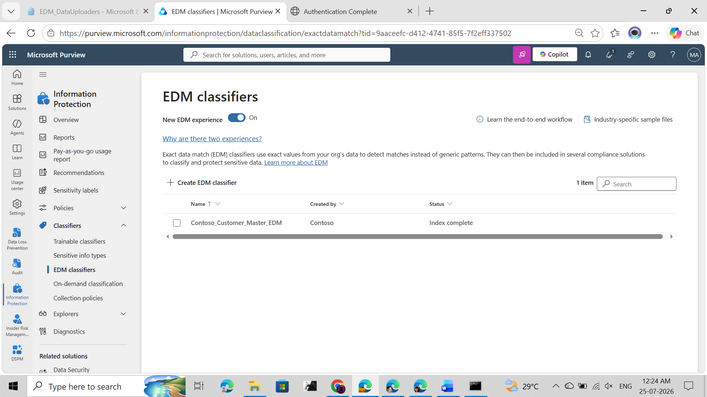

At this point the new detection workflow becomes:

```text
Email Content
     ↓
EDM Detection
     ↓
Reference Dataset Match
     ↓
DLP Rule Evaluation
```

---

# ⚙️ Phase 7 — Deploy the EDM-Tuned DLP Policy

A new tuned policy was created:

```text
Protect Contoso Customer Records - EDM Tuned
```

The associated rule is:

```text
Protect Contoso Customer Records - EDM Rule
```

Instead of using only the broad Customer ID pattern as the DLP condition, the tuned rule uses:

```text
Contoso_Customer_Master_EDM
```

### Screenshot 17 — EDM-Tuned Policy

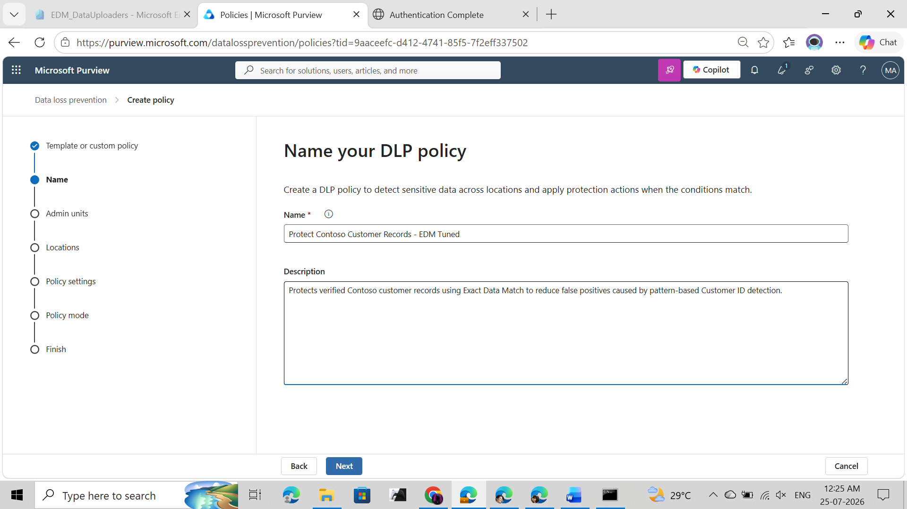

### Screenshot 18 — EDM Rule Condition

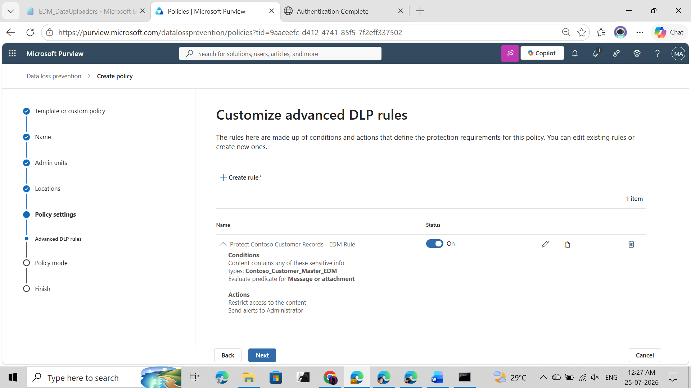

The enforcement configuration continues to protect matching customer information.

### Screenshot 19 — EDM Enforcement

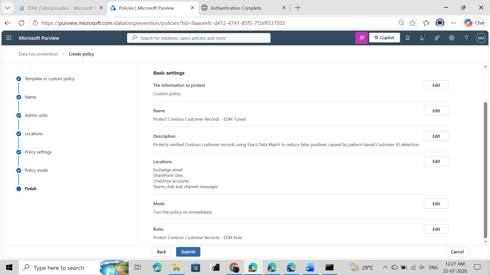

The policy was then synchronised.

### Screenshot 20 — EDM Policy Synchronised

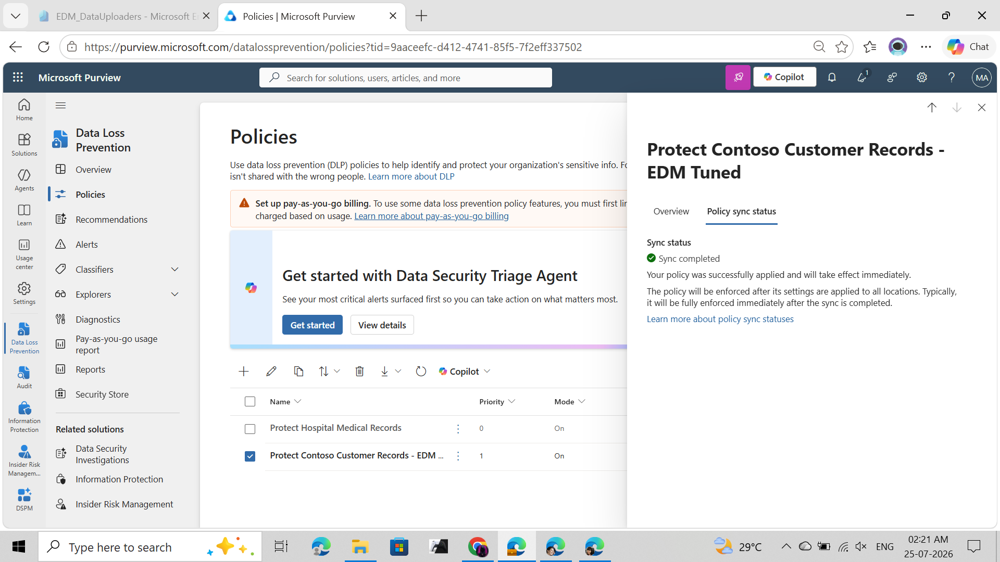

The architecture has now changed from:

```text
Customer ID Pattern
       ↓
     BLOCK
```

to:

```text
Customer Record
       ↓
EDM Evaluation
       ↓
Authoritative Dataset Match
       ↓
     BLOCK
```

---

# 🧪 Phase 8 — False-Positive Regression Test

The first post-tuning test repeats the previous **false-positive scenario**.

This is important because a policy change is not considered successful merely because configuration completed.

The original problem must be reproduced and retested.

### Screenshot 21 — Retest Previous False-Positive Record

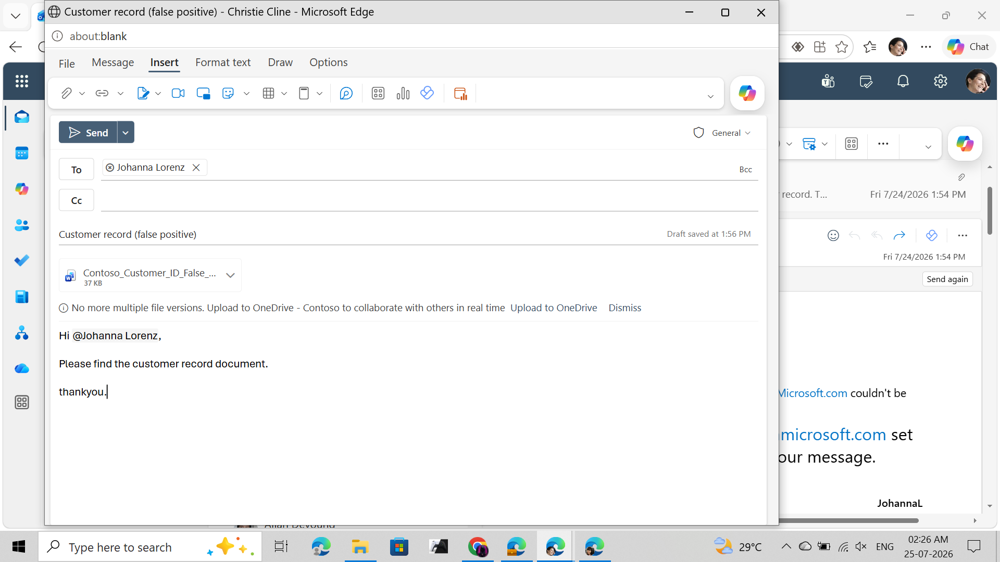

The email is sent with the false-positive test document attached.

Under the original SIT-based policy, this type of content resulted in enforcement.

With the EDM-tuned control, the message is successfully delivered to the recipient.

### Screenshot 22 — False-Positive Email Successfully Delivered

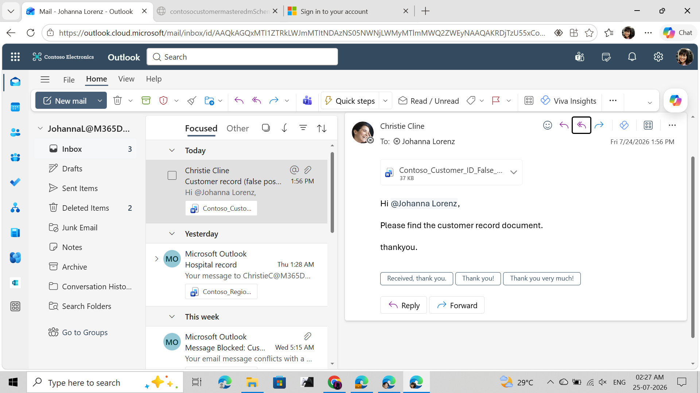

### Result

```text
Pattern-only False-Positive Record
              ↓
        EDM Evaluation
              ↓
 No qualifying EDM record match
              ↓
         Email allowed
```

**Result: PASS ✅**

The original false-positive condition has been mitigated.

---

# 🚨 Phase 9 — True-Positive Regression Test

Reducing false positives is only half of successful DLP tuning.

A tuning change must **not introduce a false negative** for the sensitive data the organisation actually intends to protect.

Therefore, a genuine customer record was tested again.

### Screenshot 23 — EDM True-Positive Test

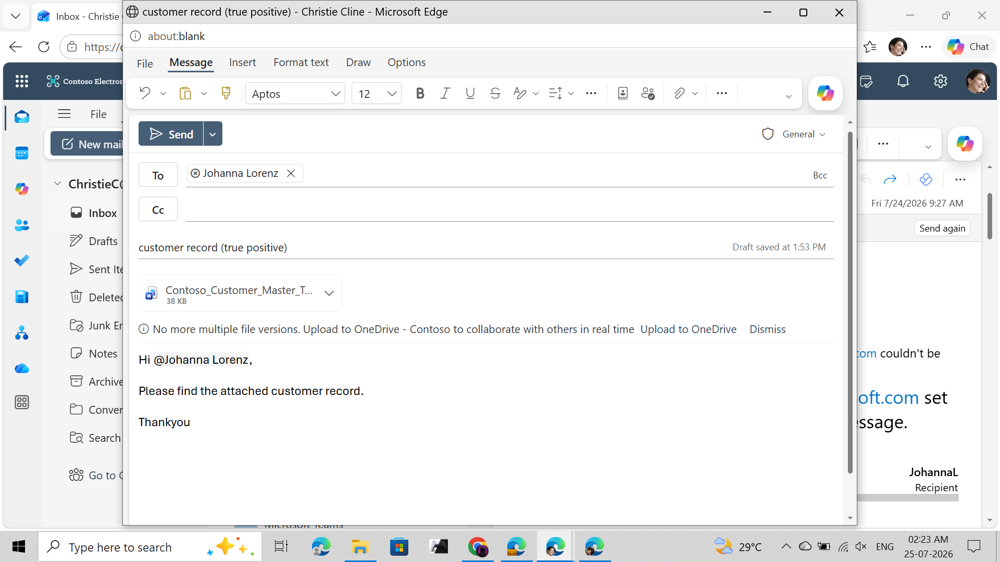

The email contains the customer record represented in the EDM-protected data.

Exchange rejects delivery.

### Screenshot 24 — True-Positive Email Blocked

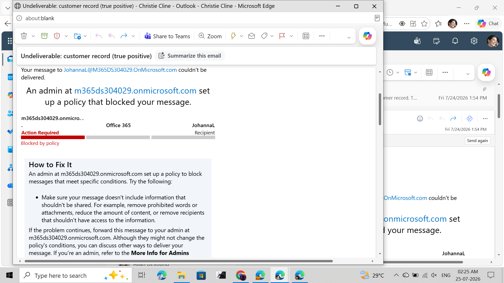

The non-delivery notification confirms:

> **An admin set up a policy that blocked your message.**

The enforcement result therefore confirms that genuine sensitive customer information remains protected.

---

## DLP Alert Validation

The corresponding event is visible within Microsoft Purview DLP Alerts.

### Screenshot 25 — EDM True-Positive DLP Alert

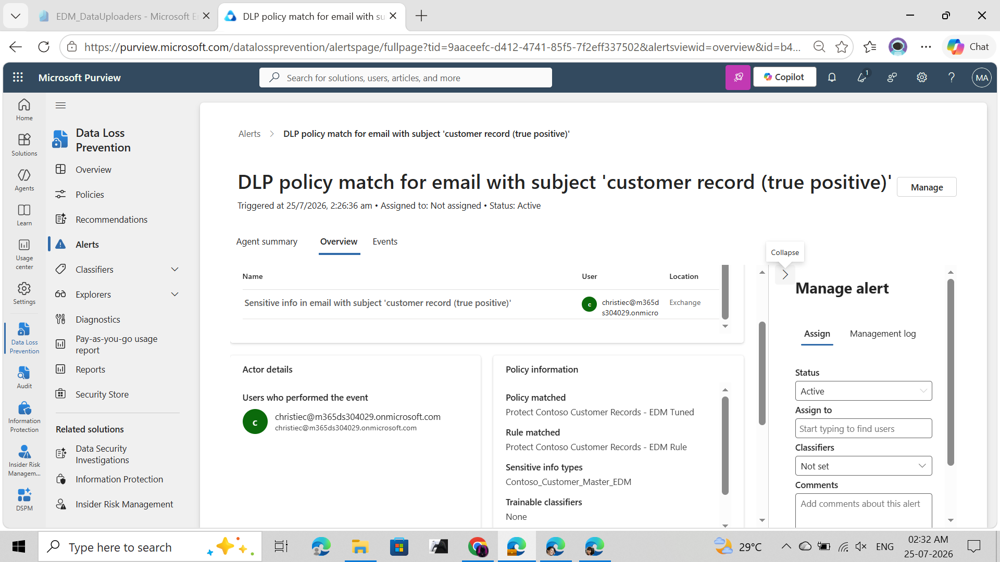

The alert confirms the following configuration matched:

```text
Policy matched:
Protect Contoso Customer Records - EDM Tuned

Rule matched:
Protect Contoso Customer Records - EDM Rule

Sensitive info type:
Contoso_Customer_Master_EDM

Location:
Exchange
```

This provides administrative evidence that the final enforcement was generated by the **EDM-tuned control**.

---

# 📊 Test Results

| Test Case | Expected | SIT Baseline | EDM Tuned | Final Result |
|---|---|---|---|---|
| Genuine customer record | Block | Blocked | Blocked | ✅ Pass |
| Pattern-only false-positive record | Allow | Blocked | Allowed | ✅ Pass |
| Genuine customer DLP alert | Generate | Generated | Generated | ✅ Pass |
| Protect actual customer data | Yes | Yes | Yes | ✅ Pass |
| Minimise demonstrated false positive | Yes | No | Yes | ✅ Pass |

---

# 🔄 Before vs After Tuning

## Before — Pattern-Based SIT

```text
                   Customer ID Pattern
                          │
             ┌────────────┴────────────┐
             │                         │
             ▼                         ▼
      Genuine Record           Similar-looking Value
             │                         │
             ▼                         ▼
           MATCH                     MATCH
             │                         │
             ▼                         ▼
           BLOCK                     BLOCK
             │                         │
             ▼                         ▼
        TRUE POSITIVE             FALSE POSITIVE
```

---

## After — Exact Data Match

```text
                     Customer Data
                          │
                          ▼
                   EDM Evaluation
                          │
             ┌────────────┴────────────┐
             │                         │
             ▼                         ▼
       Qualifying Match           No Qualifying Match
             │                         │
             ▼                         ▼
           BLOCK                     ALLOW
             │                         │
             ▼                         ▼
     TRUE POSITIVE ✅         FALSE POSITIVE REDUCED ✅
```

---

# 🧑‍💻 Security Engineering Analysis

This lab highlights an important distinction between **DLP deployment** and **DLP engineering**.

Creating a policy that blocks information is relatively straightforward.

Creating a policy that blocks the **correct information while minimising disruption to legitimate business activity** requires additional engineering.

The lifecycle demonstrated here was:

```text
1. Identify the sensitive data
             ↓
2. Define detection logic
             ↓
3. Implement DLP policy
             ↓
4. Validate true positive
             ↓
5. Identify false positive
             ↓
6. Perform root cause analysis
             ↓
7. Improve detection architecture
             ↓
8. Deploy tuned policy
             ↓
9. Regression-test false positive
             ↓
10. Regression-test true positive
             ↓
11. Validate enforcement and alerting
```

This is preferable to simply weakening the original policy because the tuning addresses the **detection mechanism** responsible for the demonstrated false positive.

---

# 🛠️ Technologies Used

| Technology | Purpose |
|---|---|
| Microsoft Purview | Data security and compliance platform |
| Microsoft Purview DLP | DLP policy configuration and enforcement |
| Sensitive Information Types | Pattern-based sensitive data classification |
| Regular Expressions | Customer ID pattern recognition |
| Exact Data Match | Dataset-based sensitive data detection |
| EDM Upload Agent | EDM dataset processing/upload |
| Exchange Online | Email enforcement channel |
| Purview DLP Alerts | Detection and investigation validation |

---

# 💡 Skills Demonstrated

This lab demonstrates practical experience with:

- Microsoft Purview Data Loss Prevention
- DLP policy design
- DLP rule configuration
- Custom Sensitive Information Types
- Regular-expression-based detection
- Exact Data Match
- EDM schema configuration
- EDM dataset indexing
- Exchange Online DLP enforcement
- DLP alert investigation
- True-positive testing
- False-positive analysis
- DLP policy tuning
- Regression testing
- Detection engineering
- Policy validation

---

# 🎯 Key Takeaways

### 1. Detection is not the same as accuracy

A DLP policy generating alerts does not automatically mean that the policy is well tuned.

The quality of the detection logic matters.

---

### 2. Regex is powerful but context-limited

Regular expressions are effective when sensitive information has a predictable structure.

However, a pattern can identify values that **look sensitive** without proving that they represent the intended business data.

---

### 3. EDM can improve precision for structured proprietary data

Where an organisation has authoritative structured datasets, Exact Data Match can provide a more targeted detection mechanism.

In this scenario, EDM allowed the DLP control to distinguish the demonstrated customer record from the previous pattern-only false-positive case.

---

### 4. False-positive tuning must include regression testing

Removing a false positive is insufficient if the change also allows genuine sensitive data to leave the organisation.

Both scenarios therefore need to be validated:

```text
False Positive → Should be allowed
True Positive  → Should still be blocked
```

Both tests passed in the final implementation.

---

### 5. DLP engineering is an iterative process

An effective DLP programme should continuously evaluate:

```text
Detect
   ↓
Investigate
   ↓
Understand
   ↓
Tune
   ↓
Test
   ↓
Monitor
```

The objective is not maximum blocking.

The objective is **accurate, defensible and operationally sustainable protection of sensitive information**.

---

# 🏆 Final Outcome

The original implementation successfully detected customer information but produced a demonstrated false positive because the pattern-based SIT was broader than the intended sensitive dataset.

The policy was subsequently enhanced using **Microsoft Purview Exact Data Match**.

Final validation demonstrated:

```text
                    SIT BASELINE
                         │
          ┌──────────────┴──────────────┐
          │                             │
   Genuine Record              Pattern-only Record
          │                             │
       BLOCKED                       BLOCKED
          │                             │
        Correct                   False Positive
                                        │
                                        ▼
                                  EDM TUNING
                                        │
                    ┌───────────────────┴──────────────────┐
                    │                                      │
             Genuine Record                     Pattern-only Record
                    │                                      │
                  BLOCK                                  ALLOW
                    │                                      │
                    ▼                                      ▼
             TRUE POSITIVE                         FALSE POSITIVE
              PRESERVED ✅                           REDUCED ✅
```

The final control therefore provides **more precise customer-data protection while preserving DLP enforcement for the genuine sensitive-data scenario**.

---

## ⚠️ Lab Disclaimer

This project was completed in a controlled Microsoft 365 lab/demo environment using synthetic Contoso data.

No production customer information or confidential organisational data is included in this repository.

---

## Author

**Dinesh Kumar**

Cybersecurity | Data Loss Prevention | Microsoft Purview | Information Protection

---

⭐ This repository is part of a hands-on cybersecurity portfolio focused on **Data Loss Prevention engineering, Microsoft Purview, information protection, policy tuning and data security**.

