# Lab 08 — Closing Source Code Detection Gaps with Microsoft Purview Trainable Classifiers

<p align="center">


</p>

> A controlled Microsoft Purview DLP experiment that identifies a file-extension detection gap and remediates it with the Microsoft-provided **Source code** trainable classifier.

---

## Table of Contents

- [Project Overview](#project-overview)
- [Business Scenario](#business-scenario)
- [Detection Problem](#detection-problem)
- [Solution Architecture](#solution-architecture)
- [Technologies Used](#technologies-used)
- [Lab Objectives](#lab-objectives)
- [Prerequisites](#prerequisites)
- [Phase 1 — File-Based Baseline](#phase-1--file-based-baseline)
- [Phase 2 — Validate the Detection Gap](#phase-2--validate-the-detection-gap)
- [Phase 3 — Content-Aware DLP Control](#phase-3--content-aware-dlp-control)
- [Phase 4 — Validate the Remediation](#phase-4--validate-the-remediation)
- [DLP Alert Investigation](#dlp-alert-investigation)
- [Results](#results)
- [Key Engineering Takeaways](#key-engineering-takeaways)
- [Skills Demonstrated](#skills-demonstrated)
- [Security and Privacy Notice](#security-and-privacy-notice)

---

## Project Overview

This lab demonstrates why file-extension controls alone are insufficient for protecting source code in email. A baseline Microsoft Purview DLP policy blocks external transmission of `.py` attachments, but the same Python source code is allowed when stored inside a `.docx` file.

The gap is remediated with Microsoft Purview's built-in **Source code** trainable classifier. The replacement policy evaluates the message or attachment content, rather than relying on the file extension. The same DOCX that was allowed by the baseline is subsequently detected and blocked when sent to an external Gmail recipient.

The result is an evidence-based comparison between file-based and content-aware DLP detection in Exchange Online.

---

## Business Scenario

Contoso develops customer-facing APIs and must prevent employees from sending proprietary source code outside the organization. An initial control blocks Python files attached to external email. While that policy protects files with the `.py` extension, an employee could copy the exact code into a Word document and bypass the control.

The security team needs a DLP control that identifies the source code itself, regardless of the supported file format used to transport it.

---

## Detection Problem

| Detection method | What it evaluates | Limitation addressed in this lab |
|---|---|---|
| File-extension rule | Attachment name and extension | A `.docx` containing Python code does not match `py`. |
| Source code trainable classifier | Message or attachment content | Detects code content even when its file extension is not `.py`. |

The lab uses the same sender, recipient, and source-code content for the baseline and remediation tests. The detection method is the meaningful variable that changes.

---

## Solution Architecture

```text
                         Contoso Exchange Online
                                   │
                                   ▼
                      Employee sends an attachment
                                   │
                 External recipient: personal Gmail
                                   │
          ┌────────────────────────┴────────────────────────┐
          │                                                 │
          ▼                                                 ▼
  BASELINE: File-extension DLP                     REMEDIATION: Content-aware DLP
          │                                                 │
  IF attachment extension = py                    IF content matches Source code
  AND recipient is external                       trainable classifier
          │                                        AND recipient is external
          ▼                                                 │
   .py attachment → BLOCK                                  ▼
   .docx with same code → ALLOW                      .py or .docx with code → BLOCK
          │                                                 │
          └─────────────────────┬───────────────────────────┘
                                ▼
                   Purview DLP alert and investigation
```

---

## Technologies Used

| Technology | Purpose |
|---|---|
| Microsoft Purview | DLP policy creation, alerting, and investigation |
| Microsoft 365 / Exchange Online | Controlled email exfiltration test location |
| Microsoft Purview Source code classifier | Built-in content-aware classification of programming code |
| Microsoft Outlook | Source mailbox used for external-sharing tests |
| Gmail | External recipient used to validate allow/block outcomes |

---

## Lab Objectives

- Create a file-extension DLP baseline for external email.
- Confirm that a Python attachment is blocked by the baseline.
- Demonstrate that the same code in a DOCX attachment bypasses the baseline.
- Create a content-aware DLP policy using the built-in **Source code** trainable classifier.
- Retest the same DOCX attachment and confirm it is blocked.
- Investigate the DLP alerts and confirm the matching policy, rule, workload, and classifier.

---

## Prerequisites

- Microsoft 365 tenant with Microsoft Purview DLP access.
- Exchange Online mailbox for the test user.
- An external email account controlled by the tester.
- The Microsoft-provided **Source code** trainable classifier available and ready to use.
- Two synthetic test files containing the same non-production code:
  - `Contoso-Customer-API.py`
  - `Contoso-Customer-API.docx`

> All content used in this lab is synthetic. No production source code, customer information, or corporate credentials were used.

---

## Phase 1 — File-Based Baseline

### 1. Create the baseline policy

In Microsoft Purview, create a custom DLP policy named **Protect Contoso Source Code - File Based Baseline**. The policy is limited to **Exchange email** so that the results are attributable to the email control under test.

<p align="center">
  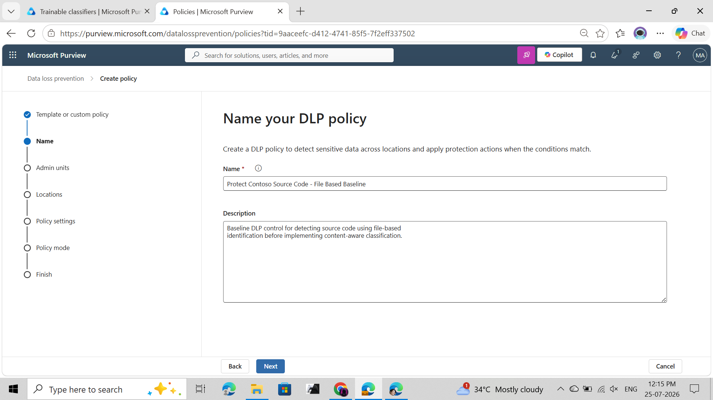
</p>

*Figure 1 — Creating the file-based baseline policy.*

### 2. Configure the baseline rule

Create a rule that requires both of the following conditions:

1. Content is shared from Microsoft 365 with people outside the organization.
2. The attachment file extension is `py`.

The rule restricts external access, notifies the user, and sends an alert to the administrator.

<p align="center">
  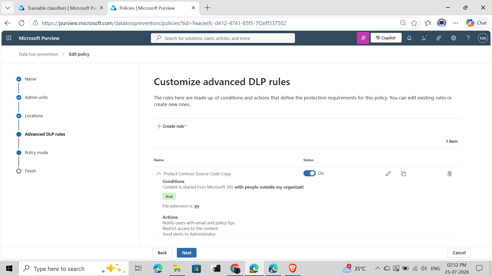
</p>

*Figure 2 — Baseline rule uses the external-recipient condition and the `py` file-extension condition.*

### 3. Review and deploy the baseline

Review the policy scope, mode, and rule configuration. Enable the policy immediately, then wait for the policy synchronization status to report **Sync completed** before testing.

<p align="center">
  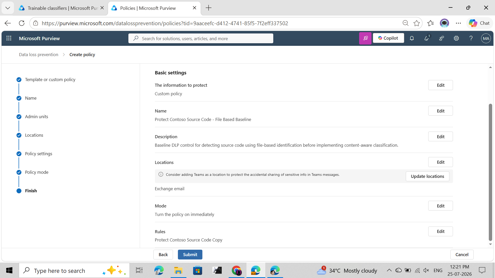
</p>

*Figure 3 — Review of the Exchange-only baseline policy before submission.*

<p align="center">
  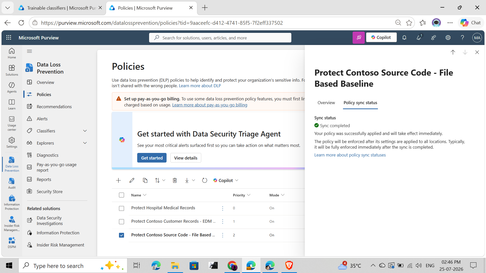
</p>

*Figure 4 — The baseline policy is synchronized and ready for enforcement.*

### 4. Test the Python attachment

Send `Contoso-Customer-API.py` from the Exchange mailbox to the external Gmail account.

<p align="center">
  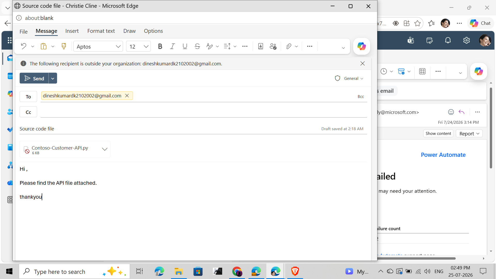
</p>

*Figure 5 — Attempting to send a Python source-code attachment to an external recipient.*

The outbound message is blocked because the attachment extension matches `py` and the recipient is outside the organization.

<p align="center">
  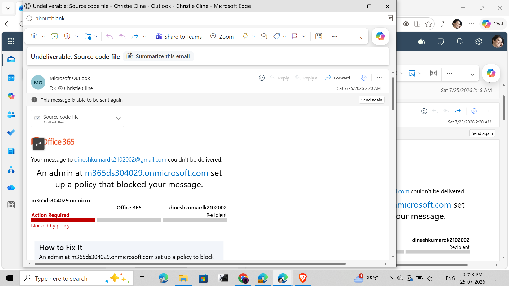
</p>

*Figure 6 — The file-based baseline blocks the external Python attachment.*

Purview generates an alert for the policy match.

<p align="center">
  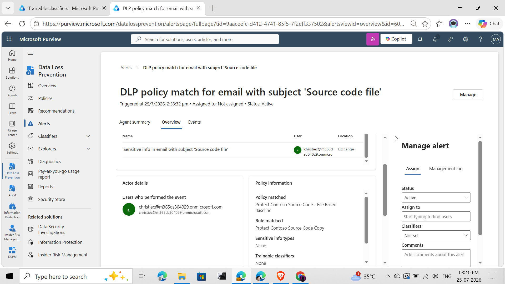
</p>

*Figure 7 — Purview alert generated by the baseline policy.*

---

## Phase 2 — Validate the Detection Gap

### 5. Test the same source code in a DOCX file

Attach `Contoso-Customer-API.docx`, which contains the same synthetic source code, and send it to the same external Gmail recipient.

<p align="center">
  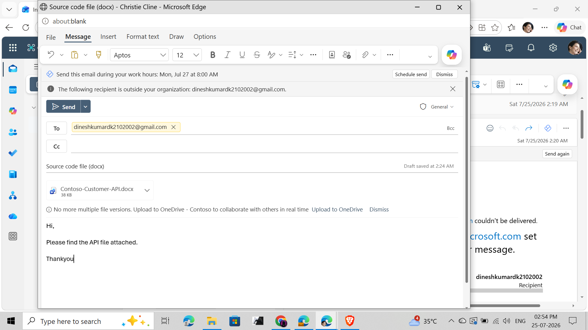
</p>

*Figure 8 — The same code is prepared for external transmission inside a DOCX attachment.*

The baseline rule does not match the `.docx` extension. The message is delivered to the external recipient.

<p align="center">
  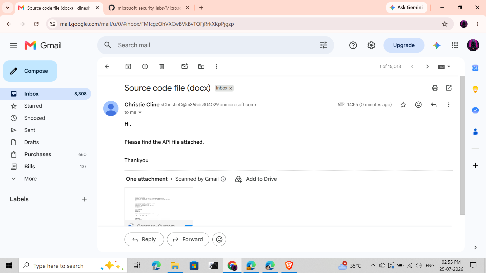
</p>

*Figure 9 — The external recipient receives the DOCX attachment, demonstrating the file-extension detection gap.*

No baseline DLP alert was generated for the DOCX test during the validation period.

<p align="center">
  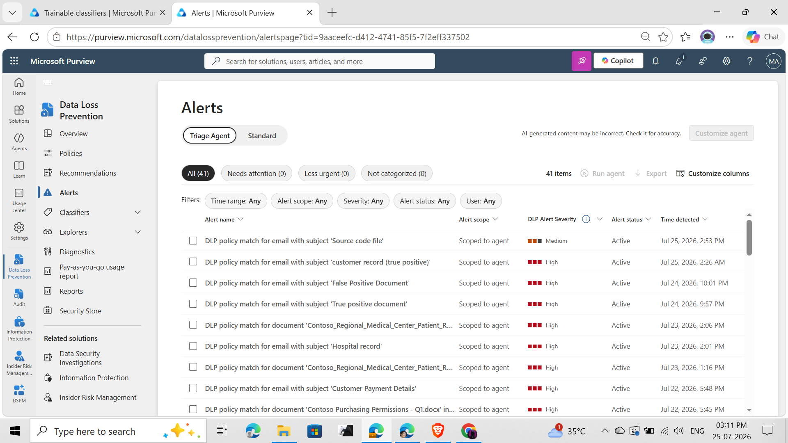
</p>

*Figure 10 — The alert list contains the Python-file alert but no corresponding baseline alert for the DOCX test.*

> **Finding:** The sensitive content did not change; only the container changed. The extension-based policy protected the `.py` file but failed to identify the same source code inside a `.docx` file.

After capturing this evidence, the baseline policy was disabled to ensure the following test results could be attributed only to the content-aware policy.

---

## Phase 3 — Content-Aware DLP Control

### 6. Create the content-aware policy

Create a second custom DLP policy named **Protect Contoso Source Code - Content Aware**. Like the baseline, this policy is scoped to Exchange email and enabled immediately after deployment.

<p align="center">
  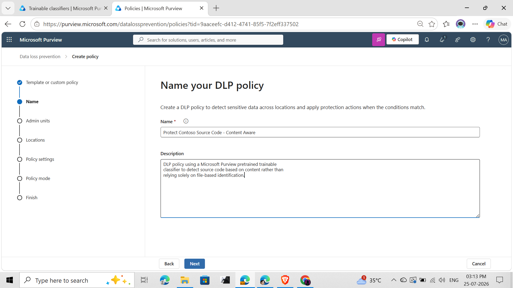
</p>

*Figure 11 — Creating the content-aware DLP policy.*

### 7. Configure the trainable-classifier rule

Create a rule with these conditions:

1. Content contains the **Source code** trainable classifier.
2. Content is shared from Microsoft 365 with people outside the organization.

The enforcement action restricts external access, notifies the user, and alerts the administrator.

<p align="center">
  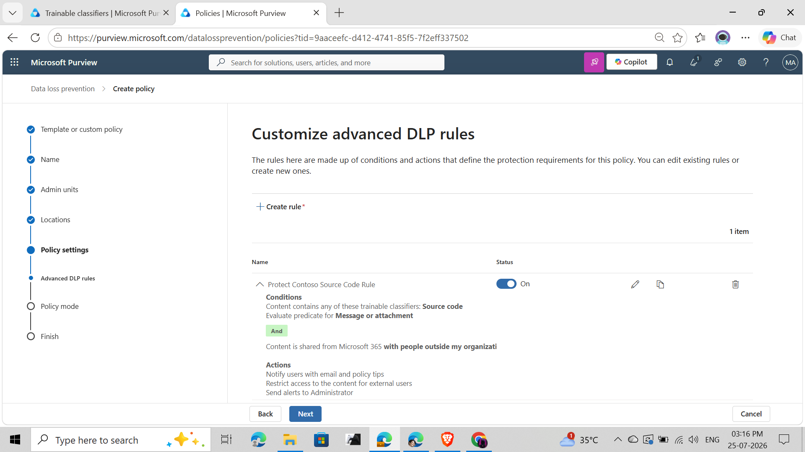
</p>

*Figure 12 — The content-aware rule evaluates messages or attachments with the Source code trainable classifier.*

### 8. Review and deploy the content-aware policy

Review the configuration and wait for a successful synchronization before running the second controlled test.

<p align="center">
  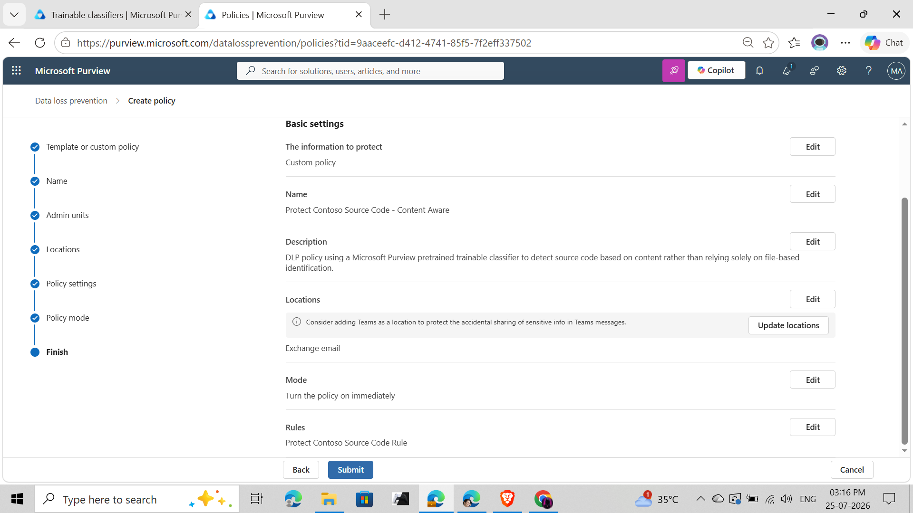
</p>

*Figure 13 — Review of the content-aware Exchange policy before deployment.*

<p align="center">
  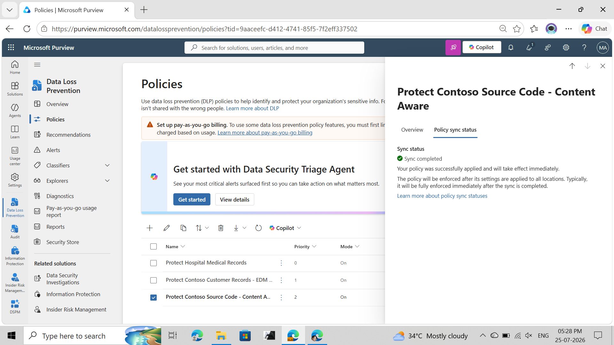
</p>

*Figure 14 — The content-aware policy has synchronized successfully.*

---

## Phase 4 — Validate the Remediation

### 9. Confirm classifier coverage for Python code

As an additional validation, send the Python attachment while the content-aware policy is active. The message is blocked, and the alert identifies **Source code** as the trainable classifier that matched.

<p align="center">
  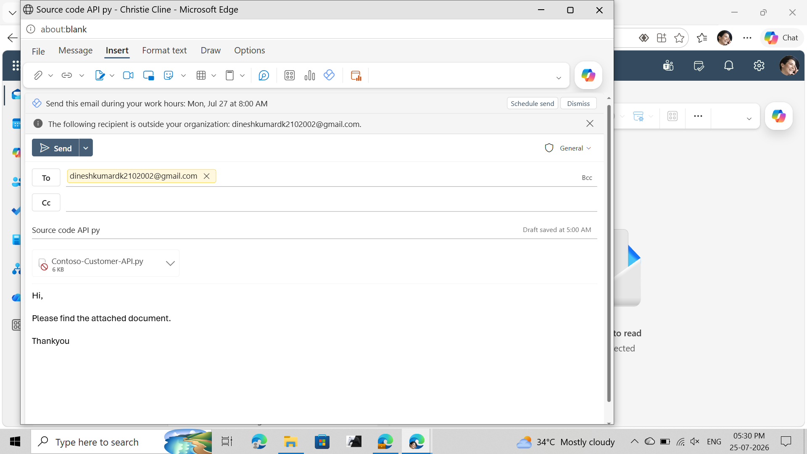
</p>

*Figure 15 — Python attachment submitted to the content-aware policy.*

<p align="center">
  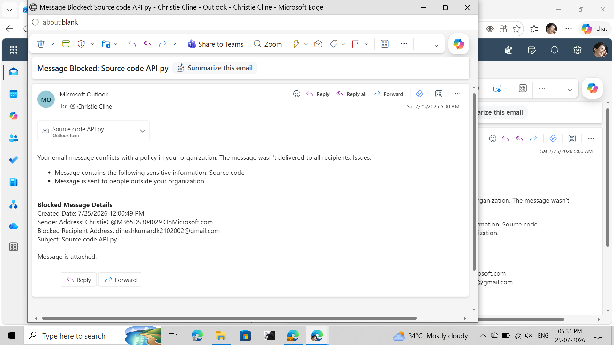
</p>

*Figure 16 — The content-aware policy blocks the Python attachment.*

<p align="center">
  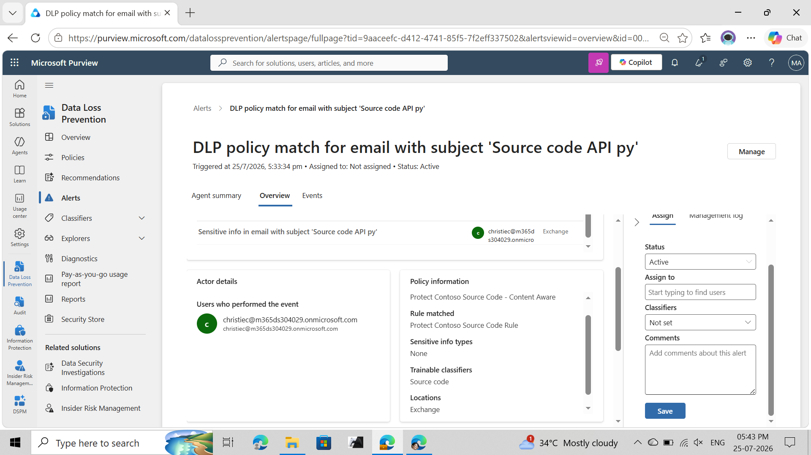
</p>

*Figure 17 — The DLP alert confirms the Source code trainable classifier match.*

### 10. Retest the DOCX that bypassed the baseline

Reuse the exact `Contoso-Customer-API.docx` attachment that was delivered during the baseline test. Send it from the same Exchange mailbox to the same external recipient.

<p align="center">
  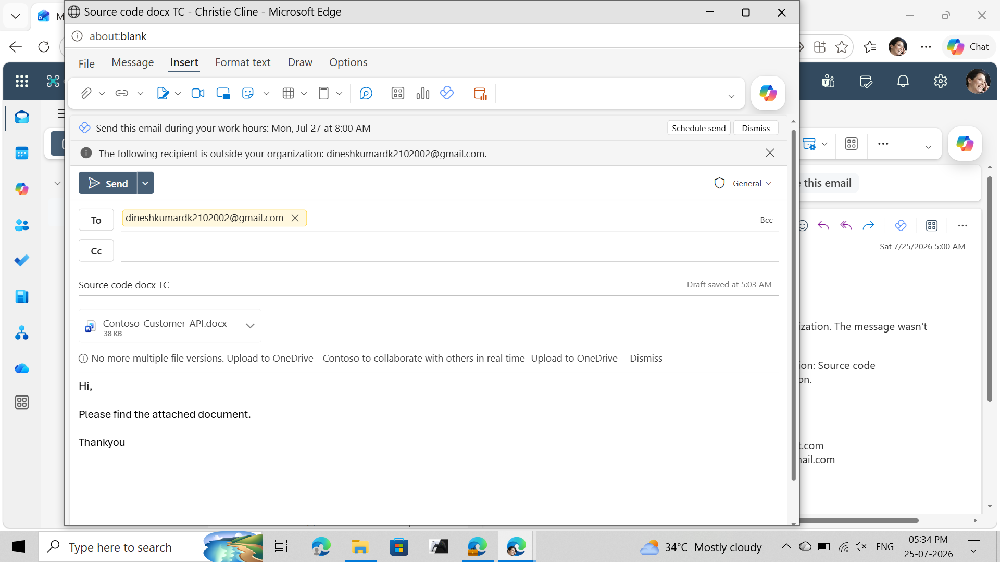
</p>

*Figure 18 — The previously allowed DOCX is retested with the content-aware policy enabled.*

The message is now blocked. The Outlook notification identifies the source-code content and the external recipient as the conditions that caused the enforcement action.

<p align="center">
  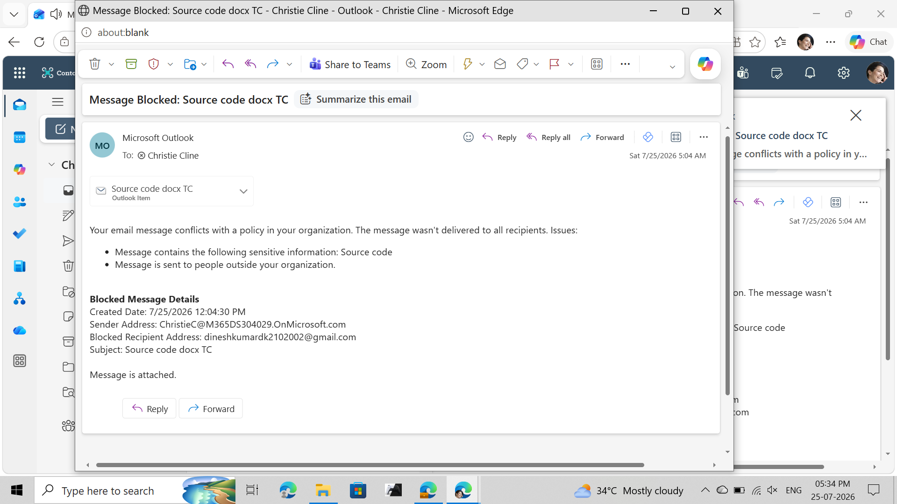
</p>

*Figure 19 — The same DOCX that bypassed the baseline is blocked by the Source code classifier.*

Purview generates an alert that identifies the content-aware policy, matched rule, Exchange workload, and **Source code** trainable classifier.

<p align="center">
  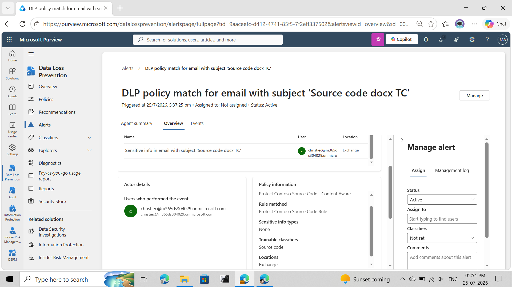
</p>

*Figure 20 — Investigation evidence for the content-aware DOCX policy match.*

---

## DLP Alert Investigation

The alert investigation verifies that policy enforcement occurred in the intended workload and that the content-aware control—not a file-extension condition—identified the sensitive material.

Key evidence captured in the alert:

| Evidence | Confirmed value |
|---|---|
| Policy | Protect Contoso Source Code - Content Aware |
| Rule | Protect Contoso Source Code Rule |
| Workload | Exchange |
| Classification method | Source code trainable classifier |
| Activity | External email-sharing attempt |
| Enforcement result | Message blocked |

---

## Results

| Test | File-based baseline | Content-aware policy | Outcome |
|---|---|---|---|
| External email with `Contoso-Customer-API.py` | Blocked | Blocked | Both controls prevented external sharing. |
| External email with `Contoso-Customer-API.docx` containing the same code | Allowed | Blocked | The trainable classifier closed the detected coverage gap. |

```text
Same source-code content
        │
        ├── .py file   → file-extension baseline detects it → BLOCK
        │
        └── .docx file → file-extension baseline misses it  → ALLOW
                              │
                              ▼
                     Source code classifier evaluates content
                              │
                              ▼
                            BLOCK
```

---

## Key Engineering Takeaways

- File-extension DLP is useful for targeted controls but cannot reliably identify sensitive content that has been copied into a different file format.
- A trainable classifier enables content-aware detection where a predictable pattern or file extension is not sufficient.
- Controlled testing matters: using the same source content, sender, and recipient made the detection-gap comparison defensible.
- DLP alerts provide the evidence required to validate the active policy, matched rule, classifier, workload, and enforcement result.
- The best DLP designs combine prevention, user notification, alerting, and investigator-visible evidence.

---

## Skills Demonstrated

- Microsoft Purview Data Loss Prevention policy engineering
- Exchange Online external-sharing controls
- Microsoft-provided trainable classifiers
- Content-aware classification and enforcement
- DLP policy synchronization validation
- Controlled positive testing and false-negative gap analysis
- Purview alert investigation
- Security documentation and evidence collection
---

## Security and Privacy Notice

This repository contains only synthetic lab content. Before publishing screenshots from a personal tenant, redact or replace personal email addresses, tenant identifiers, user names, subscription information, and any other tenant-specific data.

---

<p align="center">
  <i>Built as part of a Microsoft Security / Microsoft Purview hands-on lab portfolio.</i>
</p>

