# 🛡️ Lab 09 – Protecting Sensitive Data in Microsoft 365 Copilot with Microsoft Purview DLP


---

## 📌 Overview

Generative AI introduces a new data-loss channel: users can submit organizational data directly into AI prompts.

This lab demonstrates how **Microsoft Purview Data Loss Prevention (DLP)** can protect sensitive information used in **Microsoft 365 Copilot and Copilot Chat**.

A custom **Contoso Customer ID Sensitive Information Type (SIT)** is used to identify customer identifiers such as:

```text
CUS10002
```

The lab validates the complete DLP lifecycle:

**Baseline Testing → Policy Design → Sensitive Data Detection → Copilot Processing Restriction → Validation → False-Positive Analysis → Activity Investigation → Alert Investigation**

---

## 📑 Table of Contents

- [Business Scenario](#-business-scenario)
- [Objectives](#-objectives)
- [Architecture](#-architecture)
- [Detection Logic](#-detection-logic)
- [Phase 1 – Baseline Testing](#-phase-1--baseline-testing)
- [Phase 2 – DLP Policy Configuration](#-phase-2--dlp-policy-configuration)
- [Phase 3 – Policy Deployment](#-phase-3--policy-deployment)
- [Phase 4 – Enforcement Validation](#-phase-4--enforcement-validation)
- [Phase 5 – False-Positive Analysis](#-phase-5--false-positive-analysis)
- [Phase 6 – Activity Explorer Investigation](#-phase-6--activity-explorer-investigation)
- [Phase 7 – DLP Alert Investigation](#-phase-7--dlp-alert-investigation)
- [Results](#-results)
- [Security Analysis](#-security-analysis)
- [Key Takeaways](#-key-takeaways)
- [Skills Demonstrated](#-skills-demonstrated)

---

# 🎯 Business Scenario

Contoso employees use Microsoft 365 Copilot to assist with everyday business activities such as drafting emails and preparing customer account reviews.

A potential data-security risk exists when employees include internal customer identifiers in Copilot prompts.

For example:

```text
Prepare a professional account review summary for customer CUS10002
and suggest the sections that should be included.
```

Without an appropriate DLP control, Copilot can process the prompt and generate a response.

### Security Requirement

Contoso requires a DLP control that:

- Detects customer identifiers in Copilot prompts
- Restricts Copilot from processing prompts containing protected customer IDs
- Allows ordinary business prompts to continue functioning
- Generates security telemetry for investigation
- Enables DLP administrators to investigate policy matches

---

# 🎯 Objectives

The objectives of this lab were to:

1. Establish baseline Microsoft 365 Copilot behavior.
2. Verify that a customer ID could initially be processed.
3. Create a Microsoft Purview DLP policy targeting Microsoft 365 Copilot and Copilot Chat.
4. Detect customer IDs using the existing **Contoso Customer ID** custom Sensitive Information Type.
5. Restrict processing of prompts containing matching sensitive information.
6. Verify that normal prompts remained unaffected.
7. Validate enforcement against a customer ID.
8. Test a pattern-valid but non-genuine customer ID to identify false-positive behavior.
9. Investigate generated events through Activity Explorer.
10. Investigate the resulting DLP alert.

---

# 🏗️ Architecture

```text
                         CONTOSO USER
                              │
                              │ Prompt
                              ▼
                 ┌─────────────────────────┐
                 │ Microsoft 365 Copilot  │
                 │     / Copilot Chat     │
                 └────────────┬────────────┘
                              │
                              │ Prompt inspection
                              ▼
                 ┌─────────────────────────┐
                 │ Microsoft Purview DLP  │
                 └────────────┬────────────┘
                              │
                              ▼
              ┌──────────────────────────────┐
              │ Contoso Customer ID Custom  │
              │ Sensitive Information Type  │
              └──────────────┬───────────────┘
                             │
                    ┌────────┴────────┐
                    │                 │
                 No Match           Match
                    │                 │
                    ▼                 ▼
             Prompt Allowed    Restrict Processing
                    │                 │
                    ▼                 ▼
             Copilot Response    DLP Telemetry
                                      │
                           ┌──────────┴──────────┐
                           ▼                     ▼
                  Activity Explorer         DLP Alert
```

### Enforcement Flow

```text
User Prompt
    │
    ▼
Microsoft 365 Copilot
    │
    ▼
Purview DLP Inspection
    │
    ▼
Contoso Customer ID SIT
    │
    ├── No Match ──► Copilot processes prompt
    │
    └── Match ─────► Processing restricted
                          │
                          ├──► Activity recorded
                          │
                          └──► DLP alert generated
```

---

# 🔎 Detection Logic

The DLP rule was configured around the following logic:

| Component | Configuration |
|---|---|
| Platform | Microsoft Purview |
| Workload | Microsoft 365 Copilot and Copilot Chat |
| User activity | Upload Text |
| Detection method | Sensitive Information Type |
| SIT | Contoso Customer ID |
| Protected data | Customer identifiers |
| Example | `CUS10002` |
| Enforcement | Restrict processing prompts |
| Monitoring | DLP Alerts + Activity Explorer |

The key rule logic was effectively:

```text
IF
    Activity = UploadText

AND

    Content contains "Contoso Customer ID"

THEN
    Restrict processing prompts
    Generate DLP security telemetry
```

---

# 🧪 Phase 1 – Baseline Testing

Before deploying the DLP policy, baseline tests were performed to establish normal Copilot behavior.

## Test 1 – Normal Business Prompt

A standard business prompt containing no customer identifier was submitted:

```text
Create a short professional email asking a customer to schedule
a quarterly account review next week.
```

Copilot successfully generated the requested email.

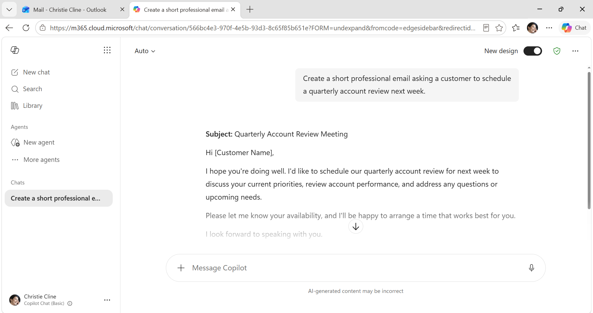

**Result:** ✅ Allowed

This established that Microsoft 365 Copilot was functioning normally before policy enforcement.

---

## Test 2 – Customer ID Before DLP Enforcement

The following prompt containing a customer identifier was then tested:

```text
Prepare a professional account review summary for customer
CUS10002 and suggest the sections that should be included.
```

Before the DLP control was implemented, Copilot processed the customer ID and generated an account review response.

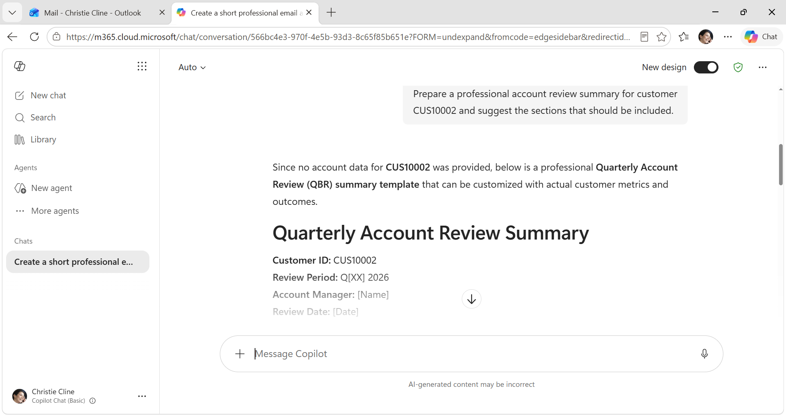

**Result:** ⚠️ Sensitive identifier processed

This demonstrated the security condition the lab was designed to address.

---

# ⚙️ Phase 2 – DLP Policy Configuration

## Policy Creation

A custom DLP policy was created in Microsoft Purview.

### Policy Name

```text
Protect Contoso Customer Data in Microsoft 365 Copilot
```

### Description

```text
Prevents Microsoft 365 Copilot and Copilot Chat from processing
prompts containing Contoso Customer IDs detected by the custom
Contoso Customer ID sensitive information type.
```

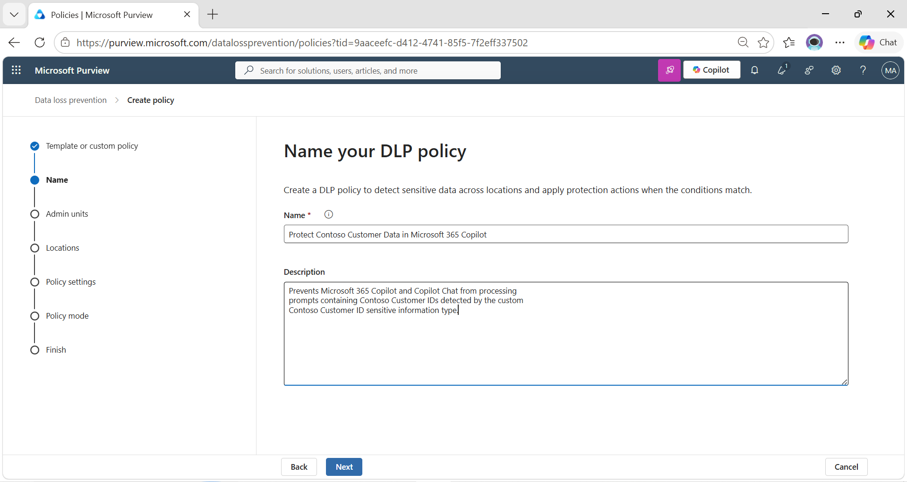

---

## Rule Configuration

The DLP rule was configured to inspect Copilot text-upload activity.

The important conditions were:

```text
HasActivity: UploadText

AND

Content contains sensitive information type:
Contoso Customer ID
```

The enforcement action was configured to:

```text
Restrict processing prompts
```

Alerting was also enabled for administrative investigation.

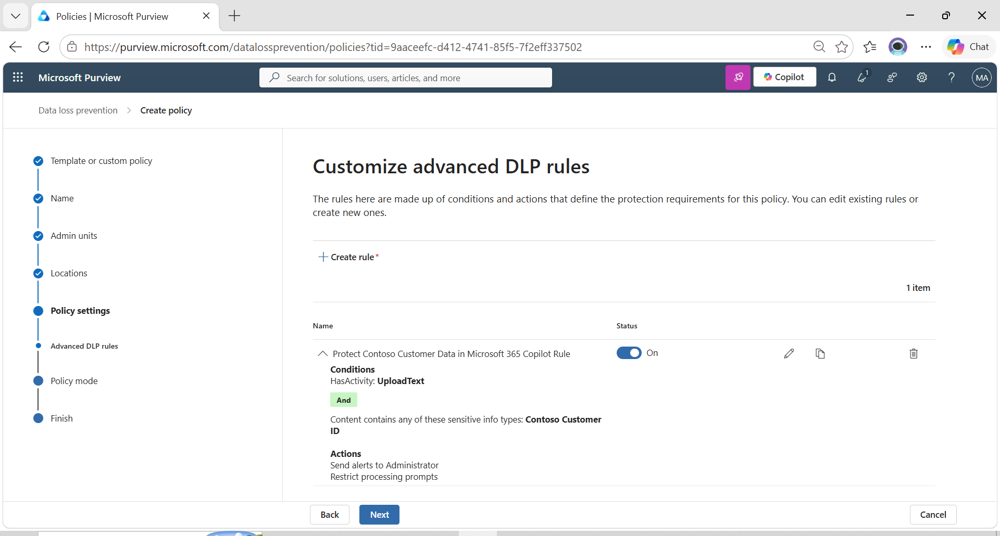

### Why Content-Based Detection?

The control is based on the **content of the prompt**, rather than simply attempting to restrict access to Copilot.

This allows normal Copilot usage to continue while applying security controls when protected information is detected.

---

## Policy Review

Before deployment, the policy configuration was reviewed.

The selected location was:

```text
Microsoft 365 Copilot and Copilot Chat
```

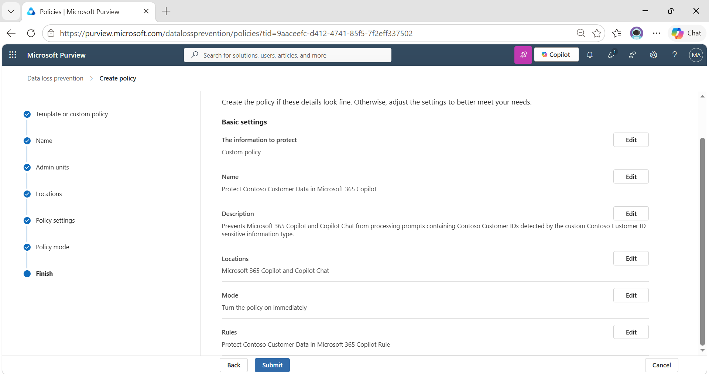

This scopes the control specifically to Copilot interactions rather than unnecessarily applying the same rule across unrelated workloads.

---

# 🚀 Phase 3 – Policy Deployment

The policy was enabled and its synchronization status was verified.

Microsoft Purview reported:

```text
Sync status: Sync completed
```

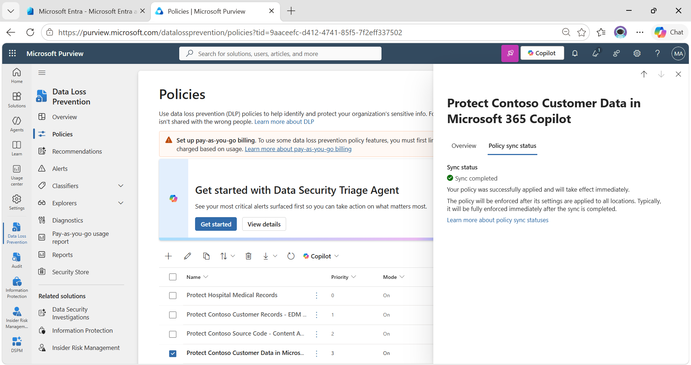

**Deployment status:** ✅ Successful

Testing was then repeated after policy deployment.

---

# 🧪 Phase 4 – Enforcement Validation

Two tests were performed after deployment:

1. Normal prompt
2. Prompt containing the protected customer identifier

This is important because successful DLP implementation requires more than proving that something can be blocked.

The control should block the targeted activity **without unnecessarily disrupting legitimate Copilot usage**.

---

## Test 3 – Normal Prompt After Policy Deployment

The original non-sensitive prompt was tested again:

```text
Create a short professional email asking a customer to schedule
a quarterly account review next week.
```

Copilot successfully generated the response.

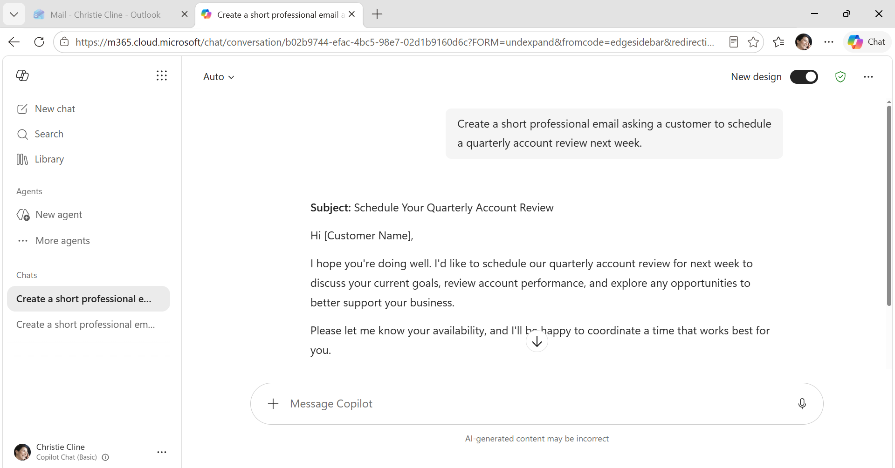

**Result:** ✅ Allowed

This confirmed that the policy did not indiscriminately disable Copilot.

---

## Test 4 – Customer ID After Policy Deployment

The sensitive prompt was repeated:

```text
Prepare a professional account review summary for customer
CUS10002 and suggest the sections that should be included.
```

This time Copilot returned:

> This request couldn't be fully completed due to your organization's policies.

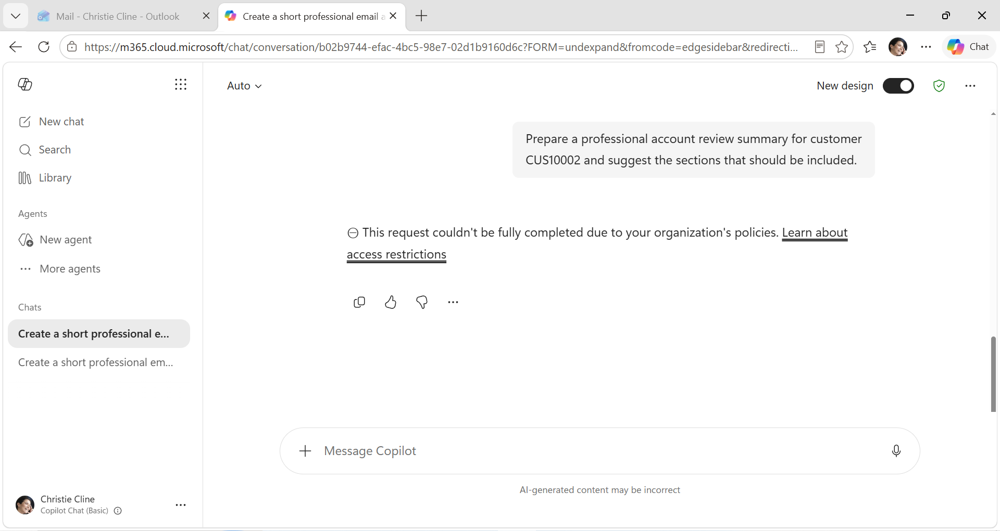

**Result:** 🛑 Restricted by DLP

### Before vs After

| Test | Before DLP | After DLP |
|---|---:|---:|
| Normal business prompt | ✅ Allowed | ✅ Allowed |
| Prompt containing `CUS10002` | ⚠️ Processed | 🛑 Restricted |

This validated that the DLP policy was selectively enforcing protection based on sensitive content.

---

# ⚠️ Phase 5 – False-Positive Analysis

Blocking a known customer ID proved enforcement, but it did not establish detection precision.

A second identifier was therefore tested:

```text
CUS99881
```

The prompt was:

```text
Prepare a professional account review summary for customer
CUS99881 and suggest the sections that should be included.
```

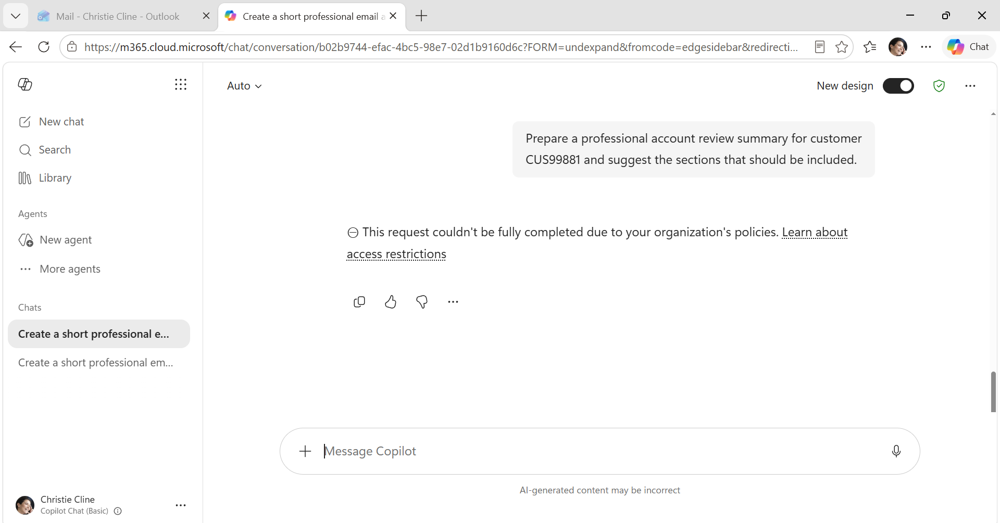

Copilot again restricted the request.

**Result:** ⚠️ Pattern matched and processing was restricted

## Analysis

`CUS99881` was intentionally used as a pattern-valid test value rather than a confirmed customer record.

Because the custom Sensitive Information Type recognizes the customer-ID pattern, the value can satisfy the detection logic even if it is not an actual customer record.

Conceptually:

```text
CUS10002
   │
   ├── Matches Customer ID pattern
   └── Genuine test customer ID
              ↓
           BLOCK


CUS99881
   │
   ├── Matches Customer ID pattern
   └── Not a genuine customer record
              ↓
           BLOCK
              ↑
        False Positive
```

This highlights an important DLP engineering consideration:

> **Pattern matching and data validation are different problems.**

A regex/custom SIT can identify data that *looks like* sensitive information, while higher-precision techniques can be required when the security requirement is to validate values against authoritative business records.

---

# 🔍 Phase 6 – Activity Explorer Investigation

Policy enforcement was then investigated through:

```text
Microsoft Purview
    ↓
Data Loss Prevention
    ↓
Explorers
    ↓
Activity Explorer
```

Activity Explorer recorded Copilot-related events including:

- Classification activity
- Copilot interaction
- DLP rule matches

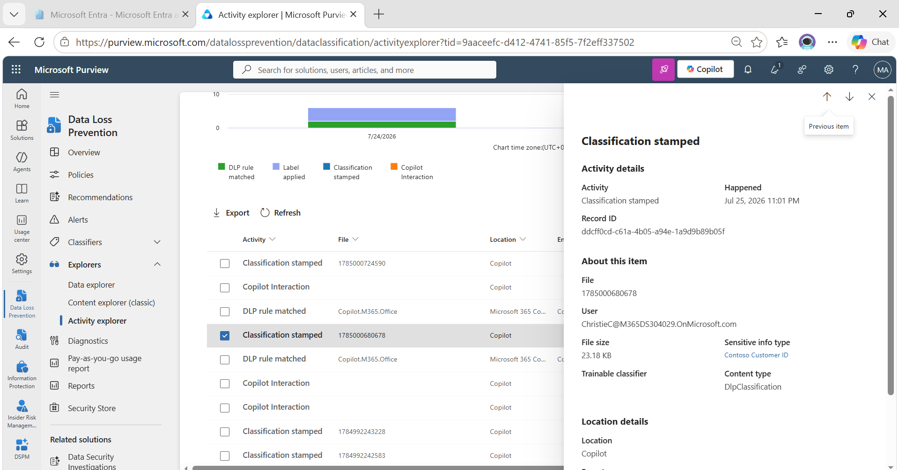

The event details showed:

```text
Location: Copilot
Sensitive info type: Contoso Customer ID
Content type: DlpClassification
```

This provides evidence that Purview classified the Copilot interaction using the configured sensitive information type.

---

# 🚨 Phase 7 – DLP Alert Investigation

The resulting DLP alert was investigated from the Purview DLP Alerts interface.

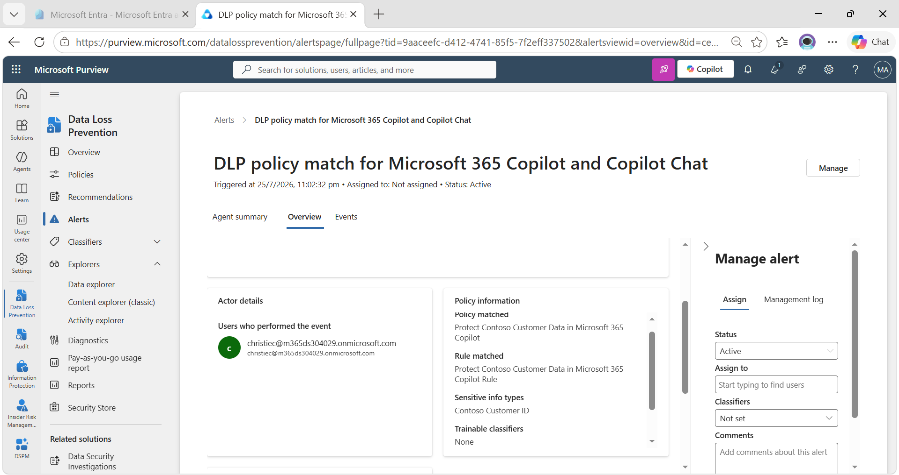

The alert confirmed the relevant security context:

```text
DLP policy match for Microsoft 365 Copilot and Copilot Chat
```

### Policy Information

```text
Policy matched:
Protect Contoso Customer Data in Microsoft 365 Copilot

Rule matched:
Protect Contoso Customer Data in Microsoft 365 Copilot Rule

Sensitive info type:
Contoso Customer ID
```

This completes the detection-to-investigation lifecycle:

```text
Sensitive Prompt
      ↓
SIT Detection
      ↓
DLP Rule Match
      ↓
Copilot Processing Restricted
      ↓
Security Activity Recorded
      ↓
DLP Alert Generated
      ↓
Administrator Investigation
```

---

# 📊 Results

| Scenario | Expected | Actual | Status |
|---|---|---|---|
| Normal prompt before policy | Allow | Allowed | ✅ |
| `CUS10002` before policy | Allow / baseline exposure | Processed | ✅ |
| Policy synchronization | Successful deployment | Sync completed | ✅ |
| Normal prompt after policy | Allow | Allowed | ✅ |
| `CUS10002` after policy | Restrict | Restricted | ✅ |
| Pattern-valid `CUS99881` | Precision test | Restricted | ⚠️ |
| Activity Explorer telemetry | Recorded | Recorded | ✅ |
| DLP alert | Generated | Generated | ✅ |

---

# 🧠 Security Analysis

## What Worked

The implemented DLP control successfully demonstrated:

- Content-aware inspection of Microsoft 365 Copilot prompts
- Custom Sensitive Information Type integration
- Selective restriction of sensitive prompts
- Continued operation for non-sensitive prompts
- DLP event visibility
- Alert generation
- Administrative investigation through Microsoft Purview

---

## Detection Precision Limitation

The false-positive test exposed an important limitation of pattern-based detection.

A custom SIT can answer:

```text
"Does this value look like a Contoso Customer ID?"
```

It does not necessarily answer:

```text
"Does this exact Customer ID exist in Contoso's authoritative
customer database?"
```

Therefore:

```text
Pattern-Based SIT
      │
      ├── CUS10002 ──► Match
      │
      └── CUS99881 ──► Match
```

This demonstrates the trade-off between **detection coverage** and **detection precision**.

---

## Exact Data Match Consideration

A natural next step would be to investigate whether exact-value validation could improve detection precision.

Earlier lab work demonstrated **Exact Data Match (EDM)** for matching sensitive information against known structured records.

However, the Copilot DLP policy configuration used in this lab did not permit the EDM/Machine Learning classifier configuration attempted during testing.

Therefore, this lab retains the custom SIT and documents the resulting precision limitation rather than presenting EDM as an implemented Copilot control.

This distinction is important:

> A security engineer must design controls around both the desired detection architecture and the capabilities supported by the target workload.

---

# 💡 Key Takeaways

### 1. AI prompts are a data-protection surface

DLP strategy increasingly needs to consider how users interact with generative AI systems in addition to traditional channels such as email, endpoints and collaboration platforms.

### 2. Blocking everything is not the objective

The control allowed ordinary Copilot prompts while restricting prompts that matched the sensitive-information condition.

### 3. Detection quality matters

A policy that blocks sensitive information can still create operational problems if the underlying detection logic generates excessive false positives.

### 4. Pattern detection does not prove record validity

The `CUS99881` test demonstrated why syntactic matching should not automatically be interpreted as validation against authoritative business data.

### 5. Enforcement must be observable

Activity Explorer and DLP Alerts provide the telemetry required to investigate why an interaction was restricted.

### 6. Platform capabilities influence policy design

Not every detection technique is necessarily available across every DLP workload. Policy design must account for the capabilities and limitations of the enforcement location.

---

# 🛠️ Skills Demonstrated

This lab demonstrates practical experience with:

- Microsoft Purview Data Loss Prevention
- Microsoft 365 Copilot DLP
- Copilot Chat data protection
- Generative AI data-security controls
- Custom Sensitive Information Types
- Content-aware DLP inspection
- DLP policy design
- DLP rule configuration
- Policy deployment and synchronization
- Positive and negative control testing
- True-positive validation
- False-positive analysis
- Detection precision analysis
- Activity Explorer investigation
- DLP alert investigation
- Security control validation
- AI data-governance concepts

---

# 📚 Conclusion

This lab demonstrated an end-to-end Microsoft Purview DLP implementation for protecting sensitive customer identifiers used in Microsoft 365 Copilot prompts.

The implementation moved beyond simply creating a DLP policy by validating the complete security-control lifecycle:

```text
Identify Risk
     ↓
Establish Baseline
     ↓
Design Detection
     ↓
Configure Enforcement
     ↓
Deploy Policy
     ↓
Validate True Positive
     ↓
Validate Normal Activity
     ↓
Test Detection Precision
     ↓
Investigate Telemetry
     ↓
Analyze DLP Alert
```

The lab also identified a meaningful detection-engineering limitation: a pattern-based Sensitive Information Type can detect values that resemble customer identifiers without proving that those values correspond to genuine customer records.

This illustrates a core DLP engineering principle:

> **Effective DLP is not only about blocking sensitive data. It requires balancing detection coverage, precision, business usability, enforcement, and investigation capability.**

---
⭐ This repository documents hands-on Microsoft security labs focused on practical DLP policy design, implementation, testing, tuning, and investigation.

# 👨‍💻 Author

**Dinesh Kumar**

Cybersecurity Engineer | Microsoft Purview | Microsoft 365 Security | Data Loss Prevention

---

<p align="center">

**⭐ If you found this project useful, consider starring the repository.**

</p>

---
